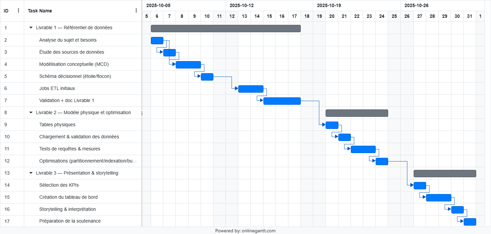

# Livrable 1 – Référentiel de données

---

## Introduction

Le secteur de la santé connaît aujourd'hui une transformation numérique profonde. Les établissements hospitaliers génèrent quotidiennement des volumes considérables de données médicales et administratives qui constituent un potentiel d'analyse encore largement inexploité. Ces données, dispersées entre systèmes de gestion, plateformes FTP et bases administratives, représentent pourtant un moyen pour améliorer la qualité des soins et optimiser la performance organisationnelle.

Dans ce contexte, le groupe CHU nous a confié la mise en place d'un entrepôt de données moderne et évolutif. 

Notre objectif : permettre aux praticiens et aux responsables d'établissement d'accéder à des analyses fiables sur les consultations, les hospitalisations, les diagnostics, la satisfaction patient et les indicateurs qualité.

Ce premier livrable constitue la base de notre projet. Nous y détaillons nos choix architecturaux, justifions notre modélisation dimensionnelle et décrivons notre approche méthodologique. 

Il comprend :

- La planification détaillée du projet sur quatre semaines
- Le choix et la justification de notre stack technologique
- La modélisation de notre base de données (en constellation)
- La description des dimensions et tables de faits
- L'approche de gestion des environnements

---

## 1. Planification du projet – Diagramme de Gantt

Pour rappel, le projet est structuré sur quatre semaines avec trois livrables successifs permettant des validations intermédiaires régulières.

### Architecture des livrables

**Livrable 1 – Référentiel de données (Semaine 1)**

Cette phase initiale pose les fondations du projet. Nous y réalisons l'analyse des besoins métier, l'étude approfondie des sources de données, la modélisation conceptuelle et la conception du schéma décisionnel. Nous définissons également l'architecture technique.

**Livrable 2 – Modèle physique et optimisation (Semaines 2-3)**

Une fois le modèle conceptuel validé, nous passons à l'implémentation technique. Cette phase comprend la création des tables physiques dans PostgreSQL, le chargement initial des données, les tests de validation métier, et l'optimisation des performances (indexation, partitionnement, ajustement des requêtes).

**Livrable 3 – Présentation et storytelling (Semaine 4)**

La phase finale valorise les données collectées. Nous définissons les indicateurs clés de performance, créons les tableaux de bord Power BI avec mise en place du Row-Level Security, interprétons les premiers résultats et préparons la présentation finale du projet.

---

## 2. Stack technologique et architecture cible

### 2.1. Analyse critique de la stack initiale

La stack initialement proposée (Talend, Hadoop, Hive, Spark) représente une architecture Big Data éprouvée mais présente plusieurs inadéquations avec notre contexte :

**Complexité disproportionnée** : Le déploiement et la maintenance d'un cluster Hadoop nécessitent des compétences spécialisées et un temps de mise en œuvre conséquent, peu cohérent avec notre délai d'un mois.

**Surdimensionnement** : Nos volumes de données (quelques millions d'enregistrements) ne justifient pas une infrastructure distribuée conçue pour des pétaoctets.

**Rigidité** : L'architecture Hadoop est optimale pour des traitements batch massifs, moins pour nos besoins d'analyses interactives et d'itérations rapides.

### 2.2. Notre proposition : une architecture moderne en 5 couches

Nous avons conçu une architecture beaucoup plus moderne, privilégiant la simplicité opérationnelle, les performances et l'évolutivité.

### 2.3. Justification des choix technologiques

**DuckDB** : C'est un moteur analytique en mémoire qui offre des performances exceptionnelles sur nos volumes de données. Sa capacité à traiter plusieurs millions de lignes en quelques secondes, combinée à sa simplicité de déploiement, en fait un choix optimal pour notre zone de staging et nos transformations.

**DBT** : Plutôt que de développer des scripts ETL complexes, DBT nous permet d'écrire nos transformations en SQL pur avec de la documentation automatique et des tests intégrés. Cette approche garantit la maintenabilité et la transparence de notre code.

**Apache Airflow** : C'est un standard de l'orchestration data, Airflow offre une interface de monitoring très claire, une gestion robuste des dépendances ainsi que pour les erreurs et une forte communauté. Son approche "configuration as code" facilite le versionnement et les déploiements.

**PostgreSQL** : Pour le warehouse final, nous avons décidé d'utiliser PostgreSQL qui offre d'excellentes performances pour nos volumes.

**Architecture ELT vs ETL** : Nous avons opté pour une approche ELT (Extract-Load-Transform) plutôt qu'ETL traditionnelle. Les transformations s'effectuent dans DuckDB, cela permet d'exploiter la puissance de calcul de DuckDB plutôt que de la délocaliser dans des outils tiers.

Cette stack nous permet de déployer l'infrastructure complète rapidement, d'avoir d'excellentes performances et de garantir une maintenance simple pour les équipes du CHU.

---

## 3. Modélisation conceptuelle des données

### 3.1. Choix du modèle en constellation

Notre analyse des besoins métier a révélé cinq domaines d'analyse distincts, chacun avec ses propres métriques et grains d'analyse :

- Les **consultations** (activité médicale quotidienne)
- Les **hospitalisations** (gestion des séjours)
- La **mortalité** (statistiques épidémiologiques)
- La **satisfaction patient** (enquêtes périodiques)
- La **qualité des soins** (indicateurs IPAQSS)

Nous avons écarté le modèle en étoile unique pour plusieurs raisons :

**Grains d'analyse incompatibles** : Une consultation individuelle et une enquête de satisfaction annuelle ne peuvent partager le même niveau de granularité sans créer de redondance massive ou de complexité requêtable.

**Performance** : Séparer les faits permet d'optimiser indépendamment chaque domaine (partitionnement, indexation) et de garantir des temps de réponse acceptables même sur des requêtes complexes.

**Évolutivité** : L'ajout de nouveaux domaines métier (par exemple pour les urgences) ne nécessite pas de refonte globale, seulement la création d'une nouvelle étoile.

**Gouvernance** : Chaque étoile peut avoir ses propres règles de gestion, niveaux d'accès et responsables métier.

Nous avons donc choisi d'utiliser le modèle en **constellation**, avec des dimensions partagées (temps, localisation, établissement, patient) qui assurent la cohérence analytique entre les différents domaines.

### 3.2. Description détaillée des étoiles

#### 3.2.1. Étoile Consultation

**Table de faits : fait_consultation**

Grain : Une ligne par consultation individuelle

**Mesures quantitatives :**
- Nombre de consultations (métrique de volume)
- Durée de consultation en minutes
- Heure de début et heure de fin
- Nombre de consultations par période

**Dimensions associées :**
- **dim_patient** : Identité et caractéristiques du patient
- **dim_professionnel** : Praticien ayant effectué la consultation
- **dim_specialite** : Spécialité médicale
- **dim_diagnostic** : Diagnostic(s) posé(s) lors de la consultation
- **dim_mutuelle** : Organisme de couverture santé
- **dim_temps** : Décomposition temporelle complète
- **dim_etablissement** : Lieu de consultation

#### 3.2.2. Étoile Hospitalisation

**Table de faits : fait_hospitalisation**

Grain : Une ligne par séjour hospitalier

**Mesures quantitatives :**
- Nombre d'hospitalisations
- Durée de séjour en jours
- Nombre d'hospitalisations distinctes par patient

**Dimensions associées :**
- **dim_patient** : Patient hospitalisé
- **dim_diagnostic** : Diagnostic principal du séjour
- **dim_etablissement** : Établissement d'hospitalisation
- **dim_localisation** : Localisation géographique
- **dim_temps** : Date d'admission/sortie

#### 3.2.3. Étoile Décès

**Table de faits : fait_deces**

Grain : Une ligne par décès enregistré

**Mesures quantitatives :**
- Nombre de décès
- Âge au décès
- Code et numéro d'acte de décès

**Dimensions associées :**
- **dim_patient** : Identité du défunt (avec hash sécurité sociale pour RGPD)
- **dim_localisation** : Lieu du décès
- **dim_temps** : Date du décès

#### 3.2.4. Étoile Satisfaction

**Table de faits : fait_satisfaction**

Grain : Une ligne par enquête de satisfaction (agrégation établissement/période)

**Mesures quantitatives :**
- Score global de satisfaction (sur 100)
- Scores détaillés : accueil, personnel infirmier, personnel médical, repas, chambre, sortie
- Taux de recommandation (%)
- Nombre de réponses (pour pondération statistique)
- Classement relatif et évolution

**Dimensions associées :**
- **dim_etablissement** : Établissement évalué
- **dim_localisation** : Localisation géographique
- **dim_temps** : Période d'enquête

#### 3.2.5. Étoile Qualité des soins

**Table de faits : fait_qualite_soins**

Grain : Une ligne par indicateur qualité/établissement/période

**Mesures quantitatives :**
- Ratio ETE_ORTHO (infections post-opératoires orthopédiques)
- Nombre d'alertes qualité
- Taux ISO (infections du site opératoire)
- Ratios ISO par spécialité
- Évolution par rapport à la période précédente

**Dimensions associées :**
- **dim_etablissement** : Établissement évalué
- **dim_localisation** : Localisation géographique
- **dim_temps** : Période de mesure

### 3.3. Dimensions partagées

#### dim_temps – La dimension temporelle

**Clé primaire :** sk_temps (clé substitut auto-incrémentée)

**Attributs descriptifs :**
- Date complète
- Décompositions : jour, mois, trimestre, semestre, année
- Semaine dans l'année (numéro ISO)
- Jour de la semaine (1=lundi, 7=dimanche)
- Libellés : nom du jour, nom du mois
- Indicateurs booléens : weekend, jour férié
- Saison (Printemps, Été, Automne, Hiver)

**Stratégie d'alimentation :** Table de référence pré-générée pour la période 2015-2024, alimentation unique lors de l'initialisation.

#### dim_localisation – La dimension géographique

**Clé primaire :** sk_localisation (clé substitut auto-incrémentée)

**Attributs descriptifs :**
- Code lieu (code INSEE ou code postal)
- Nom de la commune
- Code postal
- Ville
- Département (code et nom)
- Région (code et nom)
- Pays
- Type de lieu (classification)
- Coordonnées GPS (latitude, longitude) pour cartographie

**Stratégie d'alimentation :** Import initial depuis le référentiel INSEE des communes, avec mise à jour annuelle pour suivre les évolutions administratives (par exemple en cas de fusions de communes).

#### dim_etablissement – Les établissements de santé

**Clé primaire :** sk_etablissement (clé substitut auto-incrémentée)

**Attributs descriptifs :**
- Numéro FINESS (identifiant national unique)
- Nom de l'établissement
- Type d'établissement (CHU, clinique, EHPAD, etc.)
- Catégorie (Public/Privé)
- Localisation : région, département, adresse complète
- Date de chargement (traçabilité)

**Stratégie d'alimentation :** Import mensuel depuis le fichier FINESS national.

#### dim_patient – Les patients

**Clé primaire :** sk_patient (clé substitut auto-incrémentée)

**Attributs descriptifs :**
- Identifiant patient fonctionnel
- Nom, prénom
- Sexe
- Date de naissance
- Âge (calculé)
- Tranche d'âge (0-18, 18-35, 35-50, 50-65, 65-80, 80+)
- Groupe sanguin
- Poids, taille
- Localisation : code postal, ville, pays
- Numéro de sécurité sociale (hashé SHA-256 pour conformité RGPD)
- Dates de chargement et modification (traçabilité)

**Stratégie d'alimentation :** Extraction mensuelle depuis PostgreSQL source.

**Conformité RGPD :** Le numéro de sécurité sociale est hashé, les données nominatives sont chiffrées en environnement de production, durée de rétention limitée à 10 ans après dernier contact.

#### dim_professionnel – Les professionnels de santé

**Clé primaire :** sk_professionnel (clé substitut auto-incrémentée)

**Attributs descriptifs :**
- Identifiant RPPS (Répertoire Partagé des Professionnels de Santé)
- Civilité, nom, prénom
- Profession (médecin, infirmier, etc.)
- Catégorie professionnelle
- Spécialité (FK vers dim_specialite)
- Mode d'exercice (libéral, salarié, mixte)
- Organisation d'appartenance
- Dates de validité (début, fin)
- Statut actuel (actif/inactif)

**Stratégie d'alimentation :** Extraction mensuelle depuis la base source, avec jointure sur le référentiel des établissements.

#### dim_diagnostic – Les diagnostics médicaux

**Clé primaire :** sk_diagnostic (clé substitut auto-incrémentée)

**Attributs descriptifs :**
- Code diagnostic (interne ou CIM-10)
- Libellé du diagnostic
- Catégorie CIM-10 (classification niveau 1)
- Chapitre CIM-10 (classification niveau 2)
- Source de la donnée
- Date de chargement

**Stratégie d'alimentation :** Fusion de multiples sources (fichiers CSV, base PostgreSQL).

#### dim_specialite – Les spécialités médicales

**Clé primaire :** sk_specialite (clé substitut auto-incrémentée)

**Attributs descriptifs :**
- Code spécialité
- Fonction (ex: Cardiologue, Pédiatre)
- Spécialité complète
- Catégorie de spécialité
- Date de chargement

**Stratégie d'alimentation :** Table de référence stable, alimentée initialement puis mise à jour ponctuellement en cas d'évolution des spécialités médicales officielles.

#### dim_mutuelle – Les organismes de couverture santé

**Clé primaire :** sk_mutuelle (clé substitut auto-incrémentée)

**Attributs descriptifs :**
- Identifiant mutuelle
- Nom de la mutuelle
- Adresse complète
- Type de mutuelle (complémentaire, obligatoire)
- Date de chargement

**Stratégie d'alimentation :** Import initial depuis fichier source, mise à jour trimestrielle pour suivre les évolutions de mutuelles.

### 3.4. Passage au Modèle Logique de Données (MLD)

Nous avons réalisé un MLD à partir des différents modèles en étoile.

**Principes de conception :**

**Clés substituts** : Toutes les dimensions utilisent des clés artificielles (sk_*) de type bigint auto-incrémentées. Cette approche garantit l'indépendance vis-à-vis des identifiants fonctionnels et la stabilité des clés même en cas de modifications métier.

**Gestion des relations multiples** : Les relations de cardinalité N:N (par exemple fait_consultation vers dim_diagnostic pour gérer les diagnostics multiples) sont gérées via des colonnes de clés étrangères nullables ou des tables d'association dédiées selon la volumétrie attendue.

**Dénormalisation contrôlée** : Les dimensions sont volontairement dénormalisées (exemple : région incluse directement dans dim_localisation) pour simplifier les requêtes analytiques et optimiser les performances de lecture, conformément aux principes de modélisation dimensionnelle.

**Types de données optimisés** :
- Clés primaires et étrangères : bigint (8 octets, support de volumes importants)
- Textes : varchar avec tailles adaptées au contenu
- Décimaux : decimal pour les ratios et pourcentages (précision garantie)
- Compteurs : int ou bigint selon les volumes attendus
- Dates : type date pour les dates pures, timestamp pour la traçabilité des chargements

**Contraintes d'intégrité** :
- NOT NULL systématique sur toutes les clés primaires
- NOT NULL sur les clés étrangères obligatoires, NULL autorisé sur les FK optionnelles
- Contraintes d'intégrité référentielle (FOREIGN KEY) pour garantir la cohérence
- Index automatiques sur les clés primaires et étrangères

**Traçabilité** : Chaque table comporte un champ date_chargement (timestamp) permettant l'audit des chargements et la détection d'anomalies.

### 3.5. Description conceptuelle des flux de données

Notre architecture de traitement suit une approche ELT structurée en plusieurs phases logiques :

#### Phase 1 : Ingestion des données sources

**Sources CSV/Excel** : Lecture des fichiers patients, diagnostics, lexiques IPAQSS et autres référentiels médicaux. Conservation de l'intégrité des données sources sans transformation.

**Source PostgreSQL** : Extraction des tables consultations, hospitalisations, professionnels depuis la base de données opérationnelle. Mode incrémental basé sur les dates de modification pour optimiser les volumes.

#### Phase 2 : Nettoyage et normalisation

**Objectif** : Produire des données propres et homogènes avant intégration.

**Transformations appliquées** :
- Uniformisation de l'encodage en UTF-8
- Suppression des doublons stricts
- Normalisation des formats de dates (ISO 8601)
- Standardisation des codes géographiques
- Gestion des valeurs nulles et erronées
- Validation des contraintes métier

#### Phase 3 : Construction des dimensions

**Dimensions de référence** : Génération des dimensions stables (temps, localisation, spécialités) qui serviront de référentiel pour toute l'analyse.

**Dimensions métier** : Construction des dimensions patient, professionnel, diagnostic, établissement, mutuelle par extraction, déduplication et enrichissement des données sources.

**Génération des clés substituts** : Attribution d'identifiants techniques uniques (sk_*) pour chaque enregistrement de dimension, indépendamment des identifiants fonctionnels.

#### Phase 4 : Construction des tables de faits

**Principe** : Jointure des données sources nettoyées avec les dimensions pour récupérer les clés substituts et constituer les tables de faits.

**Fait consultation** : Agrégation des consultations individuelles avec résolution des FK vers patient, professionnel, diagnostic, mutuelle, temps, établissement.

**Fait hospitalisation** : Construction des séjours avec calcul de la durée et résolution des FK vers patient, diagnostic, établissement, localisation, temps.

**Fait décès** : Intégration du registre des décès avec matching sur dim_patient (nom/prénom/date naissance), calcul de l'âge au décès.

**Fait satisfaction** : Agrégation des enquêtes ESATIS par établissement et période, calcul des scores moyens par catégorie.

**Fait qualité des soins** : Fusion des indicateurs IPAQSS (RCP, DPA, ETE_ORTHO), calcul des ratios et alertes.

#### Phase 5 : Publication dans le Data Warehouse

**Export PostgreSQL** : Transfert des dimensions et faits depuis la zone de transformation (DuckDB) vers le warehouse final (PostgreSQL) avec gestion de l'incrémental et du mode upsert.

**Création des datamarts** : Génération de vues matérialisées pré-agrégées optimisées pour les cas d'usage Power BI :
- Synthèse des consultations par période/spécialité/établissement
- KPI hospitaliers (DMS, taux d'occupation)
- Analyses de mortalité démographiques et géographiques
- Évolution temporelle de la satisfaction
- Benchmarking qualité inter-établissements

#### Orchestration

**Orchestration Airflow** : L'ensemble des flux est orchestré via Apache Airflow avec gestion des dépendances, monitoring et alerting.

**Gestion des erreurs** : Mécanisme de retry automatique, alerting en cas d'échec, logs détaillés pour debugging.

---

## 4. Architecture des données

Notre architecture repose sur une séparation logique en quatre zones au sein de DuckDB, suivie d'une zone finale dans PostgreSQL. Cette structuration en couches garantit la traçabilité, la qualité des données et la performance.

### 4.1. Zone RAW – Données brutes

**Objectif** : Conservation des données dans leur format d'origine, sans aucune transformation.

**Contenu** :
- Fichiers CSV bruts (encodage d'origine préservé)
- Extractions PostgreSQL

**Rétention** : 90 jours (permettant les rejeux en cas d'erreur de transformation)

**Principe** : Cette zone est en lecture seule après chargement. Elle sert de source de vérité pour l'audit et le debugging. Aucune modification n'est autorisée.

### 4.2. Zone STAGING – Données nettoyées

**Objectif** : Normalisation et nettoyage des données avant intégration.

**Transformations appliquées** :
- Uniformisation de l'encodage
- Suppression des doublons
- Normalisation des formats
- Validation des contraintes métier
- Gestion des valeurs nulles

**Rétention** : 30 jours

**Principe** : Zone technique intermédiaire, non exposée aux utilisateurs finaux. Les données sont propres mais pas encore structurées en modèle dimensionnel.

### 4.3. Zone ODS – Operational Data Store

**Objectif** : Données structurées en modèle dimensionnel, prêtes à l'analyse.

**Contenu** :
- Toutes les tables de dimensions avec clés substituts
- Toutes les tables de faits avec FK résolues
- Jointures réalisées
- Métriques calculées

**Rétention** : 1 an (historisation complète)

**Principe** : Zone de travail principale pour les analystes. Peut être requêtée directement avec DuckDB pour des analyses exploratoires rapides sans impacter le warehouse de production.

### 4.4. Zone DWH – Data Warehouse final

**Localisation** : PostgreSQL schema `datawarehouse`

**Objectif** : Entrepôt de données pérenne et performant pour la Business Intelligence.

**Contenu** :
- Export complet de l'ODS
- Optimisations PostgreSQL (indexation, statistiques)
- Contraintes d'intégrité renforcées

**Rétention** : Indéfinie (avec archivage froid au-delà de 5 ans)

**Principe** : Source de vérité unique pour Power BI et tous les outils décisionnels. Garantit la cohérence des analyses entre tous les utilisateurs.

### 4.5. Zone DATAMART – Vues métier

**Localisation** : PostgreSQL schema `datamart`

**Objectif** : Vues matérialisées pré-agrégées optimisées pour des cas d'usage spécifiques.

**Contenu** :
- Agrégations pré-calculées par dimension métier
- Indicateurs complexes pré-calculés
- Jointures fréquentes matérialisées

**Principe** : Amélioration significative des performances des dashboards Power BI en évitant les agrégations à la volée sur des millions de lignes. Actualisation programmée selon les besoins métier.

---

## 5. Gestion des environnements et paramètres

Nous avons remplacé l'approche classique des contextes Talend par une gestion moderne via Airflow et DBT, offrant plus de souplesse et de maintenabilité.

### 5.1. Principes de gestion des environnements

**Séparation configuration/code** : Le code de traitement reste générique et identique entre les environnements. Seule la configuration change (chemins, connexions, paramètres).

**Versionnement** : Les configurations sont versionnées dans Git (hors credentials sensibles) pour garantir la traçabilité des modifications.

**Sécurisation** : Les credentials (mots de passe, clés API) ne sont jamais stockés en clair. Ils sont chiffrés dans la base de métadonnées Airflow et injectés dynamiquement à l'exécution.

### 5.2. Environnements définis

**Développement (DEV)** : Environnement local sur DuckDB, avec données échantillonnées. Permet les tests rapides sans impact sur la production.

**Test (TEST)** : Environnement partagé sur DuckDB, avec un jeu de données représentatif. Utilisé pour les tests d'intégration et la validation métier.

**Production (PROD)** : Environnement PostgreSQL final, avec l'ensemble des données historiques. Accès restreint, sauvegardes quotidiennes.

### 5.3. Paramétrage centralisé

**Variables d'orchestration Airflow** : Toutes les configurations sont stockées de manière centralisée dans Airflow :
- Connexions aux bases de données (source et cible)
- Seuils de qualité
- Périodes de chargement

**Profils DBT** : Les environnements de transformation sont définis dans le fichier de configuration DBT, permettant de basculer facilement entre dev/test/prod sans modification de code.

**Injection dynamique** : Les paramètres sont injectés dynamiquement dans les jobs au moment de l'exécution, garantissant que chaque environnement utilise sa propre configuration.

### 5.4. Avantages de notre approche

**Maintenabilité** : Une seule source de vérité pour la configuration, facilitant les modifications et réduisant les erreurs.

**Auditabilité** : Toutes les modifications de paramètres sont tracées et historisées dans Airflow.

**Flexibilité** : Possibilité de modifier les paramètres sans redéploiement du code, accélérant les ajustements opérationnels.

**Sécurité** : Chiffrement des credentials, principe du moindre privilège, séparation stricte des environnements.

Cette approche répond pleinement aux exigences du cahier des charges concernant l'utilisation de contextes, tout en apportant une modernité et une robustesse supérieures aux solutions traditionnelles.

---

## Conclusion

Ce premier livrable établit les fondations solides de notre projet CHU. Nous avons :

**Justifié nos choix technologiques** : Notre stack moderne (DuckDB, DBT, Airflow, PostgreSQL, Power BI) offre un excellent compromis entre simplicité, performance et maintenabilité, parfaitement adaptée à nos volumes et contraintes.

**Modélisé notre entrepôt en constellation** : Cinq étoiles métier distinctes avec des dimensions partagées, garantissant à la fois la cohérence analytique et l'évolutivité de la solution.

**Conçu une architecture en couches** : Du raw au datamart, notre architecture assure la traçabilité, la qualité et la performance des données.

**Défini nos flux de données** : Une approche ELT structurée couvrant l'ensemble de la chaîne, de l'ingestion à la publication des datamarts.

**Mis en place une gestion rigoureuse des environnements** : Via Airflow et DBT, nous garantissons la séparation configuration/code et la sécurité des accès.
