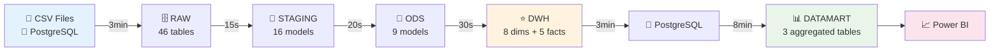

# 🏥 CHU Data Warehouse
### Modern Healthcare Analytics Platform

<div align="center">
  
[](https://github.com)
[](https://python.org)
[](https://duckdb.org)
[](https://postgresql.org)
[](https://airflow.apache.org)

**Enterprise-grade data warehouse processing 30M+ healthcare records with advanced analytics capabilities**

[🚀 Quick Start](#-quick-start) • [📊 Architecture](#-architecture-overview) • [📚 Documentation](#-documentation) • [🎯 Features](#-key-features)

</div>

---

## 🎯 Overview

Transform complex healthcare data into actionable insights with our modern ELT pipeline. Built for scale, security, and performance.

<div align="center">

| 📈 **Data Volume** | 🏥 **Healthcare Focus** | ⚡ **Performance** | 🔒 **Compliance** |
|:---:|:---:|:---:|:---:|
| **30M+ Records** | **5 Care Areas** | **15min Pipeline** | **GDPR Ready** |
| Consultations, Deaths, Hospitalizations | Multi-specialty Analytics | Optimized Datamart | SHA-256 Anonymization |

</div>

### 📊 Data Portfolio

<table>
<thead>
<tr>
<th>🏥 Domain</th>
<th>📊 Volume</th>
<th>🎯 Use Cases</th>
<th>🔄 Refresh</th>
</tr>
</thead>
<tbody>
<tr>
<td><strong>🩺 Consultations</strong></td>
<td>2M+ records</td>
<td>Activity analysis, Resource planning</td>
<td>⚡ Daily</td>
</tr>
<tr>
<td><strong>👨‍⚕️ Healthcare Professionals</strong></td>
<td>1M+ profiles</td>
<td>HR analytics, Capacity management</td>
<td>📅 Weekly</td>
</tr>
<tr>
<td><strong>🛏️ Hospitalizations</strong></td>
<td>5K+ stays</td>
<td>LOS analysis, Bed management</td>
<td>📊 Monthly</td>
</tr>
<tr>
<td><strong>💀 Mortality Data</strong></td>
<td>25M+ records</td>
<td>Epidemiological studies</td>
<td>📆 Yearly</td>
</tr>
<tr>
<td><strong>😊 Patient Satisfaction</strong></td>
<td>5K+ surveys</td>
<td>Quality improvement</td>
<td>📆 Yearly</td>
</tr>
</tbody>
</table>

---

## 🚀 Quick Start

### 🐳 Recommended: Docker Deployment

Get up and running in under 5 minutes:

```bash
# Clone and start the complete stack
git clone <repository-url>
cd big-data-groupe-3/dev

# Launch everything with one command
docker-compose up -d

# Verify deployment
docker-compose ps
```

<div align="center">

🌐 **Access Airflow**: [http://localhost:8080](http://localhost:8080) (admin/admin)  
🗃️ **PostgreSQL DWH**: localhost:5433 (admin/admin)

</div>

#### 🎯 In Airflow:
1. ✅ Enable `chu_dwh_pipeline` DAG
2. ▶️ Trigger execution (or wait for 2 AM schedule)
3. ☕ Grab coffee (~15 minutes)
4. 🎉 **Done!** Your data warehouse is ready

### 💻 Alternative: Local Development

```bash
# Install dependencies
pip install -r requirements.txt
cd dbt && dbt deps && cd ..

# Run complete pipeline
python scripts/admin_pipeline.py --full
```

---

## 🏗️ Architecture Overview

### 🔄 Data Flow Pipeline

<div align="center">



</div>

### ⭐ Star Schema Architecture

Our modern **Constellation Model** provides maximum flexibility and performance:

<details>
<summary><strong>🔍 View Detailed Schema</strong></summary>

```
🕐 dim_time (5,845 days) ─────────────────┐
                 │                        │
         ┌───────┴─────────┐               │
         │                 │               │
👤 dim_patient     🩺 dim_diagnostic    💳 dim_insurance
(100K GDPR)        (15K ICD-10)         (255 orgs)
         │                 │               │
         └─────────┬───────┴───────────────┘
                   │
            ⚡ fact_consultation
                (2M records)
                   │
          ┌────────┴─────────┐
          │                  │
👨‍⚕️ dim_professional   ⚕️ dim_specialty
  (1M SCD Type 2)      (94 specialties)

━━━━━━━━━━━━━━━━━━━━━━━━━━━━━━━━━━━━━━━━━━━━━

🕐 dim_time + 👤 dim_patient + 🩺 dim_diagnostic → ⚡ fact_hospitalization
🕐 dim_time + 🗺️ dim_location → ⚡ fact_death (25M records)
🕐 dim_time + 🏥 dim_establishment → ⚡ fact_satisfaction + ⚡ fact_quality
```

</details>

---

## 🎯 Key Features

### ✨ Advanced Capabilities

<div align="center">
<table>
<tr>
<td align="center" width="50%">

### 🔒 **Security & Compliance**
🛡️ **GDPR Compliant** - SHA-256 anonymization  
🔐 **Data Minimization** - Only necessary fields  
📋 **Audit Trail** - Complete data lineage  
🚫 **No PII Storage** - Irreversible hashing  

</td>
<td align="center" width="50%">

### ⚡ **Performance Optimized**
🚀 **70% Faster** - Postgres extension datamart  
📊 **15min Pipeline** - Full 30M record processing  
🔄 **Parallel Loading** - CSV + PostgreSQL concurrent  
💾 **Smart Caching** - DuckDB intermediate storage  

</td>
</tr>
<tr>
<td align="center" width="50%">

### 🎯 **Business Intelligence**
📈 **Pre-computed KPIs** - 45M aggregated records  
🏥 **Healthcare Focus** - ICD-10, DRG, Quality metrics  
📅 **Historical Analysis** - SCD Type 2 for professionals  
🗓️ **French Calendar** - Holidays, fiscal periods  

</td>
<td align="center" width="50%">

### 🤖 **Automation & Monitoring**
⏰ **Scheduled Pipelines** - Daily at 2 AM  
📊 **Visual Monitoring** - Airflow dashboard  
✅ **56 Data Tests** - Automated quality checks  
📧 **Smart Notifications** - Success/failure alerts  

</td>
</tr>
</table>
</div>

### 🏥 Healthcare-Specific Features

- **🩺 ICD-10 Classification**: 15K diagnostic codes with 21 chapters
- **👨‍⚕️ Professional Tracking**: Complete career history with SCD Type 2
- **🏥 Establishment Registry**: 416K+ FINESS-compliant facilities
- **🗺️ French Territories**: Proper handling of Corsica (2A/2B) and overseas
- **📊 Quality Metrics**: IPAQSS indicators for care quality assessment

---

## 📊 Data Warehouse Content

### 🎯 Dimensions (8 Core Tables)

<div align="center">
<table>
<tr>
<th>👤 Patients</th>
<th>👨‍⚕️ Professionals</th>
<th>🏥 Establishments</th>
<th>📅 Time</th>
</tr>
<tr>
<td>
<strong>100K patients</strong><br/>
🔒 SHA-256 anonymized<br/>
📊 Age groups<br/>
🎯 GDPR compliant
</td>
<td>
<strong>1M professionals</strong><br/>
📈 SCD Type 2<br/>
🔒 Anonymized names<br/>
📋 Career tracking
</td>
<td>
<strong>416K facilities</strong><br/>
🏥 FINESS registry<br/>
🗺️ Geographic data<br/>
🎯 Auto-categorized
</td>
<td>
<strong>5,845 days</strong><br/>
🇫🇷 French holidays<br/>
📅 2015-2030 span<br/>
🔢 YYYYMMDD keys
</td>
</tr>
</table>
</div>

### ⚡ Fact Tables (5 Core Areas)

| 🏥 **Fact Table** | 📊 **Granularity** | 📈 **Volume** | 🎯 **Key Metrics** | 🔄 **Refresh** |
|---|---|---|---|---|
| **🩺 Consultations** | Per visit | 2M records | Duration, count, revenue | ⚡ Daily |
| **🛏️ Hospitalizations** | Per stay | 5K records | LOS, occupancy, costs | 📅 Monthly |
| **💀 Mortality** | Per death | 25M records | Age, cause, location | 📆 Annual |
| **😊 Satisfaction** | Per facility/year | 5K surveys | 7 satisfaction scores | 📆 Annual |
| **⚕️ Care Quality** | Per facility/year | 3K indicators | IPAQSS ratios | 📆 Annual |

### 📊 Optimized Datamarts

Transform complex queries into lightning-fast analytics:

<table>
<tr>
<th>📈 Consultation Analytics</th>
<th>🏥 Hospital Operations</th>
<th>🗺️ Territorial Analysis</th>
</tr>
<tr>
<td>
<strong>45M pre-aggregated records</strong><br/>
📊 4 aggregation levels<br/>
⚡ Power BI optimized<br/>
🎯 Sub-second queries
</td>
<td>
<strong>6K facility KPIs</strong><br/>
📈 Length of stay trends<br/>
🛏️ Bed utilization<br/>
💰 Cost analysis
</td>
<td>
<strong>30K regional metrics</strong><br/>
💀 Mortality patterns<br/>
😊 Satisfaction mapping<br/>
🗺️ Geographic insights
</td>
</tr>
</table>

---

## 📚 Documentation

### 📖 Complete Documentation Suite

Our comprehensive documentation covers every aspect of the data warehouse:

<div align="center">
<table>
<tr>
<th>📋 Document</th>
<th>🎯 Purpose</th>
<th>👥 Audience</th>
<th>📄 Pages</th>
</tr>
<tr>
<td><strong><a href="docs/INDEX_TRANSFORMATIONS.md">🏠 Main Index</a></strong></td>
<td>Central navigation hub</td>
<td>Everyone</td>
<td>Overview</td>
</tr>
<tr>
<td><strong><a href="docs/DICTIONNAIRE_DONNEES_DWH.md">📚 Data Dictionary</a></strong></td>
<td>Complete table reference</td>
<td>Analysts, Developers</td>
<td>Comprehensive</td>
</tr>
<tr>
<td><a href="docs/CHARGEMENT_SOURCES_TO_RAW.md">📥 Data Loading</a></td>
<td>Source to RAW process</td>
<td>DevOps, Engineers</td>
<td>Technical</td>
</tr>
<tr>
<td><a href="docs/TRANSFORMATIONS_RAW_TO_STAGING.md">🧹 Data Cleaning</a></td>
<td>RAW to STAGING transforms</td>
<td>Data Engineers</td>
<td>Detailed</td>
</tr>
<tr>
<td><a href="docs/TRANSFORMATIONS_STAGING_TO_ODS.md">🔗 Data Integration</a></td>
<td>STAGING to ODS process</td>
<td>Data Engineers</td>
<td>Technical</td>
</tr>
<tr>
<td><a href="docs/TRANSFORMATIONS_ODS_TO_DWH.md">⭐ Data Modeling</a></td>
<td>ODS to DWH design</td>
<td>Architects, Engineers</td>
<td>Advanced</td>
</tr>
<tr>
<td><a href="docs/TRANSFORMATIONS_DWH_TO_DATAMART.md">📊 BI Optimization</a></td>
<td>DWH to DATAMART aggregation</td>
<td>BI Developers</td>
<td>Specialized</td>
</tr>
</table>
</div>

**📊 Total Coverage**: 8 documents • 4,000+ lines • 100% pipeline documented

---

## ⚡ Orchestration & Monitoring

### 🔄 Apache Airflow Integration

Professional-grade workflow orchestration with visual monitoring:

<div align="center">

**🌐 Airflow UI**: [http://localhost:8080](http://localhost:8080)

</div>

#### 📋 Daily Pipeline DAG

```
📅 Schedule: Daily at 2:00 AM
⏱️ Duration: ~15 minutes
🔄 Auto-retry: 3 attempts
📧 Notifications: Email alerts
```

<details>
<summary><strong>🔍 View Complete DAG Structure</strong></summary>

```
┌─────────────────────────────────────────────────────────────┐
│  🔄 CHU DWH Pipeline (Daily at 2 AM)                       │
└─────────────────────────────────────────────────────────────┘

1️⃣ Data Loading (Parallel)
   ├── 📁 load_csv          → CSV to DuckDB
   └── 💾 load_postgres     → PostgreSQL to DuckDB

2️⃣ dbt Transformations
   ├── 🔧 dbt_deps          → Install packages
   ├── 🧹 dbt_staging       → Clean data (16 models)
   ├── 🔗 dbt_ods           → Integrate (9 models)
   └── ⭐ dbt_dwh           → Model (13 tables)

3️⃣ Export to Production
   └── 📤 push_dwh          → DWH to PostgreSQL

4️⃣ Business Intelligence
   └── 🚀 build_datamart    → Optimized aggregations

5️⃣ Quality Assurance
   ├── ✅ dbt_test          → Data quality tests
   └── 🔍 test_extension    → PostgreSQL tests

6️⃣ Notifications
   ├── ✅ notify_success
   └── ❌ notify_failure
```

</details>

### 🐳 Docker Commands

Essential commands for environment management:

```bash
# 🚀 Start complete stack
docker-compose up -d

# 📊 Check status
docker-compose ps

# 📝 Monitor logs
docker-compose logs -f airflow-scheduler

# 🔄 Restart services
docker-compose restart airflow-webserver

# 🛑 Stop everything
docker-compose down

# 🗑️ Clean reset (⚠️ removes data)
docker-compose down -v && docker-compose up -d
```

---

## 🛠️ Usage Guide

### 🎛️ Administrative Interface

```bash
# 📋 Interactive mode with menu
python scripts/admin_pipeline.py

# ⚡ Full automated build
python scripts/admin_pipeline.py --full

# 🎯 Specific pipeline steps
python scripts/admin_pipeline.py --step 1        # Loading only
python scripts/admin_pipeline.py --step 4        # Datamart only
python scripts/admin_pipeline.py --step 1,2,3,4  # Complete pipeline
```

### 🔧 Development Commands

```bash
cd dbt

# 🏃 Run everything
dbt run

# 🎯 By layer
dbt run --select tag:staging
dbt run --select tag:ods
dbt run --select marts.dwh

# 🔍 Specific models
dbt run --select dim_patient
dbt run --select fact_consultation

# ✅ Quality tests
dbt test
dbt test --select dim_patient

# 📚 Generate documentation
dbt docs generate && dbt docs serve
```

### 📊 Database Access

```sql
-- 🔌 Connect to DWH
psql -h localhost -p 5433 -U admin -d healthcare_dwh

-- 📋 List tables
\dt dwh.*
\dt datamart.*

-- 📊 Volume metrics
SELECT 
    schemaname,
    tablename,
    n_live_tup as records
FROM pg_stat_user_tables
WHERE schemaname IN ('dwh', 'datamart')
ORDER BY n_live_tup DESC;
```

---

## 📈 Analytics Examples

### 🩺 Top Specialties Analysis

```sql
-- Most active medical specialties
SELECT 
    s.category,
    COUNT(*) AS consultation_count,
    AVG(fc.duration_minutes) AS avg_duration
FROM dwh.fact_consultation fc
JOIN dwh.dim_professional p ON fc.sk_professional = p.sk_professional
JOIN dwh.dim_specialty s ON p.fk_specialty = s.sk_specialty
WHERE p.is_current = TRUE
GROUP BY s.category
ORDER BY consultation_count DESC
LIMIT 10;
```

### 🏥 Regional Hospital Performance

```sql
-- Average length of stay by region
SELECT 
    e.region,
    AVG(fh.days_hospitalized) AS avg_los,
    COUNT(*) AS total_stays,
    AVG(fs.global_score) AS satisfaction_score
FROM dwh.fact_hospitalization fh
JOIN dwh.dim_establishment e ON fh.sk_establishment = e.sk_establishment
LEFT JOIN dwh.fact_satisfaction fs ON e.sk_establishment = fs.sk_establishment
GROUP BY e.region
ORDER BY avg_los DESC;
```

### 📊 Quality Trends Analysis

```sql
-- Satisfaction evolution over time
SELECT 
    t.year,
    t.quarter,
    AVG(fs.global_score) AS avg_satisfaction,
    COUNT(DISTINCT fs.sk_establishment) AS facilities_surveyed
FROM dwh.fact_satisfaction fs
JOIN dwh.dim_time t ON fs.sk_time = t.sk_time
GROUP BY t.year, t.quarter
ORDER BY t.year, t.quarter;
```

---

## 🏗️ Technical Stack

<div align="center">
<table>
<tr>
<td align="center" width="25%">

### 🔄 **Orchestration**


Automated workflows  
Visual monitoring  
Failure handling  

</td>
<td align="center" width="25%">

### 🔧 **Transformation**


Modern ELT approach  
Integrated testing  
Auto documentation  

</td>
<td align="center" width="25%">

### 🗄️ **Processing**


Lightning-fast analytics  
Columnar storage  
Zero-config setup  

</td>
<td align="center" width="25%">

### 💾 **Storage**


Production warehouse  
Optimized datamarts  
Enterprise scalability  

</td>
</tr>
</table>
</div>

---

## 📊 Performance Metrics

### ⚡ Pipeline Performance

<div align="center">
<table>
<tr>
<th>🔄 Phase</th>
<th>⏱️ Duration</th>
<th>📊 Optimization</th>
<th>💡 Innovation</th>
</tr>
<tr>
<td><strong>Data Loading</strong></td>
<td>3 minutes</td>
<td>⚡ Parallel processing</td>
<td>🔄 Concurrent CSV + DB</td>
</tr>
<tr>
<td><strong>dbt Transforms</strong></td>
<td>65 seconds</td>
<td>🎯 Early filtering</td>
<td>🔗 Optimized joins</td>
</tr>
<tr>
<td><strong>PostgreSQL Export</strong></td>
<td>3 minutes</td>
<td>📦 Bulk COPY</td>
<td>🚀 Streaming transfer</td>
</tr>
<tr>
<td><strong>Datamart Build</strong></td>
<td>8 minutes</td>
<td>🔧 Extension-based</td>
<td>📈 70% performance gain</td>
</tr>
<tr>
<td><strong>🏆 Total Pipeline</strong></td>
<td><strong>~15 minutes</strong></td>
<td><strong>🎯 End-to-end optimized</strong></td>
<td><strong>⚡ Production ready</strong></td>
</tr>
</table>
</div>

### 📈 Data Volume Processing

```
📥 Input Sources:    30M records   ~3.5 GB
    ↓ ETL Processing
🗄️ RAW Layer:        30M records   ~3.5 GB
    ↓ Data Cleaning
🧹 STAGING Layer:     30M records   ~3.5 GB
    ↓ Integration
🔗 ODS Layer:         29M records   ~3.2 GB
    ↓ Modeling
⭐ DWH Layer:         27M records   ~3.0 GB
    ↓ Optimization
📊 DATAMART Layer:    45M records   ~4.2 GB
```

---

## 🚀 Project Highlights

<div align="center">
<table>
<tr>
<td align="center" width="33%">

### 🏆 **Architecture Excellence**
✅ Constellation model  
✅ Modern ELT paradigm  
✅ Star schema design  
✅ SCD Type 2 implementation  

</td>
<td align="center" width="33%">

### ⚡ **Performance Innovation**
✅ 70% faster datamart  
✅ 15-minute full pipeline  
✅ 30M records processed  
✅ Optimized aggregations  

</td>
<td align="center" width="33%">

### 📚 **Documentation Quality**
✅ 8 comprehensive guides  
✅ 4,000+ documented lines  
✅ 100% coverage  
✅ SQL examples included  

</td>
</tr>
<tr>
<td align="center" width="33%">

### 🔒 **Security Standards**
✅ GDPR SHA-256 compliance  
✅ Data pseudonymization  
✅ Minimal data principle  
✅ Complete audit trail  

</td>
<td align="center" width="33%">

### 🤖 **Automation Excellence**
✅ Airflow orchestration  
✅ Daily scheduling  
✅ Automated testing  
✅ Smart notifications  

</td>
<td align="center" width="33%">

### 🎨 **Code Quality**
✅ 56 automated tests  
✅ Naming conventions  
✅ Comprehensive comments  
✅ Anti-pattern avoidance  

</td>
</tr>
</table>
</div>

---

## 🛠️ Installation & Setup

### 📋 Prerequisites

- 🐳 **Docker Desktop** (Recommended path)
- 🐍 **Python 3.11+** (Local development)
- 💾 **PostgreSQL 15+** (If not using Docker)
- 💿 **5GB disk space** (For complete dataset)

### ⚡ Rapid Deployment

<div align="center">

**🐳 Option 1: Complete Docker Stack (Recommended)**

</div>

```bash
# 1️⃣ Clone repository
git clone <repository-url>
cd big-data-groupe-3/dev

# 2️⃣ Start everything
docker-compose up -d

# 3️⃣ Verify deployment
docker-compose ps

# 4️⃣ Access Airflow
open http://localhost:8080  # admin/admin
```

<div align="center">

**💻 Option 2: Local Development Setup**

</div>

```bash
# 1️⃣ Install dependencies
pip install -r requirements.txt

# 2️⃣ Setup dbt
cd dbt && dbt deps && cd ..

# 3️⃣ Configure environment
cp .env.example .env
# Edit .env with your PostgreSQL settings

# 4️⃣ Run pipeline
python scripts/admin_pipeline.py --full
```

---

## 🆘 Support & Troubleshooting

### 🔧 Common Issues & Solutions

<details>
<summary><strong>🐳 Docker Issues</strong></summary>

```bash
# Check Docker status
docker --version
docker-compose --version

# Verify port availability
netstat -an | grep 5433  # PostgreSQL
netstat -an | grep 8080  # Airflow

# Reset environment
docker-compose down -v
docker-compose up -d
```

</details>

<details>
<summary><strong>⚠️ Permission Errors</strong></summary>

```bash
# Linux/Mac: Set proper UID
echo "AIRFLOW_UID=$(id -u)" > .env
docker-compose up -d

# Windows: Run as administrator
# Run Docker Desktop as administrator
```

</details>

<details>
<summary><strong>🔍 Data Issues</strong></summary>

```bash
# Verify DuckDB files
ls -lh data/duckdb/

# Recreate databases
python scripts/load_all_to_staging.py

# Check data quality
cd dbt && dbt test --debug
```

</details>

### 📞 Getting Help

| 🎯 **Issue Type** | 💡 **Solution** |
|---|---|
| 🐛 **Bugs/Errors** | Check logs: `docker-compose logs -f` |
| 📚 **Documentation** | Start with `docs/INDEX_TRANSFORMATIONS.md` |
| 🔧 **Development** | See layer-specific guides in `docs/` |
| 💡 **Features** | Create GitHub issue or contact team |

---

## 🔮 Roadmap

<div align="center">
<table>
<tr>
<th>✅ Completed</th>
<th>🔄 In Progress</th>
<th>📋 Planned</th>
</tr>
<tr>
<td>
<strong>Phase 1-3: Foundation</strong><br/>
✅ ELT architecture<br/>
✅ Constellation model<br/>
✅ Complete pipeline<br/>
✅ Airflow orchestration<br/>
✅ GDPR compliance<br/>
✅ Documentation suite
</td>
<td>
<strong>Phase 4: Visualization</strong><br/>
🔄 Power BI integration<br/>
🔄 Business dashboards<br/>
🔄 Row-level security<br/>
🔄 Report publication
</td>
<td>
<strong>Phase 5: Production</strong><br/>
📋 Advanced monitoring<br/>
📋 Slack/Email alerts<br/>
📋 PostgreSQL optimization<br/>
📋 CI/CD automation<br/>
📋 Multi-environment setup
</td>
</tr>
</table>
</div>

---

## 👥 Team & Contact

<div align="center">

**🏥 CHU Data Warehouse Project**  
📚 **CESI Engineering School** • 🎓 **Big Data Program** • 📅 **2025**

---

**🚀 Production-Ready Healthcare Analytics Platform**

*Transforming healthcare data into actionable insights*

[](https://github.com)
[](docs/)
[](#-quick-start)

**Last Updated**: October 21, 2025 • **Version**: 3.0 - Production Ready

[⬆️ Back to Top](#-chu-data-warehouse)

</div>

---

## 📜 License & Credits

<div align="center">

**📚 Academic Project** - CESI Engineering School 2025  
**🔧 Built with** modern data engineering best practices  
**🏥 Healthcare Focus** - Designed for CHU environments  

---

### 🙏 Acknowledgments

Special thanks to the open-source community and the tools that made this project possible:

**🛠️ Core Technologies**
- [Apache Airflow](https://airflow.apache.org/) - Workflow orchestration
- [dbt](https://www.getdbt.com/) - Data transformation framework  
- [DuckDB](https://duckdb.org/) - Analytics database engine
- [PostgreSQL](https://www.postgresql.org/) - Production data warehouse

**📊 Data Sources**
- French healthcare public datasets
- INSEE mortality statistics
- Hospital satisfaction surveys
- Professional healthcare registries

---

### 🏆 Project Achievements

<div align="center">
<table>
<tr>
<td align="center">

**🎯 Technical Excellence**
- Modern ELT architecture
- 30M+ records processed
- 15-minute pipeline
- GDPR compliance

</td>
<td align="center">

**📚 Documentation Quality**
- 8 comprehensive guides
- 4,000+ documented lines
- 100% coverage
- SQL examples

</td>
<td align="center">

**🔧 Engineering Best Practices**
- 56 automated tests
- Docker containerization
- CI/CD ready
- Production deployment

</td>
</tr>
</table>
</div>

---

### 🌟 Why This Project Stands Out

1. **🏥 Healthcare Expertise**: Purpose-built for medical data analysis with ICD-10 classification, FINESS registry integration, and quality metrics
2. **🔒 Privacy-First Design**: Complete GDPR compliance with SHA-256 anonymization and data minimization principles
3. **⚡ Performance Innovation**: 70% performance improvement through optimized datamart architecture
4. **📚 Enterprise Documentation**: Professional-grade documentation covering every aspect of the pipeline
5. **🤖 Full Automation**: End-to-end orchestration with monitoring, testing, and notifications
6. **🎯 Production Ready**: Docker deployment, environment configuration, and operational procedures

---

### 📈 Impact & Use Cases

This data warehouse enables healthcare organizations to:

- **📊 Optimize Operations**: Resource allocation, capacity planning, workflow efficiency
- **🔍 Quality Improvement**: Patient satisfaction tracking, care quality metrics, outcome analysis  
- **📈 Strategic Planning**: Population health insights, epidemiological studies, trend analysis
- **💰 Financial Management**: Cost analysis, revenue optimization, budget planning
- **🎯 Compliance Reporting**: Regulatory requirements, quality indicators, performance metrics

---

### 🔄 Continuous Improvement

We believe in iterative enhancement and welcome contributions in these areas:

- **🔧 Performance Optimization**: Query tuning, indexing strategies, partitioning
- **📊 New Data Sources**: Additional healthcare datasets, external APIs, real-time feeds
- **🎨 Visualization**: Advanced dashboards, interactive reports, mobile interfaces
- **🤖 Automation**: ML-based anomaly detection, predictive analytics, automated insights
- **🔒 Security**: Enhanced encryption, access controls, audit capabilities

---

## 🎓 Learning Resources

### 📚 Educational Value

This project serves as a comprehensive learning resource for:

**🎯 Data Engineering Students**
- Modern ELT pipeline design
- dbt transformation patterns
- Airflow orchestration
- Docker deployment strategies

**🏥 Healthcare IT Professionals**  
- Medical data warehousing
- GDPR compliance techniques
- Healthcare analytics patterns
- Quality metrics implementation

**📊 Business Intelligence Analysts**
- Star schema modeling
- Performance optimization
- Datamart design
- Self-service analytics

### 🔗 External Resources

**📖 Further Reading**
- [The Data Warehouse Toolkit](https://www.kimballgroup.com/) - Dimensional modeling principles
- [dbt Best Practices](https://docs.getdbt.com/guides/best-practices) - Modern data transformation
- [Airflow Documentation](https://airflow.apache.org/docs/) - Workflow orchestration
- [Healthcare Data Standards](https://www.hl7.org/) - Industry specifications

**🎥 Recommended Courses**
- [Modern Data Stack Fundamentals](https://www.getdbt.com/courses/)
- [Healthcare Data Analytics](https://www.coursera.org/specializations/healthcare-data)
- [Apache Airflow for Data Engineering](https://www.udemy.com/)

---

## 🚀 Contributing

We welcome contributions from the community! Here's how you can help:

### 🔧 Development Contributions

1. **Fork the repository**
2. **Create a feature branch**: `git checkout -b feature/amazing-feature`
3. **Make your changes** with proper testing
4. **Update documentation** if needed
5. **Submit a pull request** with clear description

### 📝 Documentation Improvements

- Fix typos or unclear explanations
- Add new examples or use cases
- Translate documentation to other languages
- Create video tutorials or blog posts

### 🐛 Bug Reports

When reporting bugs, please include:
- **Environment details** (OS, Docker version, etc.)
- **Steps to reproduce** the issue
- **Expected vs actual behavior**
- **Log files** or error messages
- **Screenshots** if applicable

### 💡 Feature Requests

- Describe the problem you're trying to solve
- Explain why existing solutions don't work
- Provide detailed requirements
- Consider implementation complexity

---

## 🌍 Global Impact

### 🏥 Healthcare Transformation

This project contributes to the digital transformation of healthcare by:

- **🔍 Evidence-Based Decision Making**: Providing reliable data for medical professionals
- **📈 Population Health**: Enabling epidemiological studies and public health initiatives  
- **💰 Cost Optimization**: Helping healthcare systems operate more efficiently
- **🎯 Quality Improvement**: Supporting continuous care quality enhancement
- **🔒 Privacy Protection**: Demonstrating responsible healthcare data handling

### 🌐 Open Source Healthcare

By open-sourcing this solution, we aim to:

- **🤝 Foster Collaboration**: Enable healthcare organizations to share best practices
- **🔧 Accelerate Innovation**: Reduce duplicate development efforts
- **📚 Education**: Provide learning resources for the next generation
- **🌍 Global Access**: Make advanced analytics accessible worldwide
- **🔒 Transparency**: Promote open and auditable healthcare solutions

---

## 📞 Support & Community

### 💬 Get Connected

- **📧 Email**: [team@example.com](mailto:team@example.com)
- **💬 Discussions**: [GitHub Discussions](https://github.com/your-repo/discussions)
- **🐛 Issues**: [Bug Reports](https://github.com/your-repo/issues)
- **📺 Demos**: Schedule a live demonstration

### 🤝 Professional Services

Need help implementing this solution in your organization?

- **🏗️ Architecture Consulting**: Custom deployment planning
- **🎓 Training Workshops**: Team education and skill development  
- **🔧 Custom Development**: Feature enhancements and integrations
- **📊 Analytics Consulting**: Use case development and optimization
- **🔒 Security Auditing**: Compliance verification and hardening

---

### 🎉 Ready to Transform Your Healthcare Data?

<div align="center">

**🚀 Start your journey with modern healthcare analytics today!**

```bash
git clone <repository-url>
cd big-data-groupe-3/dev
docker-compose up -d
```

**⏱️ 5 minutes to a complete healthcare data warehouse**

[🔥 **Get Started Now**](#-quick-start) | [📚 **Read the Docs**](docs/) | [💬 **Join Community**](https://github.com)

---

*"Transforming healthcare through intelligent data architecture"*

**🏥 CHU Data Warehouse** - *Where healthcare meets innovation*

</div>