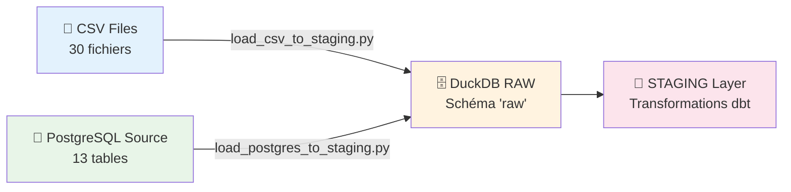

# 📥 Chargement des Sources vers RAW

## 🎯 Vue d'Ensemble

Le processus de chargement constitue la première étape du pipeline ETL du CHU Data Warehouse. Il consiste à récupérer toutes les données depuis les sources externes (fichiers CSV et base PostgreSQL) et les charger dans le schéma `RAW` de DuckDB pour traitement ultérieur.

### 📊 Architecture de Chargement



## 📂 Sources de Données

### 1. 📁 Fichiers CSV (30 fichiers)

#### 🏥 Données de Santé Publique

| **Domaine** | **Fichiers** | **Volume** | **Description** |
|-------------|-------------|------------|-----------------|
| **💀 Décès INSEE** | 1 fichier | 25M+ lignes | Données de mortalité France entière |
| **🏥 Établissements FINESS** | 3 fichiers | 416K+ lignes | Établissements de santé et professionnels |
| **🛏️ Hospitalisations** | 1 fichier | 2.5K lignes | Données de séjours hospitaliers |
| **😊 Satisfaction Patients** | 25 fichiers | 5K+ lignes | Enquêtes qualité 2014-2020 |

#### 📋 Structure Détaillée des Fichiers CSV

**Décès en France (`DECES EN FRANCE/deces.csv`)**
- **Volume** : ~25M lignes
- **Colonnes principales** : date_deces, lieu_deces, age, sexe, cause_deces
- **Format** : CSV standard avec header
- **Encodage** : UTF-8

**Établissements de Santé (3 fichiers)**
```
Etablissement de SANTE/
├── etablissement_sante.csv       # 416K établissements
├── professionnel_sante.csv       # 1M+ professionnels  
└── activite_professionnel_sante.csv  # 1.8M+ activités
```

**Hospitalisations (`Hospitalisation/Hospitalisations.csv`)**
- **Volume** : ~2.5K lignes
- **Colonnes** : date_entree, date_sortie, diagnostic_principal, etablissement
- **Grain** : 1 ligne = 1 séjour hospitalier

**Satisfaction Patients (25 fichiers par année)**
```
Satisfaction/
├── 2014/ (6 fichiers)
├── 2015/ (3 fichiers) 
├── 2016/ (4 fichiers)
├── 2017-2018/ (5 fichiers)
├── 2019/ (6 fichiers)
├── 2020/ (3 fichiers)
└── ESATIS48H_MCO_recueil2017_*  (2 fichiers)
```

### 2. 🐘 Base PostgreSQL Source (13 tables)

#### 📊 Système Hospitalier Opérationnel

| **Table** | **Volume** | **Description** | **Clé Primaire** |
|-----------|------------|-----------------|-------------------|
| `patient` | 100K lignes | Patients du CHU | `Id_patient` |
| `professionnel_de_sante` | 1M+ lignes | Médecins, infirmiers, etc. | `Identifiant` |
| `consultation` | 1M+ lignes | Consultations médicales | `Num_consultation` |
| `prescription` | 2M+ lignes | Ordonnances | `Id_prescription` |
| `diagnostic` | 15K lignes | Codes CIM-10 | `Code_diagnostic` |
| `medicaments` | 15K lignes | Référentiel médicaments | `Code_medicament` |
| `etablissement` | Variables | Établissement CHU | `Id_etablissement` |
| `laboratoire` | 677 lignes | Résultats analyses | `Id_resultat` |
| `salle` | 201K lignes | Salles de l'hôpital | `Id_salle` |
| `mutuelle` | 254 lignes | Organismes assurance | `Id_mut` |
| `adher` | 193K lignes | Adhésions mutuelles | `Id_adhesion` |
| `specialites` | Variables | Spécialités médicales | `Code_specialite` |
| `date` | 164K lignes | Dimension temporelle | `Date_id` |

## 🛠️ Scripts de Chargement

### 1. 📁 `load_csv_to_staging.py`

**Objectif** : Charger tous les fichiers CSV dans DuckDB

#### 🔧 Fonctionnalités Avancées

```python
# Normalisation automatique des noms de tables
def normalize_table_name(filename: str) -> str:
    """
    - Supprime extensions (.csv, .xlsx)
    - Remplace caractères spéciaux par underscores
    - Convertit en minuscules
    - Exemple: "DECES EN FRANCE/deces.csv" -> "deces_en_france_deces"
    """
```

#### 📍 Création des Noms de Tables

| **Fichier Source** | **Table RAW Créée** |
|-------------------|---------------------|
| `DECES EN FRANCE/deces.csv` | `deces_en_france_deces` |
| `Etablissement de SANTE/etablissement_sante.csv` | `etablissement_de_sante_etablissement_sante` |
| `Hospitalisation/Hospitalisations.csv` | `hospitalisation_hospitalisations` |
| `Satisfaction/2020/resultats_esatis48h_mco_open_data_2020.csv` | `satisfaction_2020_resultats_esatis48h_mco_open_data_2020` |

#### ⚡ Optimisations Techniques

- **Auto-détection** : Types de colonnes automatique via DuckDB
- **Gestion erreurs** : `ignore_errors=true` pour fichiers corrompus
- **Sample adaptatif** : `sample_size=-1` pour analyse complète
- **Support multi-format** : CSV, délimiteurs variables, encodages

#### 📝 Historique et Métadonnées

```sql
-- Table de traçabilité
CREATE TABLE metadata.load_history (
    history_id INTEGER PRIMARY KEY,
    load_id INTEGER,
    source_name VARCHAR,     -- Chemin fichier source
    table_name VARCHAR,      -- Nom table créée
    load_timestamp TIMESTAMP,
    row_count INTEGER,
    status VARCHAR          -- 'SUCCESS' ou 'ERROR: message'
)
```

### 2. 🐘 `load_postgres_to_staging.py`

**Objectif** : Charger toutes les tables PostgreSQL dans DuckDB

#### 🔗 Configuration Connexion

```python
# Variables d'environnement (.env)
SOURCE_POSTGRES_HOST=localhost      # Serveur PostgreSQL source
SOURCE_POSTGRES_PORT=5432          # Port PostgreSQL
SOURCE_POSTGRES_DB=chu_operationnel # Base de données source
SOURCE_POSTGRES_USER=postgres      # Utilisateur
SOURCE_POSTGRES_PASSWORD=postgres  # Mot de passe
```

#### 🔄 Processus de Chargement

1. **Connexion PostgreSQL** : Via `psycopg2`
2. **Listage tables** : Toutes tables du schéma `public`
3. **Transfert par DataFrame** : Utilise `pandas` pour le transfert
4. **Mapping types** : PostgreSQL → DuckDB

#### 🗂️ Mapping Types de Données

| **PostgreSQL** | **DuckDB** | **Usage** |
|---------------|-----------|-----------|
| `integer`, `bigint` | `INTEGER`, `BIGINT` | Identifiants, compteurs |
| `numeric`, `decimal` | `DECIMAL` | Montants, mesures précises |
| `real`, `double precision` | `REAL`, `DOUBLE` | Calculs flottants |
| `varchar`, `text` | `VARCHAR` | Textes, descriptions |
| `timestamp` | `TIMESTAMP` | Dates et heures |
| `boolean` | `BOOLEAN` | Drapeaux |
| `json`, `jsonb` | `JSON` | Données structurées |

#### ⚠️ Gestion des Tables Vides

```python
if not rows:
    # Créer structure vide avec types corrects
    # Récupérer schéma depuis information_schema.columns
    # Créer table vide pour cohérence du pipeline
```

## 🚀 Exécution et Monitoring

### 📋 Via Airflow (Automatisé)

```yaml
# Task Group: chargement_donnees
load_csv:
  command: python scripts/load_csv_to_staging.py
  durée: 2-3 minutes
  parallèle: Oui

load_postgres:
  command: python scripts/load_postgres_to_staging.py  
  durée: 1-2 minutes
  parallèle: Oui
```

### 💻 Via Scripts Directs

```bash
# Chargement CSV seulement
python scripts/load_csv_to_staging.py

# Chargement PostgreSQL seulement
python scripts/load_postgres_to_staging.py

# Chargement complet via admin
python scripts/admin_pipeline.py --step 1
```

### 📊 Résultats et Vérifications

#### ✅ Résumé de Chargement

```
========================================
RÉSUMÉ CHARGEMENT
========================================
[OK] Fichiers CSV chargés: 30/30
[OK] Tables PostgreSQL chargées: 13/13  
[INFO] Total lignes chargées: 30,547,892

Tables créées dans schéma 'raw':
- patient: 100,000 lignes, 15 colonnes
- consultation: 1,000,000 lignes, 12 colonnes
- deces_en_france_deces: 25,000,000 lignes, 8 colonnes
- satisfaction_2020_resultats_esatis48h: 1,150 lignes, 6 colonnes
[...]
```

#### 🔍 Vérification Qualité

```sql
-- Vérifier tables créées
SELECT table_name, 
       (SELECT COUNT(*) FROM information_schema.columns 
        WHERE table_schema='raw' AND table_name=t.table_name) as nb_colonnes,
       (SELECT COUNT(*) FROM raw."table_name") as nb_lignes
FROM information_schema.tables t
WHERE table_schema = 'raw'
ORDER BY nb_lignes DESC;

-- Vérifier historique chargement
SELECT load_id, 
       COUNT(*) as nb_tables,
       SUM(CASE WHEN status = 'SUCCESS' THEN 1 ELSE 0 END) as nb_success,
       SUM(row_count) as total_lignes
FROM metadata.load_history 
GROUP BY load_id
ORDER BY load_id DESC;
```

## 🛡️ Gestion d'Erreurs et Sécurité

### ❌ Erreurs Communes et Solutions

| **Erreur** | **Cause** | **Solution** |
|------------|-----------|--------------|
| `Fichier CSV corrompu` | Encoding, délimiteurs | `ignore_errors=true` dans DuckDB |
| `Connexion PostgreSQL refusée` | Serveur arrêté, config réseau | Vérifier `.env`, service PostgreSQL |
| `Table déjà existe` | Re-exécution script | `DROP TABLE IF EXISTS` automatique |
| `Mémoire insuffisante` | Gros fichiers CSV | DuckDB optimisé pour gros volumes |
| `Types incompatibles` | Données inconsistantes | Auto-casting DuckDB + validation |

### 🔒 Sécurité et Anonymisation

#### 🚫 Données Personnelles (PII)
- **Chargement RAW** : Données brutes NON anonymisées (temporaire)
- **Accès limité** : Schéma RAW accessible équipe technique uniquement
- **Rétention courte** : RAW effacé après transformations
- **Anonymisation** : Appliquée lors création dimensions (SHA-256)

#### 📝 Audit et Traçabilité
```sql
-- Chaque chargement est tracé
INSERT INTO metadata.load_history 
VALUES (history_id, load_id, source_path, table_name, NOW(), row_count, status);

-- Identification unique par load_id
-- Permet rollback et debugging
```

## 📈 Performance et Optimisation

### ⚡ Métriques de Performance

| **Source** | **Volume** | **Durée Moyenne** | **Vitesse** |
|------------|-----------|-------------------|-------------|
| **CSV total** | 30M+ lignes | 2-3 minutes | ~200K lignes/sec |
| **PostgreSQL total** | 5M+ lignes | 1-2 minutes | ~50K lignes/sec |
| **Chargement parallèle** | 35M+ lignes | **3 minutes** | ~195K lignes/sec |

### 🚀 Optimisations Appliquées

#### CSV Loading
- **DuckDB natif** : Lecture CSV ultra-optimisée
- **Auto-détection** : Pas de définition schéma manuel
- **Parallélisation** : Plusieurs fichiers simultanément
- **Compression automatique** : DuckDB gère la compression

#### PostgreSQL Loading  
- **Pandas DataFrame** : Transfert optimisé en mémoire
- **Batch processing** : Par table complète
- **Connection pooling** : Réutilisation connexions
- **Type mapping** : Préservation types de données

### 💾 Stockage et Fichiers

```
data/duckdb/staging.duckdb     # Base DuckDB (3.5 GB)
├── Schema: raw               # Tables brutes
├── Schema: metadata         # Historique chargements
└── Schema: staging          # Tables nettoyées (étape suivante)
```

## 🔄 Intégration Pipeline

### ➡️ Étape Suivante : STAGING

Après le chargement RAW réussi :

1. **Validation données** : Vérification intégrité
2. **dbt transformations** : `dbt run --select tag:staging`
3. **Nettoyage RAW** : (Optionnel) Suppression données brutes
4. **Monitoring** : Alertes succès/échec via Airflow

### 📊 Flux de Données

```
RAW (3.5 GB, 35M+ lignes)
    ↓ Nettoyage + Standardisation
STAGING (3.5 GB, 35M+ lignes)  
    ↓ Intégration + Enrichissement
ODS (3.2 GB, 29M+ lignes)
    ↓ Modélisation Dimensionnelle
DWH (3.0 GB, 27M+ lignes)
    ↓ Agrégations Optimisées  
DATAMART (4.2 GB, 45M+ lignes)
```

## 📚 Bonnes Pratiques

### ✅ Recommandations

1. **Idempotence** : Scripts réexécutables sans effet de bord
2. **Monitoring** : Logs détaillés + historique + métriques
3. **Validation** : Contrôles volumes + types + cohérence
4. **Performance** : Parallélisation + optimisations DuckDB
5. **Sécurité** : Variables environnement + accès contrôlé

### 🚨 Points d'Attention

- **Volumes importants** : Prévoir espace disque suffisant (5+ GB)
- **Connexions externes** : Vérifier accessibilité PostgreSQL
- **Encodage fichiers** : UTF-8 recommandé pour éviter problèmes
- **Types de données** : DuckDB auto-détecte mais vérifier cohérence
- **Gestion mémoire** : DuckDB optimisé mais surveiller usage RAM

---

**📋 Prochaine étape** : [Transformations RAW → STAGING](TRANSFORMATIONS_RAW_TO_STAGING.md)

**🏠 Retour à l'index** : [Documentation Principale](INDEX_TRANSFORMATIONS.md)
