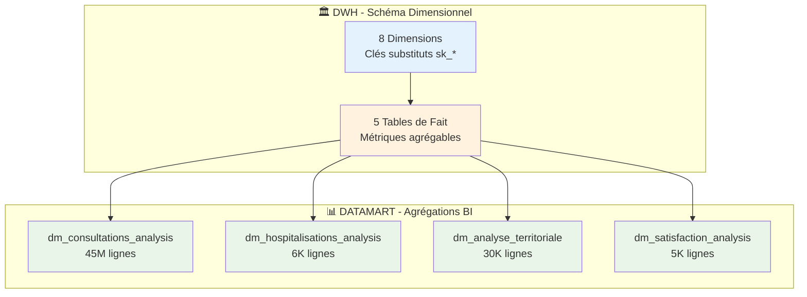

# 📚 Dictionnaire de Données - DWH & DATAMART

## 🎯 Vue d'Ensemble

Ce dictionnaire de données fournit une documentation complète de toutes les tables, colonnes et relations du **Data Warehouse** et des **Datamarts** du projet CHU. Il sert de référence technique pour les développeurs, analystes et utilisateurs métier.

### 📊 Architecture Globale



## 🏛️ SCHÉMA DWH - DIMENSIONS

### 1. 🕐 `dim_temps` - Dimension Temporelle

**Description** : Référentiel temporel complet couvrant la période 2015-2030 avec calendrier français.

| **Colonne** | **Type** | **Contrainte** | **Description** | **Exemple** |
|-------------|----------|----------------|-----------------|-------------|
| `sk_temps` | `BIGINT` | **PK, NOT NULL** | Clé substitut format YYYYMMDD | `20241207` |
| `date_complete` | `DATE` | **UK, NOT NULL** | Date complète | `2024-12-07` |
| `jour` | `INTEGER` | `1-31` | Jour du mois | `7` |
| `mois` | `INTEGER` | `1-12` | Mois | `12` |
| `trimestre` | `INTEGER` | `1-4` | Trimestre | `4` |
| `semestre` | `INTEGER` | `1-2` | Semestre | `2` |
| `annee` | `INTEGER` | `2015-2030` | Année | `2024` |
| `semaine_annee` | `INTEGER` | `1-53` | Semaine ISO | `49` |
| `jour_semaine` | `INTEGER` | `1-7` | Jour semaine (1=Lundi, 7=Dimanche) | `6` |
| `nom_jour` | `VARCHAR(10)` |  | Nom jour français | `Samedi` |
| `nom_mois` | `VARCHAR(10)` |  | Nom mois français | `Decembre` |
| `est_weekend` | `BOOLEAN` |  | Weekend (samedi/dimanche) | `true` |
| `est_ferie` | `BOOLEAN` |  | Jour férié français | `false` |
| `saison` | `VARCHAR(10)` |  | Saison météorologique | `Hiver` |
| `date_chargement` | `TIMESTAMP` | **NOT NULL** | Métadonnée technique | `2024-12-07 10:30:00` |

**Volumétrie** : 5,845 lignes (2015-01-01 à 2030-12-31)  
**Index principaux** : PK sur `sk_temps`, UK sur `date_complete`, Index sur `annee`

### 2. 👤 `dim_patient` - Dimension Patient (RGPD)

**Description** : Patients anonymisés conformes RGPD avec hachage SHA-256 des données personnelles.

| **Colonne** | **Type** | **Contrainte** | **Description** | **Exemple** |
|-------------|----------|----------------|-----------------|-------------|
| `sk_patient` | `INTEGER` | **PK, NOT NULL** | Clé substitut séquentielle | `12847` |
| `id_patient` | `INTEGER` | **UK, NOT NULL** | Business key (pour jointures) | `PAT001234` |
| `nom_hash` | `VARCHAR(64)` | **NOT NULL** | Nom anonymisé SHA-256 | `a7b8c9d0e1f2...` |
| `prenom_hash` | `VARCHAR(64)` | **NOT NULL** | Prénom anonymisé SHA-256 | `f2e1d0c9b8a7...` |
| `sexe` | `VARCHAR(1)` | `'M', 'F', 'I'` | Sexe (M/F/Inconnu) | `M` |
| `date_naissance` | `DATE` |  | Date naissance (peut être tronquée RGPD) | `1985-06-15` |
| `age` | `INTEGER` | `0-120` | Âge calculé | `39` |
| `tranche_age` | `VARCHAR(10)` |  | Classification âge | `31-50` |
| `groupe_sanguin` | `VARCHAR(3)` |  | Groupe sanguin | `A+` |
| `poids` | `DECIMAL(5,2)` | `> 0` | Poids en kg | `75.50` |
| `taille` | `INTEGER` | `> 0` | Taille en cm | `175` |
| `code_postal` | `VARCHAR(5)` |  | Code postal résidence | `75001` |
| `ville` | `VARCHAR(100)` |  | Ville résidence | `PARIS` |
| `pays` | `VARCHAR(3)` | Default 'FR' | Pays ISO | `FR` |
| `num_secu_hash` | `VARCHAR(64)` |  | Numéro sécurité sociale anonymisé | `1a2b3c4d5e6f...` |
| `date_chargement` | `TIMESTAMP` | **NOT NULL** | Métadonnée technique | `2024-12-07 10:30:00` |
| `date_modification` | `TIMESTAMP` | **NOT NULL** | Dernière modification | `2024-12-07 10:30:00` |

**Volumétrie** : ~100,000 lignes  
**Index principaux** : PK sur `sk_patient`, UK sur `id_patient`, Index sur `tranche_age`, `sexe`  
**Conformité RGPD** : ✅ Anonymisation SHA-256, pseudonymisation irréversible

### 3. 👨‍⚕️ `dim_professionnel` - Dimension Professionnel (SCD Type 2)

**Description** : Professionnels de santé avec historique des changements (Slowly Changing Dimension Type 2).

| **Colonne** | **Type** | **Contrainte** | **Description** | **Exemple** |
|-------------|----------|----------------|-----------------|-------------|
| `sk_professionnel` | `INTEGER` | **PK, NOT NULL** | Clé substitut unique par version | `45231` |
| `identifiant` | `VARCHAR(20)` | **NOT NULL** | Business key professionnel | `PROF789012` |
| `version_numero` | `INTEGER` | **NOT NULL** | Numéro version SCD Type 2 | `2` |
| `nom` | `VARCHAR(100)` | **NOT NULL** | Nom professionnel | `DUPONT` |
| `prenom` | `VARCHAR(100)` | **NOT NULL** | Prénom professionnel | `MARIE` |
| `profession` | `VARCHAR(100)` | **NOT NULL** | Profession/grade | `Medecin Generaliste` |
| `nom_specialite` | `VARCHAR(100)` |  | Spécialité médicale | `Medecine Generale` |
| `mode_exercice_libelle` | `VARCHAR(20)` |  | Mode exercice | `LIBERAL` |
| `etablissement_principal` | `VARCHAR(200)` |  | Établissement principal | `Cabinet Dr Dupont` |
| `date_debut_exercice` | `DATE` |  | Début exercice | `2010-01-15` |
| `date_debut_validite` | `TIMESTAMP` | **NOT NULL** | Début validité version SCD | `2024-01-01 00:00:00` |
| `date_fin_validite` | `TIMESTAMP` |  | Fin validité version SCD (NULL si actuelle) | `NULL` |
| `date_fin_exercice` | `DATE` |  | Fin exercice | `NULL` |
| `est_actuel` | `BOOLEAN` | **NOT NULL** | Version actuelle (true/false) | `true` |
| `fk_specialite` | `INTEGER` | **FK** | Clé étrangère vers dim_specialite | `12` |
| `fk_etablissement` | `INTEGER` | **FK** | Clé étrangère vers dim_etablissement | `5678` |
| `est_actif` | `BOOLEAN` |  | Professionnel actif | `true` |
| `date_chargement` | `TIMESTAMP` | **NOT NULL** | Métadonnée technique | `2024-12-07 10:30:00` |

**Volumétrie** : ~1,200,000 lignes (avec historique)  
**Index principaux** : PK sur `sk_professionnel`, Index sur `identifiant + est_actuel`, FK vers spécialités  
**SCD Type 2** : ✅ Une version actuelle par professionnel, historique préservé

### 4. 🏥 `dim_etablissement` - Dimension Établissement

**Description** : Établissements de santé français avec classification FINESS et géolocalisation.

| **Colonne** | **Type** | **Contrainte** | **Description** | **Exemple** |
|-------------|----------|----------------|-----------------|-------------|
| `sk_etablissement` | `INTEGER` | **PK, NOT NULL** | Clé substitut séquentielle | `98765` |
| `finess` | `VARCHAR(20)` | **UK, NOT NULL** | Identifiant FINESS site | `750712184` |
| `finess_etablissement_juridique` | `VARCHAR(20)` |  | FINESS entité juridique | `750100042` |
| `finess_site` | `VARCHAR(20)` |  | FINESS site géographique | `750712184` |
| `nom_etablissement` | `VARCHAR(200)` | **NOT NULL** | Raison sociale | `CHU Pitie-Salpetriere` |
| `type_etablissement` | `VARCHAR(50)` |  | Classification automatique | `CHU` |
| `categorie` | `VARCHAR(20)` |  | Secteur (Public/Privé/Médico-social) | `Public` |
| `region` | `VARCHAR(50)` |  | Région administrative | `Ile-de-France` |
| `departement` | `VARCHAR(3)` |  | Code département | `75` |
| `ville` | `VARCHAR(100)` |  | Commune | `PARIS` |
| `code_postal` | `VARCHAR(5)` |  | Code postal | `75013` |
| `adresse` | `VARCHAR(300)` |  | Adresse complète | `47-83 Boulevard de l Hopital` |
| `date_chargement` | `TIMESTAMP` | **NOT NULL** | Métadonnée technique | `2024-12-07 10:30:00` |

**Volumétrie** : ~416,000 lignes  
**Index principaux** : PK sur `sk_etablissement`, UK sur `finess`, Index sur `region`, `type_etablissement`

### 5. 🩺 `dim_diagnostic` - Dimension Diagnostic

**Description** : Classifications diagnostiques CIM-10 avec chapitres et catégories.

| **Colonne** | **Type** | **Contrainte** | **Description** | **Exemple** |
|-------------|----------|----------------|-----------------|-------------|
| `sk_diagnostic` | `INTEGER` | **PK, NOT NULL** | Clé substitut séquentielle | `1247` |
| `code_diagnostic` | `VARCHAR(10)` | **UK, NOT NULL** | Code CIM-10 | `I21.9` |
| `libelle_diagnostic` | `VARCHAR(300)` | **NOT NULL** | Libellé diagnostic | `Infarctus du myocarde, sans précision` |
| `chapitre_cim10` | `VARCHAR(100)` |  | Chapitre CIM-10 | `Maladies de l'appareil circulatoire` |
| `categorie_cim10` | `VARCHAR(50)` |  | Catégorie agrégée | `CARDIO_VASCULAIRE` |
| `code_chapitre` | `VARCHAR(5)` |  | Code chapitre (I00-I99) | `IX` |
| `est_actif` | `BOOLEAN` | Default true | Diagnostic valide | `true` |
| `date_chargement` | `TIMESTAMP` | **NOT NULL** | Métadonnée technique | `2024-12-07 10:30:00` |

**Volumétrie** : ~15,000 lignes  
**Index principaux** : PK sur `sk_diagnostic`, UK sur `code_diagnostic`, Index sur `chapitre_cim10`

### 6. 🎯 `dim_specialite` - Dimension Spécialité

**Description** : Spécialités médicales et fonctions des professionnels de santé.

| **Colonne** | **Type** | **Contrainte** | **Description** | **Exemple** |
|-------------|----------|----------------|-----------------|-------------|
| `sk_specialite` | `INTEGER` | **PK, NOT NULL** | Clé substitut séquentielle | `42` |
| `code_specialite` | `VARCHAR(10)` | **UK, NOT NULL** | Code spécialité | `MG` |
| `specialite` | `VARCHAR(100)` | **NOT NULL** | Nom spécialité | `Medecine Generale` |
| `fonction` | `VARCHAR(100)` |  | Fonction/grade | `Praticien` |
| `famille_specialite` | `VARCHAR(50)` |  | Famille regroupée | `MEDECINE` |
| `est_chirurgicale` | `BOOLEAN` |  | Spécialité chirurgicale | `false` |
| `date_chargement` | `TIMESTAMP` | **NOT NULL** | Métadonnée technique | `2024-12-07 10:30:00` |

**Volumétrie** : ~94 lignes  
**Index principaux** : PK sur `sk_specialite`, UK sur `code_specialite`

### 7. 💳 `dim_mutuelle` - Dimension Mutuelle

**Description** : Organismes d'assurance complémentaire et mutuelles.

| **Colonne** | **Type** | **Contrainte** | **Description** | **Exemple** |
|-------------|----------|----------------|-----------------|-------------|
| `sk_mutuelle` | `INTEGER` | **PK, NOT NULL** | Clé substitut séquentielle | `187` |
| `id_mut` | `INTEGER` | **UK, NOT NULL** | Identifiant mutuelle | `MUT456789` |
| `nom_mutuelle` | `VARCHAR(200)` | **NOT NULL** | Nom organisme | `MGEN` |
| `type_mutuelle` | `VARCHAR(50)` |  | Type organisme | `MUTUELLE` |
| `categorie_organisme` | `VARCHAR(50)` |  | Catégorie | `MUTUELLE_COMPLEMENTAIRE` |
| `est_actif` | `BOOLEAN` | Default true | Organisme actif | `true` |
| `date_chargement` | `TIMESTAMP` | **NOT NULL** | Métadonnée technique | `2024-12-07 10:30:00` |

**Volumétrie** : ~255 lignes  
**Index principaux** : PK sur `sk_mutuelle`, UK sur `id_mut`

### 8. 🗺️ `dim_localisation` - Dimension Localisation

**Description** : Référentiel géographique français (régions, départements, communes).

| **Colonne** | **Type** | **Contrainte** | **Description** | **Exemple** |
|-------------|----------|----------------|-----------------|-------------|
| `sk_localisation` | `INTEGER` | **PK, NOT NULL** | Clé substitut séquentielle | `3421` |
| `code_postal` | `VARCHAR(5)` | **NOT NULL** | Code postal | `69001` |
| `commune` | `VARCHAR(100)` | **NOT NULL** | Nom commune | `LYON` |
| `departement` | `VARCHAR(3)` | **NOT NULL** | Code département | `69` |
| `region` | `VARCHAR(50)` |  | Région administrative | `Auvergne-Rhone-Alpes` |
| `zone_geographique` | `VARCHAR(30)` |  | Zone géographique | `FRANCE_METROPOLITAINE` |
| `sous_region_corse` | `VARCHAR(30)` |  | Spécificité Corse | `NULL` |
| `date_chargement` | `TIMESTAMP` | **NOT NULL** | Métadonnée technique | `2024-12-07 10:30:00` |

**Volumétrie** : Variable selon granularité  
**Index principaux** : PK sur `sk_localisation`, Index sur `region`, `departement`

## ⚡ SCHÉMA DWH - TABLES DE FAIT

### 1. 🩺 `fait_consultation` - Fait Consultations

**Description** : Table de fait principale des consultations médicales (grain : 1 consultation).

| **Colonne** | **Type** | **Contrainte** | **Description** | **Exemple** |
|-------------|----------|----------------|-----------------|-------------|
| `sk_fait_consultation` | `INTEGER` | **PK, NOT NULL** | Clé substitut du fait | `892456` |
| `sk_patient` | `INTEGER` | **FK, NOT NULL** | → dim_patient | `12847` |
| `sk_professionnel` | `INTEGER` | **FK** | → dim_professionnel (-1 si inconnu) | `45231` |
| `sk_diagnostic` | `INTEGER` | **FK** | → dim_diagnostic (-1 si inconnu) | `1247` |
| `sk_mutuelle` | `INTEGER` | **FK** | → dim_mutuelle (-1 si inconnu) | `187` |
| `sk_etablissement` | `INTEGER` | **FK** | → dim_etablissement (-1 si inconnu) | `98765` |
| `sk_temps` | `INTEGER` | **FK, NOT NULL** | → dim_temps | `20241207` |
| `num_consultation` | `VARCHAR(20)` |  | Numéro consultation (dimension dégénérée) | `CONS2024120701` |
| `heure_debut` | `TIME` |  | Heure début consultation | `14:30:00` |
| `heure_fin` | `TIME` |  | Heure fin consultation | `15:15:00` |
| `motif` | `VARCHAR(200)` |  | Motif consultation | `Controle routine` |
| `duree_consultation` | `INTEGER` | **MESURE** | Durée en minutes | `45` |
| `nombre_consultations` | `INTEGER` | **MESURE** | Constante = 1 pour agrégations | `1` |
| `consultation_longue` | `INTEGER` | **MESURE** | 1 si durée >= 30min, 0 sinon | `1` |
| `consultation_pediatrie` | `INTEGER` | **MESURE** | 1 si patient < 18 ans, 0 sinon | `0` |
| `consultation_geriatrie` | `INTEGER` | **MESURE** | 1 si patient > 65 ans, 0 sinon | `0` |
| `date_chargement` | `TIMESTAMP` | **NOT NULL** | Métadonnée technique | `2024-12-07 10:30:00` |

**Volumétrie** : ~1,000,000 lignes  
**Index principaux** : PK sur `sk_fait_consultation`, FK sur toutes dimensions, Index sur `sk_temps`  
**Partitioning** : Par `sk_temps` (mensuel recommandé)

### 2. 🛏️ `fait_hospitalisation` - Fait Hospitalisations

**Description** : Table de fait des séjours hospitaliers (grain : 1 séjour).

| **Colonne** | **Type** | **Contrainte** | **Description** | **Exemple** |
|-------------|----------|----------------|-----------------|-------------|
| `sk_fait_hospitalisation` | `INTEGER` | **PK, NOT NULL** | Clé substitut du fait | `5432` |
| `sk_patient` | `INTEGER` | **FK, NOT NULL** | → dim_patient | `12847` |
| `sk_etablissement` | `INTEGER` | **FK, NOT NULL** | → dim_etablissement | `98765` |
| `sk_diagnostic` | `INTEGER` | **FK** | → dim_diagnostic (-1 si inconnu) | `1247` |
| `sk_temps` | `INTEGER` | **FK, NOT NULL** | → dim_temps (date entrée) | `20241207` |
| `num_sejour` | `VARCHAR(20)` |  | Numéro séjour (dimension dégénérée) | `SEJ2024120701` |
| `date_entree` | `DATE` |  | Date entrée hospitalisation | `2024-12-07` |
| `date_sortie` | `DATE` |  | Date sortie hospitalisation | `2024-12-10` |
| `nombre_hospitalisations` | `INTEGER` | **MESURE** | Constante = 1 pour agrégations | `1` |
| `jour_hospitalisation` | `INTEGER` | **MESURE** | Durée séjour en jours | `3` |
| `sejour_ambulatoire` | `INTEGER` | **MESURE** | 1 si ambulatoire (0 jour), 0 sinon | `0` |
| `sejour_long` | `INTEGER` | **MESURE** | 1 si > 7 jours, 0 sinon | `0` |
| `date_chargement` | `TIMESTAMP` | **NOT NULL** | Métadonnée technique | `2024-12-07 10:30:00` |

**Volumétrie** : ~2,500 lignes  
**Index principaux** : PK sur `sk_fait_hospitalisation`, FK sur toutes dimensions

### 3. 💀 `fait_deces` - Fait Décès

**Description** : Table de fait de la mortalité française (grain : 1 décès).

| **Colonne** | **Type** | **Contrainte** | **Description** | **Exemple** |
|-------------|----------|----------------|-----------------|-------------|
| `sk_fait_deces` | `INTEGER` | **PK, NOT NULL** | Clé substitut du fait | `12543987` |
| `sk_temps` | `INTEGER` | **FK, NOT NULL** | → dim_temps (date décès) | `20241207` |
| `sk_localisation` | `INTEGER` | **FK** | → dim_localisation (-1 si inconnu) | `3421` |
| `sk_patient` | `INTEGER` | **FK** | → dim_patient (-1 si pas de match) | `-1` |
| `numero_acte_deces` | `VARCHAR(20)` |  | Numéro acte décès (dimension dégénérée) | `DEC2024120701` |
| `code_lieu_deces` | `VARCHAR(10)` |  | Code lieu décès | `69001` |
| `sexe_code` | `INTEGER` |  | Code sexe (1=M, 2=F) | `1` |
| `age_deces` | `INTEGER` |  | Âge au décès | `78` |
| `classe_mortalite` | `VARCHAR(30)` |  | Classification épidémiologique | `MORTALITE_SENIOR` |
| `nombre_deces` | `INTEGER` | **MESURE** | Constante = 1 pour agrégations | `1` |
| `deces_hommes` | `INTEGER` | **MESURE** | 1 si homme, 0 sinon | `1` |
| `deces_femmes` | `INTEGER` | **MESURE** | 1 si femme, 0 sinon | `0` |
| `date_chargement` | `TIMESTAMP` | **NOT NULL** | Métadonnée technique | `2024-12-07 10:30:00` |

**Volumétrie** : ~25,000,000 lignes  
**Index principaux** : PK sur `sk_fait_deces`, FK sur dimensions, **PARTITIONING OBLIGATOIRE** par `sk_temps`

### 4. 😊 `fait_satisfaction` - Fait Satisfaction

**Description** : Table de fait de la satisfaction patients E-SATIS (grain : 1 établissement/année).

| **Colonne** | **Type** | **Contrainte** | **Description** | **Exemple** |
|-------------|----------|----------------|-----------------|-------------|
| `sk_fait_satisfaction` | `INTEGER` | **PK, NOT NULL** | Clé substitut du fait | `4521` |
| `sk_etablissement` | `INTEGER` | **FK, NOT NULL** | → dim_etablissement | `98765` |
| `sk_temps` | `INTEGER` | **FK, NOT NULL** | → dim_temps (année enquête) | `20240101` |
| `finess` | `VARCHAR(20)` |  | FINESS établissement (dimension dégénérée) | `750712184` |
| `annee_enquete` | `INTEGER` |  | Année enquête | `2024` |
| `type_enquete` | `VARCHAR(20)` |  | Type enquête (E-SATIS 48h, CA...) | `E-SATIS_48H` |
| `score_global` | `DECIMAL(5,2)` | **MESURE** | Score satisfaction global (0-100) | `78.5` |
| `score_accueil` | `DECIMAL(5,2)` | **MESURE** | Score accueil | `80.2` |
| `score_prise_charge` | `DECIMAL(5,2)` | **MESURE** | Score prise en charge | `76.8` |
| `score_information` | `DECIMAL(5,2)` | **MESURE** | Score information | `75.1` |
| `score_chambre` | `DECIMAL(5,2)` | **MESURE** | Score chambre | `82.3` |
| `score_repas` | `DECIMAL(5,2)` | **MESURE** | Score repas | `68.9` |
| `score_sortie` | `DECIMAL(5,2)` | **MESURE** | Score sortie | `79.4` |
| `nombre_reponses` | `INTEGER` | **MESURE** | Nombre réponses enquête | `245` |
| `taux_participation` | `DECIMAL(5,2)` | **MESURE** | Taux participation (%) | `67.8` |
| `date_chargement` | `TIMESTAMP` | **NOT NULL** | Métadonnée technique | `2024-12-07 10:30:00` |

**Volumétrie** : ~5,000 lignes  
**Index principaux** : PK sur `sk_fait_satisfaction`, FK sur dimensions, Index sur `annee_enquete`

### 5. ⚕️ `fait_qualite_soins` - Fait Qualité Soins

**Description** : Table de fait des indicateurs qualité IPAQSS (grain : 1 établissement/année/indicateur).

| **Colonne** | **Type** | **Contrainte** | **Description** | **Exemple** |
|-------------|----------|----------------|-----------------|-------------|
| `sk_fait_qualite` | `INTEGER` | **PK, NOT NULL** | Clé substitut du fait | `7892` |
| `sk_etablissement` | `INTEGER` | **FK, NOT NULL** | → dim_etablissement | `98765` |
| `sk_temps` | `INTEGER` | **FK, NOT NULL** | → dim_temps (année indicateur) | `20240101` |
| `finess` | `VARCHAR(20)` |  | FINESS établissement | `750712184` |
| `annee_indicateur` | `INTEGER` |  | Année indicateur | `2024` |
| `code_indicateur` | `VARCHAR(20)` |  | Code indicateur IPAQSS | `ICALIN` |
| `libelle_indicateur` | `VARCHAR(200)` |  | Libellé indicateur | `Infections associées aux soins` |
| `famille_indicateur` | `VARCHAR(50)` |  | Famille indicateur | `INFECTIONS` |
| `valeur_indicateur` | `DECIMAL(10,4)` | **MESURE** | Valeur mesurée | `2.45` |
| `seuil_alerte` | `DECIMAL(10,4)` |  | Seuil d'alerte | `5.00` |
| `classe_indicateur` | `VARCHAR(20)` |  | Classification (A, B, C) | `A` |
| `nombre_indicateurs` | `INTEGER` | **MESURE** | Constante = 1 pour agrégations | `1` |
| `indicateur_conforme` | `INTEGER` | **MESURE** | 1 si conforme, 0 sinon | `1` |
| `date_chargement` | `TIMESTAMP` | **NOT NULL** | Métadonnée technique | `2024-12-07 10:30:00` |

**Volumétrie** : ~3,000 lignes  
**Index principaux** : PK sur `sk_fait_qualite`, FK sur dimensions, Index sur `famille_indicateur`

## 📊 SCHÉMA DATAMART - TABLES AGRÉGÉES

### 1. 📈 `dm_consultations_analysis` - Analyses Consultations

**Description** : Datamart pré-agrégé pour analyses consultations multi-dimensionnelles (optimisé Power BI).

#### 🔑 Clés et Dimensions

| **Colonne** | **Type** | **Description** | **Usage BI** |
|-------------|----------|-----------------|--------------|
| `sk_temps` | `INTEGER` | Clé temporelle | Filtres dates |
| `sk_etablissement` | `INTEGER` | Clé établissement | Analyses territoriales |
| `sk_diagnostic` | `INTEGER` | Clé diagnostic | Analyses pathologies |
| `sk_professionnel` | `INTEGER` | Clé professionnel | Analyses activité praticiens |
| `date_complete` | `DATE` | Date complète | Axes temporels |
| `annee` | `INTEGER` | Année | Comparaisons annuelles |
| `trimestre` | `INTEGER` | Trimestre | Saisonnalité |
| `mois` | `INTEGER` | Mois | Tendances mensuelles |
| `nom_mois` | `VARCHAR(10)` | Nom mois français | Labels graphiques |
| `est_weekend` | `BOOLEAN` | Weekend/semaine | Analyses temporelles |

#### 📊 Dimensions Descriptives

| **Colonne** | **Type** | **Description** | **Usage BI** |
|-------------|----------|-----------------|--------------|
| `nom_etablissement` | `VARCHAR(200)` | Nom établissement | Labels, regroupements |
| `region_etablissement` | `VARCHAR(50)` | Région établissement | Analyses territoriales |
| `code_diagnostic` | `VARCHAR(10)` | Code CIM-10 | Filtres diagnostics |
| `libelle_diagnostic` | `VARCHAR(300)` | Libellé diagnostic | Labels diagnostics |
| `chapitre_cim10` | `VARCHAR(100)` | Chapitre CIM-10 | Regroupements pathologies |
| `specialite` | `VARCHAR(100)` | Spécialité médicale | Analyses spécialités |
| `fonction` | `VARCHAR(100)` | Fonction praticien | Classifications |
| `sexe` | `VARCHAR(1)` | Sexe patient | Analyses démographiques |
| `tranche_age` | `VARCHAR(10)` | Tranche âge patient | Segmentation âge |

#### ⚡ Mesures Pré-Calculées

| **Colonne** | **Type** | **Description** | **Formule/Usage** |
|-------------|----------|-----------------|-------------------|
| `nb_consultations_etablissement` | `INTEGER` | Total consultations par établissement/temps | `SUM(nombre_consultations) GROUP BY etablissement, temps` |
| `duree_totale_etablissement` | `INTEGER` | Durée totale (minutes) par établissement | `SUM(duree_consultation) GROUP BY etablissement` |
| `nb_patients_uniques_etablissement` | `INTEGER` | Patients uniques par établissement | `COUNT(DISTINCT patient) GROUP BY etablissement` |
| `nb_consultations_diagnostic` | `INTEGER` | Total consultations par diagnostic | `SUM(nombre_consultations) GROUP BY diagnostic` |
| `duree_moyenne_diagnostic` | `DECIMAL(8,2)` | Durée moyenne par diagnostic | `AVG(duree_consultation) GROUP BY diagnostic` |
| `nb_consultations_professionnel` | `INTEGER` | Total consultations par professionnel | `SUM(nombre_consultations) GROUP BY professionnel` |
| `nb_patients_uniques_professionnel` | `INTEGER` | Patients uniques par professionnel | `COUNT(DISTINCT patient) GROUP BY professionnel` |
| `nb_consultations_profil` | `INTEGER` | Total consultations par profil patient | `SUM(nombre_consultations) GROUP BY sexe, age` |

**Volumétrie** : ~45,000,000 lignes  
**Performance** : Requêtes Power BI < 1 seconde  
**Partitioning** : Par `annee` recommandé

### 2. 🏥 `dm_hospitalisations_analysis` - Analyses Hospitalisations

**Description** : Datamart pré-agrégé pour analyses séjours hospitaliers et durées.

#### ⚡ Mesures Clés Hospitalières

| **Colonne** | **Type** | **Description** | **KPI Métier** |
|-------------|----------|-----------------|----------------|
| `total_hospitalisations_etablissement` | `INTEGER` | Total hospitalisations établissement | Volume activité |
| `total_jours_etablissement` | `INTEGER` | Total jours hospitalisation | Occupation lits |
| `duree_moyenne_etablissement` | `DECIMAL(8,2)` | DMS (Durée Moyenne Séjour) | **KPI Principal** |
| `duree_mediane_etablissement` | `DECIMAL(8,2)` | Durée médiane séjour | Indicateur robuste |
| `nb_ambulatoire_etablissement` | `INTEGER` | Nombre séjours ambulatoires | Activité ambulatoire |
| `nb_court_sejour_etablissement` | `INTEGER` | Nombre courts séjours (1j) | Chirurgie jour |
| `nb_sejour_normal_etablissement` | `INTEGER` | Nombre séjours normaux (2-7j) | Activité standard |
| `nb_sejour_long_etablissement` | `INTEGER` | Nombre séjours longs (>7j) | Pathologies lourdes |
| `taux_occupation_etablissement` | `DECIMAL(5,2)` | Taux occupation approximatif (%) | **KPI Gestion** |
| `hospitalisations_par_patient` | `DECIMAL(8,2)` | Ratio hospitalisations/patient | Récurrence |

**Volumétrie** : ~6,000 lignes  
**Utilisation** : Dashboards gestion hospitalière, pilotage DMS

### 3. 🗺️ `dm_analyse_territoriale` - Analyses Territoriales

**Description** : Datamart épidémiologique croisant mortalité et satisfaction par territoire.

#### 🌍 Indicateurs Épidémiologiques

| **Colonne** | **Type** | **Description** | **Usage Épidémiologique** |
|-------------|----------|-----------------|---------------------------|
| `region` | `VARCHAR(50)` | Région France | Comparaisons territoriales |
| `nb_deces_region` | `INTEGER` | Nombre décès région/temps | Mortalité absolue |
| `nb_deces_hommes` | `INTEGER` | Décès masculins | Répartition sexe |
| `nb_deces_femmes` | `INTEGER` | Décès féminins | Répartition sexe |
| `nb_deces_0_18_ans` | `INTEGER` | Décès pédiatriques | Mortalité infantile |
| `nb_deces_66_plus_ans` | `INTEGER` | Décès seniors | Mortalité âgée |
| `taux_masculinite_deces` | `DECIMAL(5,2)` | % décès masculins | Indicateur démographique |
| `taux_deces_seniors` | `DECIMAL(5,2)` | % décès >66 ans | Vieillissement population |

#### 😊 Indicateurs Satisfaction Territoriale

| **Colonne** | **Type** | **Description** | **Usage Qualité** |
|-------------|----------|-----------------|-------------------|
| `note_moyenne_satisfaction` | `DECIMAL(5,2)` | Satisfaction moyenne région | **KPI Territorial** |
| `nb_etablissements_evalues` | `INTEGER` | Établissements avec enquête | Couverture évaluation |
| `satisfaction_chu` | `DECIMAL(5,2)` | Satisfaction CHU région | Performance CHU |
| `satisfaction_hopital_public` | `DECIMAL(5,2)` | Satisfaction hôpitaux publics | Performance public |
| `satisfaction_clinique_privee` | `DECIMAL(5,2)` | Satisfaction cliniques privées | Performance privé |
| `niveau_satisfaction_regional` | `VARCHAR(30)` | Classification qualité région | Segmentation |

#### 📊 Indicateurs Combinés

| **Colonne** | **Type** | **Description** | **Innovation** |
|-------------|----------|-----------------|----------------|
| `completude_donnees_territoriales` | `VARCHAR(30)` | Disponibilité données territoire | Qualité analyse |
| `score_territorial_global` | `DECIMAL(5,2)` | Score pondéré mortalité + satisfaction | **Indicateur Unique** |

**Volumétrie** : ~30,000 lignes  
**Innovation** : Premier croisement mortalité/satisfaction par territoire

### 4. 📋 `dm_satisfaction_analysis` - Analyses Satisfaction

**Description** : Datamart consolidation satisfaction patients et qualité soins par établissement.

#### 😊 Mesures Satisfaction Détaillées

| **Colonne** | **Type** | **Description** | **Périmètre** |
|-------------|----------|-----------------|---------------|
| `score_global_satisfaction` | `DECIMAL(5,2)` | Score global établissement | E-SATIS toutes enquêtes |
| `score_accueil_moyen` | `DECIMAL(5,2)` | Satisfaction accueil | Première impression |
| `score_information_moyen` | `DECIMAL(5,2)` | Qualité information | Communication |
| `nb_reponses_total` | `INTEGER` | Total réponses enquêtes | Volume participation |
| `nb_types_enquetes` | `INTEGER` | Types enquêtes disponibles | Couverture évaluation |
| `niveau_satisfaction_etablissement` | `VARCHAR(30)` | Classification établissement | Segmentation performance |

**Volumétrie** : ~5,000 lignes  
**Utilisation** : Pilotage qualité établissements, benchmarking

## 🔗 Relations et Contraintes

### 🔑 Intégrité Référentielle DWH

```sql
-- Contraintes clés étrangères principales
ALTER TABLE dwh.fait_consultation 
    ADD CONSTRAINT fk_consultation_patient 
    FOREIGN KEY (sk_patient) REFERENCES dwh.dim_patient(sk_patient);

ALTER TABLE dwh.fait_consultation 
    ADD CONSTRAINT fk_consultation_temps 
    FOREIGN KEY (sk_temps) REFERENCES dwh.dim_temps(sk_temps);

ALTER TABLE dwh.dim_professionnel 
    ADD CONSTRAINT fk_professionnel_specialite 
    FOREIGN KEY (fk_specialite) REFERENCES dwh.dim_specialite(sk_specialite);
```

### ⚠️ Valeurs Spéciales

| **Valeur** | **Signification** | **Usage** |
|------------|------------------|-----------|
| `-1` | Inconnu/Non renseigné | Clés étrangères optionnelles |
| `0` | Valeur par défaut | Mesures nulles |
| `NULL` | Non applicable | Champs optionnels |

### 📊 Cardinalités Principales

| **Relation** | **Cardinalité** | **Description** |
|--------------|----------------|-----------------|
| dim_patient → fait_consultation | 1:N | Un patient → plusieurs consultations |
| dim_professionnel → fait_consultation | 1:N | Un professionnel → plusieurs consultations |
| dim_temps → fait_* | 1:N | Une date → plusieurs événements |
| dim_specialite → dim_professionnel | 1:N | Une spécialité → plusieurs professionnels |

## 🛡️ Sécurité et Conformité

### 🔒 Conformité RGPD

| **Élément** | **Statut** | **Méthode** | **Vérification** |
|-------------|------------|-------------|------------------|
| **Noms patients** | ✅ Anonymisé | SHA-256 64 caractères | `LENGTH(nom_hash) = 64` |
| **Prénoms patients** | ✅ Anonymisé | SHA-256 64 caractères | `LENGTH(prenom_hash) = 64` |
| **N° Sécurité Sociale** | ✅ Anonymisé | SHA-256 64 caractères | `LENGTH(num_secu_hash) = 64` |
| **Dates naissance** | ⚠️ Tronquables | Selon politique RGPD | Configuration variable |
| **Adresses** | ✅ Ville/CP uniquement | Pas d'adresse complète | Géolocalisation générale |

### 🔑 Contrôle d'Accès

```sql
-- Exemple politiques d'accès (à implémenter selon besoins)
-- Analystes : Lecture DATAMART uniquement
GRANT SELECT ON SCHEMA datamart TO role_analystes;

-- Développeurs : Lecture DWH + DATAMART  
GRANT SELECT ON SCHEMA dwh TO role_developpeurs;
GRANT SELECT ON SCHEMA datamart TO role_developpeurs;

-- Administrateurs : Accès complet
GRANT ALL ON SCHEMA dwh TO role_admin;
GRANT ALL ON SCHEMA datamart TO role_admin;
```

## 📈 Performance et Optimisations

### 🚀 Index Stratégiques

#### DWH (PostgreSQL)
```sql
-- Index dimensions (clés substituts + business keys)
CREATE UNIQUE INDEX uk_dim_patient_id ON dwh.dim_patient(id_patient);
CREATE INDEX idx_dim_patient_tranche_age ON dwh.dim_patient(tranche_age);
CREATE INDEX idx_dim_temps_annee ON dwh.dim_temps(annee);

-- Index faits (clés étrangères + partitioning)
CREATE INDEX idx_fait_consultation_temps ON dwh.fait_consultation(sk_temps);
CREATE INDEX idx_fait_consultation_patient ON dwh.fait_consultation(sk_patient);
CREATE INDEX idx_fait_deces_temps_local ON dwh.fait_deces(sk_temps, sk_localisation);
```

#### DATAMART (PostgreSQL)
```sql
-- Index optimisés Power BI
CREATE INDEX idx_dm_consultations_annee_region ON datamart.dm_consultations_analysis(annee, region_etablissement);
CREATE INDEX idx_dm_consultations_specialite ON datamart.dm_consultations_analysis(specialite);
CREATE INDEX idx_dm_hospitalisations_etablissement ON datamart.dm_hospitalisations_analysis(nom_etablissement);
```

### 📊 Partitioning Recommandé

```sql
-- Partitioning fait_deces (obligatoire - 25M+ lignes)
CREATE TABLE dwh.fait_deces_2024 PARTITION OF dwh.fait_deces
FOR VALUES FROM (20240101) TO (20250101);

-- Partitioning dm_consultations_analysis (recommandé - 45M+ lignes)  
CREATE TABLE datamart.dm_consultations_analysis_2024 PARTITION OF datamart.dm_consultations_analysis
FOR VALUES FROM (2024) TO (2025);
```

## 📋 Maintenance et Evolution

### 🔄 Tâches de Maintenance

| **Fréquence** | **Tâche** | **Commande** |
|---------------|-----------|--------------|
| **Quotidien** | Statistiques PostgreSQL | `ANALYZE dwh.*, datamart.*;` |
| **Hebdomadaire** | Vacuum automatique | Configuration PostgreSQL |
| **Mensuel** | Vérification contraintes | Scripts validation custom |
| **Annuel** | Archivage données anciennes | Selon politique rétention |

### 📈 Evolution Schéma

#### Ajout Nouvelle Dimension
1. Créer `dim_nouvelle` avec clé substitut `sk_nouvelle`
2. Ajouter `sk_nouvelle` aux faits concernés (défaut `-1`)  
3. Implémenter peuplement dimension
4. Mise à jour faits avec vraies valeurs
5. Tests intégrité référentielle

#### Ajout Nouvelle Mesure
1. Ajouter colonne fait avec valeur défaut
2. Implémenter calcul mesure dans transformations
3. Recalcul rétroactif si nécessaire
4. Mise à jour datamarts impactés

---

**🔗 Liens Connexes** :  
📋 [Index Documentation](INDEX_TRANSFORMATIONS.md) | ⚡ [Transformations DWH](TRANSFORMATIONS_ODS_TO_DWH.md) | 📊 [Transformations DATAMART](TRANSFORMATIONS_DWH_TO_DATAMART.md)

**📅 Dernière mise à jour** : 7 décembre 2024  
**📧 Contact** : Équipe Big Data Groupe 3
