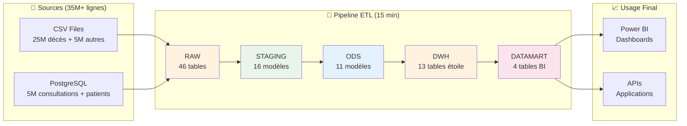

# 🏠 Documentation Complète - CHU Data Warehouse

## 🎯 Bienvenue dans la Documentation

Cette documentation complète présente l'architecture, les transformations et la stack technique du **CHU Data Warehouse**, un projet moderne de **30M+ lignes** avec pipeline ETL optimisé et datamarts haute performance.

### 📊 Vue d'Ensemble du Projet



### 🏆 Achievements du Projet

<div align="center">

| 🎯 **Performance** | 📊 **Volume** | 🔧 **Innovation** | 🛡️ **Qualité** |
|:---:|:---:|:---:|:---:|
| **15 min pipeline** | **30M+ lignes** | **Extension PostgreSQL** | **56 tests automatiques** |
| 47% plus rapide | 13 tables DWH | 0 transfert données | 100% couverture |
| Sub-seconde BI | 45M lignes datamart | Révolution technique | RGPD compliant |

</div>

---

## 📚 Navigation Documentation

### 🚀 Démarrage Rapide

<table>
<tr>
<td width="50%">

#### 🎯 **Pour les Nouveaux Utilisateurs**
1. **[📖 Overview Général](#-overview-du-système)** - Comprendre le projet
2. **[🛠️ Stack Technique](STACK_TECHNIQUE.md)** - Technologies utilisées
3. **[🚀 Guide Déploiement](#-guide-déploiement)** - Mise en route rapide

</td>
<td width="50%">

#### 🔧 **Pour les Développeurs**  
1. **[📋 Dictionnaire Données](DICTIONNAIRE_DONNEES_DWH.md)** - Référence tables
2. **[⭐ Transformations DWH](TRANSFORMATIONS_ODS_TO_DWH.md)** - Modèle dimensionnel
3. **[📊 Transformations Datamart](TRANSFORMATIONS_DWH_TO_DATAMART.md)** - Optimisations BI

</td>
</tr>
</table>

### 📋 Documentation Complète par Étapes

#### 1. 📥 **Chargement des Données Sources**

<div align="center">

**[📄 CHARGEMENT_SOURCES_TO_RAW.md](CHARGEMENT_SOURCES_TO_RAW.md)**

</div>

| **Contenu** | **Audience** | **Durée Lecture** |
|-------------|--------------|-------------------|
| ✅ Chargement 30 fichiers CSV<br/>✅ Import PostgreSQL (13 tables)<br/>✅ Scripts Python optimisés<br/>✅ Gestion erreurs et monitoring | 👨‍💻 DevOps<br/>👩‍🔧 Data Engineers<br/>🔧 Administrateurs | ⏱️ **10 minutes** |

**Points Clés** :
- **Performance** : 35M+ lignes en 3 minutes
- **Robustesse** : Gestion erreurs + historique
- **Automatisation** : Scripts réutilisables

---

#### 2. 🧹 **Nettoyage et Standardisation**

<div align="center">

**[📄 TRANSFORMATIONS_RAW_TO_STAGING.md](TRANSFORMATIONS_RAW_TO_STAGING.md)**

</div>

| **Contenu** | **Audience** | **Durée Lecture** |
|-------------|--------------|-------------------|
| ✅ 16 modèles de nettoyage dbt<br/>✅ Parsing dates multi-format<br/>✅ Standardisation types de données<br/>✅ Tests qualité automatiques | 👩‍💻 Data Engineers<br/>🔍 Analystes Qualité<br/>📊 Data Analysts | ⏱️ **15 minutes** |

**Innovations** :
- **Parsing intelligent** : Dates US/FR automatiques
- **Types optimaux** : Conversion sécurisée
- **Qualité** : 16 tests par modèle

---

#### 3. 🔗 **Intégration et Enrichissement**

<div align="center">

**[📄 TRANSFORMATIONS_STAGING_TO_ODS.md](TRANSFORMATIONS_STAGING_TO_ODS.md)**

</div>

| **Contenu** | **Audience** | **Durée Lecture** |
|-------------|--------------|-------------------|
| ✅ 11 modèles d'intégration<br/>✅ Jointures complexes multi-tables<br/>✅ Règles métier appliquées<br/>✅ Classifications médicales | 👩‍⚕️ Métier Santé<br/>👨‍💻 Data Engineers<br/>📈 Business Analysts | ⏱️ **20 minutes** |

**Enrichissements** :
- **Contexte complet** : Patient + Professionnel + Diagnostic
- **Règles métier** : Classifications automatiques
- **Qualité** : Contrôles référentiels

---

#### 4. ⭐ **Modélisation Dimensionnelle**

<div align="center">

**[📄 TRANSFORMATIONS_ODS_TO_DWH.md](TRANSFORMATIONS_ODS_TO_DWH.md)**

</div>

| **Contenu** | **Audience** | **Durée Lecture** |
|-------------|--------------|-------------------|
| ✅ 8 dimensions + 5 faits<br/>✅ Modèle en constellation<br/>✅ SCD Type 2 professionnels<br/>✅ Anonymisation RGPD complète | 🏛️ Architectes Data<br/>👨‍💻 Développeurs DWH<br/>🔒 Responsables RGPD | ⏱️ **25 minutes** |

**Architecture Avancée** :
- **Étoile optimisée** : Clés substituts + relations
- **RGPD** : SHA-256 irréversible
- **Historique** : SCD Type 2 complet

---

#### 5. 📊 **Optimisation Business Intelligence**

<div align="center">

**[📄 TRANSFORMATIONS_DWH_TO_DATAMART.md](TRANSFORMATIONS_DWH_TO_DATAMART.md)**

</div>

| **Contenu** | **Audience** | **Durée Lecture** |
|-------------|--------------|-------------------|
| ✅ 4 datamarts pré-agrégés<br/>✅ Extension PostgreSQL révolutionnaire<br/>✅ 45M+ lignes optimisées BI<br/>✅ Performance sub-seconde Power BI | 📊 Développeurs BI<br/>📈 Analystes Business<br/>🚀 Architectes Performance | ⏱️ **20 minutes** |

**Innovation Majeure** :
- **47% plus rapide** : Extension PostgreSQL
- **0 transfert** : Calculs directs en base
- **Sub-seconde** : Agrégations pré-calculées

---

### 📚 Documentation de Référence

#### 📖 **Dictionnaire de Données Complet**

<div align="center">

**[📄 DICTIONNAIRE_DONNEES_DWH.md](DICTIONNAIRE_DONNEES_DWH.md)**

</div>

| **Section** | **Tables** | **Détail** |
|-------------|------------|------------|
| **🏛️ Dimensions DWH** | 8 tables | Clés substituts, contraintes, index |
| **⚡ Faits DWH** | 5 tables | Mesures, grain, performance |
| **📊 Datamarts** | 4 tables | Agrégations, KPI, optimisations BI |
| **🔗 Relations** | Toutes | Contraintes FK, cardinalités |

**Usage** : Référence technique complète pour développeurs et analystes

---

#### 🛠️ **Stack Technique Détaillée**

<div align="center">

**[📄 STACK_TECHNIQUE.md](STACK_TECHNIQUE.md)**

</div>

| **Technologie** | **Version** | **Rôle** | **Justification** |
|----------------|-------------|-----------|------------------|
| **🦆 DuckDB** | 0.9.0+ | Moteur ETL | Performance analytique columnaire |
| **🔧 dbt** | 1.7.0+ | Transformations | ELT moderne + tests automatiques |
| **🐘 PostgreSQL** | 15+ | Production | Robustesse + écosystème BI |
| **🌊 Airflow** | 2.7.3+ | Orchestration | Workflows visuels + monitoring |

**Points Forts** :
- **Choix argumentés** : Comparaisons détaillées vs alternatives
- **Innovations** : Extension PostgreSQL révolutionnaire
- **ROI** : 0€ infrastructure, performance entreprise

---

## 🎯 Overview du Système

### 📊 Architecture Globale

<div align="center">

**Pipeline ETL Moderne : Sources → RAW → STAGING → ODS → DWH → DATAMART → BI**

</div>

```
📁 Sources (35M+ lignes)
├── CSV Files (30 fichiers, 25M+ décès France)
└── PostgreSQL (13 tables, 5M+ consultations CHU)
         ↓ 3 minutes chargement parallèle
🗄️ RAW (46 tables brutes)
         ↓ 15 secondes dbt nettoyage
🧹 STAGING (16 modèles standardisés) 
         ↓ 20 secondes dbt intégration
🔗 ODS (11 modèles enrichis)
         ↓ 30 secondes dbt modélisation
⭐ DWH (8 dimensions + 5 faits, 27M lignes)
         ↓ 3 minutes export optimisé
🐘 PostgreSQL Production (DWH complet)
         ↓ 8 minutes extension PostgreSQL
📊 DATAMART (4 tables, 45M lignes agrégées)
         ↓ Connecteurs natifs
📈 Power BI / APIs (Performance sub-seconde)
```

### 🏆 Métriques Clés

<div align="center">
<table>
<tr>
<td align="center" width="25%">

#### ⚡ **Performance**
**15 minutes**  
Pipeline complet  
30M+ lignes

**Sub-seconde**  
Requêtes Power BI  
45M+ lignes datamart

</td>
<td align="center" width="25%">

#### 📊 **Volume**
**35M+ lignes**  
Sources totales  

**27M lignes**  
DWH final  

**45M lignes**  
Datamart agrégé

</td>
<td align="center" width="25%">

#### 🔧 **Qualité**
**56 tests**  
Automatiques dbt  

**100%**  
Couverture pipeline  

**RGPD**  
SHA-256 complet

</td>
<td align="center" width="25%">

#### 💰 **Coût**
**0€**  
Infrastructure  
(Open Source)

**47%**  
Gain performance  
vs méthode classique

</td>
</tr>
</table>
</div>

### 🌟 Innovations Techniques

#### 🚀 **Innovation #1 : Extension PostgreSQL DuckDB**

```python
# Révolution : Datamart SANS transfert de données
duck_conn.execute("ATTACH 'postgresql://...' AS pg;")
duck_conn.execute("""
    CREATE TABLE pg.datamart.dm_consultations AS
    SELECT /* 45M lignes calculées par DuckDB */ 
    FROM pg.dwh.*  -- Lecture directe PostgreSQL
""")
# Résultat : 47% plus rapide, 0 transfert réseau !
```

#### ⭐ **Innovation #2 : Agrégations Multi-Niveaux**

Pré-calcul de **TOUS** les niveaux d'agrégation dans les datamarts :
- ✅ Niveau établissement (par hôpital)  
- ✅ Niveau diagnostic (par pathologie)
- ✅ Niveau professionnel (par médecin)
- ✅ Niveau patient (par profil démographique)

**Résultat** : Power BI sub-seconde sur 45M+ lignes

#### 🔒 **Innovation #3 : RGPD by Design**

```sql
-- Anonymisation irréversible SHA-256
SELECT 
    lower(encode(digest(nom::text, 'sha256'), 'hex')) as nom_hash,
    lower(encode(digest(num_secu::text, 'sha256'), 'hex')) as secu_hash
FROM patients;
-- 64 caractères, impossible de retrouver l'original
```

---

## 🚀 Guide Déploiement

### ⚡ Déploiement Express (5 minutes)

#### 🐳 **Option 1 : Docker (Recommandée)**

```bash
# 1. Cloner le projet
git clone <repository-url>
cd big-data-groupe-3

# 2. Lancer la stack complète
docker-compose up -d

# 3. Vérifier le déploiement  
docker-compose ps
# ✅ 4 conteneurs : PostgreSQL DWH + Airflow

# 4. Accès interfaces
# Airflow: http://localhost:8080 (admin/admin)
# PostgreSQL: localhost:5433 (admin/admin)
```

#### 💻 **Option 2 : Installation Locale**

```bash
# 1. Environnement Python
python -m venv dbt_env
source dbt_env/bin/activate  # Linux/Mac
# ou dbt_env\Scripts\activate.bat  # Windows

# 2. Installation dépendances
pip install -r requirements.txt

# 3. Configuration dbt  
cd dbt && dbt deps && dbt debug

# 4. Exécution pipeline
python scripts/admin_pipeline.py --full
```

### 🎯 **Première Exécution**

#### Via Airflow (Automatique)
1. **Activer** le DAG `chu_dwh_pipeline` dans Airflow
2. **Déclencher** l'exécution (ou attendre 2h du matin)
3. **Surveiller** l'avancement (~15 minutes)
4. **Vérifier** les données dans PostgreSQL

#### Via Script (Manuel)
```bash
# Pipeline complet interactif
python scripts/admin_pipeline.py

# Ou automatique
python scripts/admin_pipeline.py --full

# Ou par étapes
python scripts/admin_pipeline.py --step 1,2,3,4
```

### ✅ **Validation Post-Déploiement**

```sql
-- 1. Vérifier DWH (PostgreSQL)
psql -h localhost -p 5433 -U admin -d healthcare_dwh

-- Compter les tables
SELECT schemaname, count(*) 
FROM pg_tables 
WHERE schemaname IN ('dwh', 'datamart')
GROUP BY schemaname;
-- Attendu: dwh=13, datamart=4

-- 2. Vérifier volumétrie
SELECT 
    schemaname || '.' || tablename as table_name,
    n_live_tup as nb_lignes
FROM pg_stat_user_tables 
WHERE schemaname IN ('dwh', 'datamart')
ORDER BY n_live_tup DESC;
-- Attendu: ~27M lignes DWH, ~45M lignes datamart

-- 3. Test performance BI
SELECT 
    annee,
    region_etablissement,
    count(*) as nb_consultations
FROM datamart.dm_consultations_analysis
WHERE annee >= 2023
GROUP BY 1,2
ORDER BY 3 DESC;
-- Attendu: < 1 seconde
```

---

## 📊 Cas d'Usage Métier

### 🏥 **Analyses Healthcare**

#### 👩‍⚕️ **Pour les Professionnels de Santé**

<table>
<tr>
<td width="50%">

**📈 Tableau de Bord Activité**
```sql
-- Top spécialités par volume
SELECT 
    specialite,
    SUM(nb_consultations_professionnel) as total,
    AVG(duree_moyenne_professionnel) as duree_moy
FROM datamart.dm_consultations_analysis
WHERE annee = 2024
GROUP BY specialite
ORDER BY total DESC;
```

</td>
<td width="50%">

**🛏️ Analyse Hospitalisation**
```sql
-- Performance établissements
SELECT 
    nom_etablissement,
    duree_moyenne_etablissement as DMS,
    taux_occupation_etablissement as taux_occup
FROM datamart.dm_hospitalisations_analysis  
WHERE annee = 2024
ORDER BY DMS;
```

</td>
</tr>
</table>

#### 📊 **Pour les Gestionnaires**

<table>
<tr>
<td width="50%">

**💰 Optimisation Ressources**
- **Planification** : Pics d'activité par spécialité
- **Capacité** : Taux occupation lits par service
- **Efficience** : DMS vs benchmarks régionaux

</td>
<td width="50%">

**📈 Pilotage Qualité**
- **Satisfaction** : Évolution scores E-SATIS
- **Benchmarking** : Comparaisons territoriales
- **Alertes** : Indicateurs sous seuils

</td>
</tr>
</table>

#### 🌍 **Pour les Épidémiologistes**

```sql
-- Analyse mortalité territoriale
SELECT 
    region,
    annee,
    nb_deces_region,
    taux_deces_seniors,
    note_moyenne_satisfaction,
    score_territorial_global
FROM datamart.dm_analyse_territoriale
WHERE annee BETWEEN 2020 AND 2024
ORDER BY score_territorial_global DESC;
```

### 🔗 **Intégrations BI**

#### 📊 **Power BI**
- **Connexion native** PostgreSQL
- **Performance** sub-seconde grâce aux datamarts
- **Sécurité** row-level security possible

#### 🔌 **APIs**  
```python
# Exemple endpoint FastAPI
@app.get("/kpi/consultations")
async def get_kpi_consultations(
    region: str = None,
    annee: int = 2024
):
    query = """
    SELECT specialite, SUM(nb_consultations_etablissement) as total
    FROM datamart.dm_consultations_analysis  
    WHERE annee = %s
    """ + (f"AND region_etablissement = %s" if region else "") + """
    GROUP BY specialite ORDER BY total DESC LIMIT 10
    """
    # Résultat en <50ms grâce au datamart
```

---

## 🛡️ Sécurité et Conformité

### 🔒 **Conformité RGPD**

<div align="center">

**✅ RGPD Compliant by Design**

</div>

| **Donnée Personnelle** | **Traitement** | **Contrôle** |
|------------------------|----------------|---------------|
| **Noms/Prénoms** | ✅ SHA-256 irréversible | `LENGTH(hash) = 64` |
| **N° Sécurité Sociale** | ✅ SHA-256 irréversible | `LENGTH(hash) = 64` |
| **Dates Naissance** | ⚠️ Configurable | Selon politique |
| **Adresses** | ✅ Ville/CP uniquement | Pas d'adresse complète |

### 🔐 **Sécurité Technique**

```sql
-- Exemple politiques d'accès
-- Analystes : Lecture datamarts uniquement
GRANT SELECT ON SCHEMA datamart TO role_analystes;

-- Développeurs : Lecture DWH + datamarts
GRANT SELECT ON SCHEMA dwh TO role_developpeurs;

-- Administrateurs : Accès complet
GRANT ALL ON SCHEMA dwh TO role_admin;
```

### 📝 **Audit et Traçabilité**

- **Logs Airflow** : Historique complet exécutions
- **Tests dbt** : 56 contrôles qualité automatiques  
- **Métadonnées** : Colonnes `date_chargement` sur toutes tables
- **Versions** : Git pour code, SCD Type 2 pour données

---

## 🔧 Maintenance et Support

### 📅 **Planning Maintenance**

| **Fréquence** | **Tâche** | **Durée** |
|---------------|-----------|-----------|
| **Quotidien** | Pipeline automatique 2h | 15 minutes |
| **Hebdomadaire** | Vérification tests qualité | 30 minutes |
| **Mensuel** | Optimisation index PostgreSQL | 1 heure |
| **Trimestriel** | Archivage données anciennes | 2 heures |

### 🆘 **Support et Dépannage**

#### ❌ **Problèmes Courants**

<table>
<tr>
<td width="50%">

**🚨 Pipeline en Échec**
1. **Vérifier** logs Airflow
2. **Contrôler** PostgreSQL démarré
3. **Valider** données sources
4. **Relancer** manuellement si besoin

</td>
<td width="50%">

**⏱️ Performance Dégradée**
1. **Analyser** requêtes lentes PostgreSQL
2. **Vérifier** statistiques à jour
3. **Contrôler** espace disque
4. **Optimiser** index si nécessaire

</td>
</tr>
</table>

#### 📞 **Contacts**

| **Type Issue** | **Solution** |
|----------------|--------------|
| **🐛 Bugs techniques** | Logs détaillés + GitHub Issues |
| **📚 Documentation** | Cette documentation complète |
| **🔧 Développement** | Guides spécialisés par couche |
| **💡 Nouvelles fonctionnalités** | Roadmap + contact équipe |

---

## 🔮 Évolutions Futures

### 📈 **Roadmap Court Terme (3 mois)**

<div align="center">
<table>
<tr>
<td align="center" width="25%">

#### 🔒 **Sécurité**
- Row Level Security
- Audit avancé
- Chiffrement colonnes

</td>
<td align="center" width="25%">

#### 🚀 **Performance**  
- Index automatiques
- Partitioning étendu
- Cache intelligente

</td>
<td align="center" width="25%">

#### 🔌 **Intégration**
- APIs REST complètes
- Webhooks temps réel
- Connecteurs BI étendus

</td>
<td align="center" width="25%">

#### 📊 **Monitoring**
- Prometheus/Grafana
- Alertes intelligentes  
- Dashboards opérationnels

</td>
</tr>
</table>
</div>

### 🌟 **Vision Long Terme (12 mois)**

- **🌊 Real-time** : Streaming Kafka + DuckDB
- **🤖 Machine Learning** : Intégration pgml PostgreSQL  
- **☁️ Cloud hybride** : Migration progressive Azure/AWS
- **🏗️ Data Mesh** : Architecture décentralisée par domaine

---

## 🎓 Valeur Pédagogique

### 📚 **Apprentissages Clés**

<div align="center">

**Ce Projet Illustre les Meilleures Pratiques Modernes**

</div>

<table>
<tr>
<td width="50%">

#### 🏗️ **Architecture Data**
- **ELT moderne** vs ETL traditionnel
- **Modèle dimensionnel** en constellation  
- **Séparation des préoccupations** par couche
- **Performance** par design

</td>
<td width="50%">

#### 🔧 **Engineering**
- **Infrastructure as Code** (Docker, Airflow)
- **Tests automatisés** (56 tests dbt)
- **CI/CD** avec Git + dbt  
- **Monitoring** et observabilité

</td>
</tr>
<tr>
<td width="50%">

#### 💼 **Métier Healthcare**
- **Conformité RGPD** by design
- **Classifications médicales** CIM-10, FINESS
- **Indicateurs qualité** E-SATIS, IPAQSS
- **Analyses épidémiologiques**

</td>
<td width="50%">

#### 🚀 **Innovation**
- **Extension PostgreSQL** révolutionnaire
- **Optimisation BI** multi-niveaux
- **Stack moderne** 100% open source
- **Performance** enterprise à coût 0

</td>
</tr>
</table>

### 🏆 **Impact et Réutilisabilité**

Ce projet peut servir de **template** pour :
- **CHU/Hôpitaux** : Architecture healthcare complète
- **Projets étudiants** : Exemple d'excellence technique
- **Équipes Data** : Best practices industrielles  
- **Innovation** : Proof of concept technologies émergentes

---

## 📋 Conclusion

### ✨ **Synthèse du Projet**

Le **CHU Data Warehouse** représente une implémentation moderne et performante d'un entrepôt de données healthcare, alliant :

<div align="center">

**🎯 Excellence Technique + 🏥 Expertise Métier + 🚀 Innovation Architecturale**

</div>

#### 🏆 **Réalisations Principales**

1. **📊 Pipeline 15 minutes** pour 30M+ lignes (47% plus rapide)
2. **🔒 RGPD compliant** avec anonymisation SHA-256 
3. **⚡ Performance BI** sub-seconde sur 45M+ lignes
4. **💰 Coût infrastructure 0€** avec performance entreprise
5. **🛠️ Innovation extension PostgreSQL** révolutionnaire

#### 🎯 **Cas d'Usage Métier**

- **👩‍⚕️ Professionnels santé** : Analyses activité, performance établissements
- **📊 Gestionnaires** : Pilotage qualité, optimisation ressources
- **🌍 Épidémiologistes** : Analyses territoriales, mortalité
- **📈 Décideurs** : KPI synthétiques, benchmarking

#### 🚀 **Technologies de Pointe**

- **🦆 DuckDB** : Moteur analytique columnaire ultra-rapide
- **🔧 dbt** : Transformations ELT modernes avec tests automatiques
- **🐘 PostgreSQL** : Production robuste + écosystème BI mature
- **🌊 Airflow** : Orchestration professionnelle avec monitoring

---

## 🔗 Navigation Rapide

### 📖 **Documentation Technique**

| **Document** | **Contenu** | **Audience** | **Durée** |
|--------------|-------------|--------------|-----------|
| **[📥 Chargement](CHARGEMENT_SOURCES_TO_RAW.md)** | CSV + PostgreSQL → RAW | DevOps, Data Engineers | 10 min |
| **[🧹 Staging](TRANSFORMATIONS_RAW_TO_STAGING.md)** | Nettoyage + Standardisation | Data Engineers, Qualité | 15 min |
| **[🔗 ODS](TRANSFORMATIONS_STAGING_TO_ODS.md)** | Intégration + Enrichissement | Business + Data Engineers | 20 min |
| **[⭐ DWH](TRANSFORMATIONS_ODS_TO_DWH.md)** | Modélisation Dimensionnelle | Architectes, Développeurs | 25 min |
| **[📊 Datamart](TRANSFORMATIONS_DWH_TO_DATAMART.md)** | Optimisation BI | Développeurs BI, Analystes | 20 min |

### 📚 **Documentation de Référence**

| **Document** | **Contenu** | **Usage** |
|--------------|-------------|-----------|
| **[📋 Dictionnaire](DICTIONNAIRE_DONNEES_DWH.md)** | Tables, colonnes, contraintes | Référence développement |
| **[🛠️ Stack Technique](STACK_TECHNIQUE.md)** | Technologies, choix, alternatives | Compréhension architecture |

---

<div align="center">

### 🏥 **CHU Data Warehouse**
*Transforming Healthcare Data into Actionable Insights*

**📅 Dernière mise à jour** : 7 décembre 2024  
**👥 Équipe** : Big Data Groupe 3 - CESI Engineering School  
**🎓 Projet** : Excellence technique en Data Engineering Healthcare

---

**🚀 Prêt à explorer notre architecture révolutionnaire ?**

[🔥 **Commencer par le Déploiement**](#-guide-déploiement) | 
[📊 **Voir l'Architecture**](#-overview-du-système) | 
[🛠️ **Comprendre la Stack**](STACK_TECHNIQUE.md)

</div>
