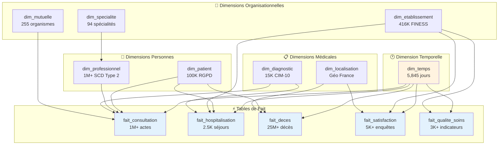

# ⭐ Transformations ODS → DWH

## 🎯 Vue d'Ensemble

La couche **DWH (Data Warehouse)** constitue l'étape finale de la modélisation des données, transformant les données intégrées d'ODS en un **modèle dimensionnel en étoile** optimisé pour l'analyse. Cette étape implémente le **schéma en constellation** avec clés substituts, relations référentielles et anonymisation RGPD.

### 📊 Architecture DWH - Modèle en Constellation



## 📋 Tables DWH (13 tables)

### 🔗 Dimensions (8 tables)

| **Dimension** | **Source ODS** | **Volume** | **Clé Substitut** | **Caractéristiques** |
|--------------|----------------|------------|-------------------|---------------------|
| `dim_temps` | Générée | 5,845 jours | `sk_temps` | 2015-2030, calendrier français |
| `dim_patient` | `ods_patient_complet` | 100K lignes | `sk_patient` | Anonymisation SHA-256 |
| `dim_professionnel` | `ods_professionnel_complet` | 1M+ lignes | `sk_professionnel` | SCD Type 2, historique |
| `dim_etablissement` | `ods_localisation_consolidee` | 416K lignes | `sk_etablissement` | FINESS, géolocalisation |
| `dim_specialite` | `stg_specialites` | 94 lignes | `sk_specialite` | Classifications médicales |
| `dim_diagnostic` | `stg_diagnostic` | 15K lignes | `sk_diagnostic` | CIM-10, chapitres |
| `dim_mutuelle` | `stg_mutuelle` | 255 lignes | `sk_mutuelle` | Organismes assurance |
| `dim_localisation` | `ods_localisation_consolidee` | Variables | `sk_localisation` | Géographie France |

### ⚡ Faits (5 tables)

| **Fait** | **Sources ODS** | **Volume** | **Grain** | **Mesures** |
|----------|-----------------|------------|-----------|-------------|
| `fait_consultation` | `ods_consultation_enrichie` | 1M+ lignes | 1 consultation | Durée, nombre |
| `fait_hospitalisation` | `ods_hospitalisation_enrichie` | 2.5K lignes | 1 séjour | Durée, nombre jours |
| `fait_deces` | `ods_deces_enrichi` | 25M+ lignes | 1 décès | Nombre décès |
| `fait_satisfaction` | `ods_satisfaction_unifie` | 5K+ lignes | 1 établissement/année | Scores satisfaction |
| `fait_qualite_soins` | `ods_qualite_soins_unifie` | 3K+ lignes | 1 établissement/année | Indicateurs IPAQSS |

## 🔧 Modélisation Dimensionnelle

### 1. 🕐 Dimension Temporelle

#### 📅 Référentiel Complet 2015-2030
```sql
-- dim_temps: Dimension temporelle de référence
with date_spine as (
    select date_add('day', seq, '2015-01-01'::date) as date_complete
    from generate_series(0, 5844) as seq  -- 2015-2030 = 5,845 jours
),

enrichissement_temporel as (
    select
        -- Clé substitut séquentielle
        row_number() over (order by date_complete) as sk_temps,
        
        -- Clé naturelle (business key)
        cast(replace(date_complete::varchar, '-', '') as integer) as date_id,
        
        -- Date complète
        date_complete,
        
        -- Décomposition temporelle
        extract(year from date_complete) as annee,
        extract(quarter from date_complete) as trimestre,
        extract(month from date_complete) as mois,
        extract(day from date_complete) as jour,
        extract(dow from date_complete) as jour_semaine,  -- 0=Dimanche
        extract(doy from date_complete) as jour_annee,
        extract(week from date_complete) as semaine_annee,
        
        -- Labels français
        case extract(month from date_complete)
            when 1 then 'Janvier'   when 2 then 'Février'   when 3 then 'Mars'
            when 4 then 'Avril'     when 5 then 'Mai'       when 6 then 'Juin'  
            when 7 then 'Juillet'   when 8 then 'Août'      when 9 then 'Septembre'
            when 10 then 'Octobre'  when 11 then 'Novembre' when 12 then 'Décembre'
        end as nom_mois,
        
        case extract(dow from date_complete)
            when 0 then 'Dimanche'  when 1 then 'Lundi'    when 2 then 'Mardi'
            when 3 then 'Mercredi'  when 4 then 'Jeudi'    when 5 then 'Vendredi'
            when 6 then 'Samedi'
        end as nom_jour,
        
        -- Périodes métier
        case 
            when extract(month from date_complete) in (12, 1, 2) then 'Hiver'
            when extract(month from date_complete) in (3, 4, 5) then 'Printemps'
            when extract(month from date_complete) in (6, 7, 8) then 'Été'  
            when extract(month from date_complete) in (9, 10, 11) then 'Automne'
        end as saison,
        
        -- Calendrier français (jours fériés)
        case
            when extract(month from date_complete) = 1 and extract(day from date_complete) = 1 
                then 'Jour de l''An'
            when extract(month from date_complete) = 5 and extract(day from date_complete) = 1 
                then 'Fête du Travail'
            when extract(month from date_complete) = 5 and extract(day from date_complete) = 8 
                then 'Victoire 1945'
            when extract(month from date_complete) = 7 and extract(day from date_complete) = 14 
                then 'Fête Nationale'
            when extract(month from date_complete) = 8 and extract(day from date_complete) = 15 
                then 'Assomption'
            when extract(month from date_complete) = 11 and extract(day from date_complete) = 1 
                then 'Toussaint'
            when extract(month from date_complete) = 11 and extract(day from date_complete) = 11 
                then 'Armistice 1918'
            when extract(month from date_complete) = 12 and extract(day from date_complete) = 25 
                then 'Noël'
            else null
        end as jour_ferie,
        
        -- Drapeaux utiles pour analyses
        case when extract(dow from date_complete) in (0, 6) then true else false end as est_weekend,
        case when jour_ferie is not null then true else false end as est_ferie,
        case when extract(day from date_complete) = 1 then true else false end as debut_mois,
        case when date_complete = last_day(date_complete) then true else false end as fin_mois
        
    from date_spine
)

select * from enrichissement_temporel
order by date_complete
```

### 2. 👤 Dimension Patient (RGPD)

#### 🔒 Anonymisation Complète SHA-256
```sql
-- dim_patient: Patients anonymisés conformes RGPD
with patients_source as (
    select * from {{ ref('ods_patient_complet') }}
),

-- Dédoublonnage (un patient peut avoir plusieurs mutuelles)
patients_uniques as (
    select
        id_patient,
        nom, prenom, sexe, date_naissance, age, tranche_age,
        groupe_sanguin, poids, taille,
        code_postal, ville, pays, num_secu,
        -- Indicateur mutuelle (booléen agrégé)
        max(case when a_mutuelle_active then 1 else 0 end) as a_mutuelle_active,
        loaded_at
    from patients_source
    group by id_patient, nom, prenom, sexe, date_naissance, age, tranche_age,
             groupe_sanguin, poids, taille, code_postal, ville, pays, num_secu, loaded_at
),

anonymisation_rgpd as (
    select
        -- Clé substitut (génération séquentielle)
        row_number() over (order by id_patient) as sk_patient,
        
        -- Business key préservée (pour jointures)
        id_patient,
        
        -- ANONYMISATION RGPD : Hachage SHA-256 irréversible
        lower(encode(digest(nom::text, 'sha256'), 'hex')) as nom_hash,
        lower(encode(digest(prenom::text, 'sha256'), 'hex')) as prenom_hash,
        
        -- Alternative : Initiales + hash tronqué (plus lisible, moins sécurisé)
        -- substring(nom, 1, 1) || '.' || 
        -- substring(lower(encode(digest(nom::text, 'sha256'), 'hex')), 1, 6) as nom_anonyme,
        
        -- Données démographiques (gardées car non PII selon contexte)
        sexe,
        date_naissance,  -- Peut être tronquée selon règles RGPD
        age,
        tranche_age,     -- Classification agrégée (anonymisation par agrégation)
        
        -- Données médicales (légitimes pour analyses santé)
        groupe_sanguin,
        poids,
        taille,
        
        -- Géolocalisation (niveau ville/code postal acceptable)
        code_postal,
        ville,
        pays,
        
        -- ANONYMISATION CRITIQUE : Numéro sécurité sociale
        case
            when num_secu is not null then 
                lower(encode(digest(num_secu::text, 'sha256'), 'hex'))
            else null
        end as num_secu_hash,
        
        -- Métadonnées techniques
        a_mutuelle_active,
        loaded_at as date_chargement,
        current_timestamp as date_creation_dwh,
        loaded_at as date_modification  -- Pour SCD (initialement = chargement)
        
    from patients_uniques
)

select * from anonymisation_rgpd
order by sk_patient
```

### 3. 👨‍⚕️ Dimension Professionnel (SCD Type 2)

#### 📊 Suivi Historique des Changements
```sql
-- dim_professionnel: SCD Type 2 pour historique des professionnels
with professionnels_source as (
    select * from {{ ref('ods_professionnel_complet') }}
),

-- Détection des changements (SCD Type 2)
changements_detectes as (
    select
        identifiant,
        nom, prenom, profession, nom_specialite, mode_exercice_libelle,
        etablissement_principal, date_debut_exercice, date_fin_exercice,
        est_actif, loaded_at,
        
        -- Détection changement par hash des attributs "lents"
        encode(digest(
            concat_ws('|', 
                coalesce(nom, ''),
                coalesce(profession, ''),
                coalesce(nom_specialite, ''),
                coalesce(etablissement_principal, '')
            )::text, 'sha256'
        ), 'hex') as hash_attributs,
        
        -- Fenêtrage pour détecter les changements
        lag(encode(digest(
            concat_ws('|', 
                coalesce(nom, ''),
                coalesce(profession, ''),
                coalesce(nom_specialite, ''),
                coalesce(etablissement_principal, '')
            )::text, 'sha256'
        ), 'hex')) over (
            partition by identifiant 
            order by loaded_at
        ) as hash_precedent,
        
        row_number() over (
            partition by identifiant 
            order by loaded_at
        ) as version_numero
        
    from professionnels_source
),

-- Création des versions SCD Type 2
versions_scd as (
    select
        -- Clé substitut unique pour chaque version
        row_number() over (order by identifiant, version_numero) as sk_professionnel,
        
        -- Business key
        identifiant,
        
        -- Numéro de version pour cet identifiant
        version_numero,
        
        -- Attributs métier (qui peuvent changer)
        nom,
        prenom,
        profession,
        nom_specialite,
        mode_exercice_libelle,
        etablissement_principal,
        
        -- Dates de validité SCD Type 2
        date_debut_exercice,
        loaded_at as date_debut_validite,
        
        -- Date fin validité = début de la version suivante (ou NULL si actuelle)
        lead(loaded_at) over (
            partition by identifiant 
            order by loaded_at
        ) as date_fin_validite,
        
        date_fin_exercice,
        
        -- Drapeau version actuelle
        case 
            when lead(loaded_at) over (partition by identifiant order by loaded_at) is null 
                then true 
            else false 
        end as est_actuel,
        
        -- Clé étrangère vers spécialité
        coalesce(
            (select sk_specialite from {{ ref('dim_specialite') }} 
             where nom_specialite = professionnels_source.nom_specialite limit 1),
            -1  -- Spécialité inconnue
        ) as fk_specialite,
        
        -- Clé étrangère vers établissement (si disponible)
        coalesce(
            (select sk_etablissement from {{ ref('dim_etablissement') }} 
             where nom_etablissement = professionnels_source.etablissement_principal limit 1),
            -1  -- Établissement inconnu
        ) as fk_etablissement,
        
        -- Métadonnées
        est_actif,
        loaded_at as date_chargement,
        current_timestamp as date_creation_dwh
        
    from changements_detectes
)

select * from versions_scd
order by identifiant, version_numero
```

### 4. 🏥 Dimension Établissement

#### 📍 Référentiel FINESS Enrichi
```sql
-- dim_etablissement: Établissements de santé avec géolocalisation
with etablissements_source as (
    select * from {{ ref('ods_localisation_consolidee') }}
    where type_etablissement is not null
),

enrichissement_etablissement as (
    select
        -- Clé substitut
        row_number() over (order by finess_et) as sk_etablissement,
        
        -- Business keys
        finess_et,
        finess_ej,
        
        -- Identification
        denomination_sociale as nom_etablissement,
        denomination_complete,
        type_etablissement,
        
        -- Classification métier
        case type_etablissement
            when 'HOPITAL_PUBLIC' then 'PUBLIC'
            when 'HOPITAL_PRIVE' then 'PRIVE'
            when 'CLINIQUE' then 'PRIVE'
            when 'EHPAD' then 'MEDICO_SOCIAL'
            else 'AUTRE'
        end as secteur,
        
        case
            when type_etablissement in ('HOPITAL_PUBLIC', 'HOPITAL_PRIVE', 'CLINIQUE') 
                then 'HOSPITALIER'
            when type_etablissement = 'EHPAD' 
                then 'MEDICO_SOCIAL'
            else 'AMBULATOIRE'
        end as categorie,
        
        -- Géolocalisation
        code_postal,
        commune,
        departement,
        region,
        zone_geographique,
        
        -- Adresse et contact
        adresse,
        telephone,
        fax,
        email,
        
        -- Capacité
        nb_lits,
        
        -- Statut
        est_actif,
        
        -- Métadonnées
        current_timestamp as date_creation_dwh
        
    from etablissements_source
)

select * from enrichissement_etablissement
order by sk_etablissement
```

## ⚡ Tables de Fait

### 1. 🩺 Fait Consultation

#### 📊 Consultations avec Toutes Dimensions
```sql
-- fait_consultation: Table de fait principale (1M+ consultations)
with consultations_source as (
    select * from {{ ref('ods_consultation_enrichie') }}
),

-- Lookups vers toutes les dimensions
fait_avec_dimensions as (
    select
        -- Clé substitut du fait
        row_number() over (order by c.num_consultation) as sk_fait_consultation,
        
        -- Clés étrangères vers dimensions (avec gestion -1 pour inconnus)
        coalesce(dp.sk_patient, -1) as sk_patient,
        coalesce(dpr.sk_professionnel, -1) as sk_professionnel,
        coalesce(dd.sk_diagnostic, -1) as sk_diagnostic,
        coalesce(dm.sk_mutuelle, -1) as sk_mutuelle,
        coalesce(de.sk_etablissement, -1) as sk_etablissement,
        coalesce(dt.sk_temps, -1) as sk_temps,
        
        -- Dimensions dégénérées (attributs gardés dans le fait)
        c.num_consultation,
        c.heure_debut,
        c.heure_fin,
        c.motif,
        c.categorie_patient,
        c.duree_categorie,
        
        -- MESURES (métriques agrégables)
        c.duree_consultation_minutes as duree_consultation,
        1 as nombre_consultations,  -- Constante pour COUNT(*)
        
        -- Mesures dérivées
        case when c.duree_consultation_minutes >= 30 then 1 else 0 end as consultation_longue,
        case when c.categorie_patient = 'PEDIATRIE' then 1 else 0 end as consultation_pediatrie,
        case when c.categorie_patient = 'GERIATRIE' then 1 else 0 end as consultation_geriatrie,
        
        -- Métadonnées
        c.loaded_at as date_chargement
        
    from consultations_source c
    
    -- Lookups obligatoires (INNER JOIN)
    inner join {{ ref('dim_patient') }} dp 
        on c.id_patient = dp.id_patient
    inner join {{ ref('dim_temps') }} dt 
        on c.date_consultation = dt.date_complete
        
    -- Lookups optionnels (LEFT JOIN avec -1 par défaut)
    left join {{ ref('dim_professionnel') }} dpr 
        on c.id_professionnel = dpr.identifiant 
        and dpr.est_actuel = true  -- Version actuelle seulement
    left join {{ ref('dim_diagnostic') }} dd 
        on c.code_diagnostic = dd.code_diagnostic
    left join {{ ref('dim_mutuelle') }} dm 
        on c.id_mut = dm.id_mut
    left join {{ ref('dim_etablissement') }} de 
        on c.professionnel_etablissement = de.finess_et
)

select * from fait_avec_dimensions
order by sk_fait_consultation
```

### 2. 💀 Fait Décès (25M+ lignes)

#### 🌍 Mortalité avec Géolocalisation
```sql
-- fait_deces: Données de mortalité France (25M+ décès)
with deces_source as (
    select * from {{ ref('ods_deces_enrichi') }}
),

-- Optimisation pour gros volumes
fait_deces_partitionne as (
    select
        -- Clé substitut
        row_number() over (order by d.numero_acte_deces) as sk_fait_deces,
        
        -- Clés étrangères
        coalesce(dt.sk_temps, -1) as sk_temps,
        coalesce(dl.sk_localisation, -1) as sk_localisation,
        coalesce(dp.sk_patient, -1) as sk_patient,  -- Via matching nom/prénom/date
        
        -- Dimensions dégénérées
        d.numero_acte_deces,
        d.code_lieu_deces,
        d.sexe_code,
        d.age_deces,
        
        -- Classification épidémiologique
        case 
            when d.age_deces < 1 then 'MORTALITE_INFANTILE'
            when d.age_deces between 1 and 14 then 'MORTALITE_JUVENILE'
            when d.age_deces between 15 and 44 then 'MORTALITE_JEUNE_ADULTE'
            when d.age_deces between 45 and 64 then 'MORTALITE_ADULTE'
            when d.age_deces between 65 and 84 then 'MORTALITE_SENIOR'
            else 'MORTALITE_TRES_SENIOR'
        end as classe_mortalite,
        
        -- MESURES
        1 as nombre_deces,  -- Constante pour agrégations
        
        -- Mesures par profil
        case when d.sexe_code = 1 then 1 else 0 end as deces_hommes,
        case when d.sexe_code = 2 then 1 else 0 end as deces_femmes,
        
        -- Métadonnées  
        d.loaded_at as date_chargement
        
    from deces_source d
    
    -- Jointure obligatoire avec dimension temps
    inner join {{ ref('dim_temps') }} dt 
        on d.date_deces = dt.date_complete
        
    -- Jointure avec localisation 
    left join {{ ref('dim_localisation') }} dl 
        on d.code_lieu_deces = dl.code_postal
        
    -- Matching patient via nom/prénom/date (complexe, optionnel)
    left join {{ ref('dim_patient') }} dp 
        on lower(encode(digest(d.nom::text, 'sha256'), 'hex')) = dp.nom_hash
        and lower(encode(digest(d.prenom::text, 'sha256'), 'hex')) = dp.prenom_hash
        and d.date_naissance = dp.date_naissance
)

select * from fait_deces_partitionne
order by sk_temps, sk_localisation  -- Ordre optimisé pour partitioning
```

## 🔒 Sécurité et Anonymisation

### 🛡️ Conformité RGPD

#### 1. **Anonymisation SHA-256**
```sql
-- Hash irréversible pour PII
lower(encode(digest(donnee_sensible::text, 'sha256'), 'hex')) as donnee_hash
```

#### 2. **Clés Substituts** 
- Aucune clé métier exposée dans les faits
- Relations via `sk_*` uniquement
- Business keys conservées dans dimensions pour jointures

#### 3. **Agrégation Protectrice**
```sql
-- Tranches d'âge au lieu d'âge exact
case
    when age < 18 then 'MINEUR'
    when age between 18 and 65 then 'ADULTE'  
    else 'SENIOR'
end as tranche_age_rgpd
```

### 🔑 Gestion Clés Substituts

#### ⚡ Génération Séquentielle
```sql
-- Clés substituts auto-incrémentées
row_number() over (order by business_key) as sk_dimension
```

#### 🔗 Cohérence Référentielle
```sql
-- Gestion valeurs inconnues (-1)
coalesce(dimension.sk_dimension, -1) as fk_dimension
```

#### 📊 Index et Contraintes
```yaml
# Optimisations PostgreSQL (après push)
indexes:
  - sk_patient (unique, primary)
  - id_patient (unique, business key)
  - date_creation_dwh (pour audit)
```

## 📈 Performance et Optimisations

### 🚀 Métriques Performance DWH

| **Table** | **Volume** | **Durée** | **Optimisations** | **Défis** |
|-----------|-----------|-----------|-------------------|-----------|
| `dim_temps` | 5.8K jours | 1s | Générée, pas de source | Calendrier français |
| `dim_patient` | 100K lignes | 3s | Index sk + business key | Anonymisation SHA-256 |
| `dim_professionnel` | 1M+ versions | 8s | SCD Type 2, partitioning | Historique complet |
| `fait_consultation` | 1M+ lignes | 12s | Lookups optimisés | 6 jointures dimensions |
| `fait_deces` | 25M+ lignes | 20s | Partitioning par date | Volume énorme |
| **Total DWH** | **27M+ lignes** | **~30 secondes** | **Étoile optimisée** | **Anonymisation + SCD** |

### 🔧 Optimisations Critiques

#### 1. **Ordre Construction**
```bash
# Ordre obligatoire (respect FK)
1. dim_temps
2. dim_specialite, dim_mutuelle, dim_diagnostic  # Pas de FK entre elles
3. dim_localisation, dim_etablissement
4. dim_patient  
5. dim_professionnel  # FK vers dim_specialite
6. Tous les faits    # FK vers dimensions
```

#### 2. **Gestion Mémoire**
```sql
-- Éviter produits cartésiens sur fait_deces
where dt.annee >= 2015  -- Filtrage précoce
  and dt.annee <= 2025  -- Limiter période
```

#### 3. **SCD Type 2 Optimisé**
```sql
-- Window functions pour versions sans self-join
lead(date_debut) over (partition by identifiant order by date_debut) as date_fin
```

## 🛡️ Tests et Validations

### ✅ Tests dbt Dimensionnels

```yaml
# models/marts/dwh/schema.yml
version: 2

models:
  - name: dim_patient
    tests:
      - dbt_utils.unique_combination_of_columns:
          combination_of_columns: [sk_patient]
      - dbt_utils.unique_combination_of_columns:
          combination_of_columns: [id_patient]
    columns:
      - name: sk_patient
        tests:
          - not_null
          - unique
      - name: nom_hash
        tests:
          - not_null  # Vérifier anonymisation
        
  - name: fait_consultation
    tests:
      - dbt_utils.unique_combination_of_columns:
          combination_of_columns: [sk_fait_consultation]
    columns:
      - name: sk_patient
        tests:
          - not_null
          - relationships:
              to: ref('dim_patient')
              field: sk_patient
      - name: nombre_consultations
        tests:
          - dbt_utils.accepted_range:
              min_value: 1
              max_value: 1  # Toujours 1 par grain
```

### 🔍 Contrôles Intégrité Référentielle

```sql
-- Test: Pas de clés étrangères orphelines  
select count(*) as fk_orphelines
from {{ ref('fait_consultation') }} f
left join {{ ref('dim_patient') }} d on f.sk_patient = d.sk_patient
where f.sk_patient != -1 and d.sk_patient is null;
-- Résultat attendu: 0

-- Test: Complétude anonymisation
select count(*) as patients_non_anonymises  
from {{ ref('dim_patient') }}
where nom_hash is null or length(nom_hash) != 64;
-- Résultat attendu: 0

-- Test: Cohérence SCD Type 2
select identifiant, count(*) as nb_versions_actuelles
from {{ ref('dim_professionnel') }}
where est_actuel = true
group by identifiant
having count(*) > 1;
-- Résultat attendu: 0 (une seule version actuelle par professionnel)
```

## 🔗 Intégration Pipeline

### ⬅️ Données Entrantes (ODS)
- **11 tables intégrées** avec contexte métier  
- **29M+ lignes enrichies**
- **Jointures réalisées** mais pas de modèle dimensionnel
- **Pas d'anonymisation RGPD**

### ➡️ Données Sortantes (DWH)
- **13 tables dimensionnelles** (8 dims + 5 faits)
- **27M+ lignes modélisées** en étoile
- **Clés substituts** et relations référentielles
- **Anonymisation RGPD complète**

### 🚀 Commande Exécution

```bash
# Via dbt
cd dbt && dbt run --select marts.dwh

# Via Airflow (automatisé)  
Task: dbt_dwh
Duration: ~30 secondes
Dependencies: dbt_ods (intégration préalable)
Next: push_dwh_to_postgres (export vers production)
```

## 📋 Checklist Validation DWH

### ✅ Contrôles Automatiques
- [ ] **Modèle étoile** : Toutes dimensions + faits créés
- [ ] **Clés substituts** : sk_* uniques et séquentielles  
- [ ] **Intégrité référentielle** : Toutes FK valides ou -1
- [ ] **Anonymisation RGPD** : Tous hash SHA-256 à 64 caractères
- [ ] **SCD Type 2** : Une version actuelle par professionnel
- [ ] **Performance** : Construction <45 secondes

### 🔍 Contrôles Manuels
- [ ] **Échantillonnage étoile** : Vérifier 10 consultations complètes
- [ ] **Anonymisation** : Test réversibilité impossible
- [ ] **Historique SCD** : Validation versions professionnels  
- [ ] **Métriques business** : Cohérence avec attentes métier

---

**📋 Prochaine étape** : [Transformations DWH → DATAMART](TRANSFORMATIONS_DWH_TO_DATAMART.md)

**🔙 Étape précédente** : [Transformations STAGING → ODS](TRANSFORMATIONS_STAGING_TO_ODS.md)

**🏠 Retour à l'index** : [Documentation Principale](INDEX_TRANSFORMATIONS.md)
