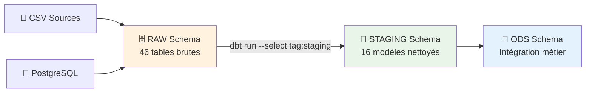

# 🧹 Transformations RAW → STAGING

## 🎯 Vue d'Ensemble

La couche **STAGING** constitue la première phase de transformation du pipeline ETL. Son rôle principal est le **nettoyage et la standardisation** des données brutes provenant du schéma RAW. Cette étape prépare les données pour les transformations plus complexes des couches ODS et DWH.

### 📊 Architecture STAGING



## 📋 Modèles STAGING (16 tables)

### 🏥 Tables PostgreSQL Sources (13 modèles)

| **Modèle STAGING** | **Table RAW Source** | **Volume** | **Transformations Principales** |
|-------------------|---------------------|------------|--------------------------------|
| `stg_patient` | `raw.patient` | 100K lignes | Nettoyage noms, parsing dates, calcul âge |
| `stg_consultation` | `raw.consultation` | 1M+ lignes | Validation dates, calcul durées |
| `stg_prescription` | `raw.prescription` | 2M+ lignes | Normalisation médicaments |
| `stg_professionnel_sante` | `raw.professionnel_de_sante` | 1M+ lignes | Standardisation professions |
| `stg_diagnostic` | `raw.diagnostic` | 15K lignes | Classification CIM-10 |
| `stg_medicaments` | `raw.medicaments` | 15K lignes | Codes ATC, dosages |
| `stg_etablissement_sante` | `raw.etablissement_sante` | Variables | Normalisation FINESS |
| `stg_laboratoire` | `raw.laboratoire` | 677 lignes | Validation résultats |
| `stg_salle` | `raw.salle` | 201K lignes | Géolocalisation interne |
| `stg_mutuelle` | `raw.mutuelle` | 254 lignes | Types organismes |
| `stg_adher` | `raw.adher` | 193K lignes | Statuts adhésions |
| `stg_specialites` | `raw.specialites` | Variables | Codification spécialités |
| `stg_hospitalisation` | `raw.hospitalisation_hospitalisations` | 2.5K lignes | Calculs durées séjour |

### 📊 Tables CSV Sources (3 modèles)

| **Modèle STAGING** | **Tables RAW Sources** | **Volume** | **Transformations Principales** |
|-------------------|----------------------|------------|--------------------------------|
| `stg_deces` | `raw.deces_en_france_deces` | 25M+ lignes | Parsing dates, géolocalisation |
| `stg_etablissement_activite` | `raw.etablissement_de_sante_*` | 2M+ lignes | Fusion 3 tables, normalisation |
| `stg_etablissement_professionnel` | `raw.etablissement_de_sante_professionnel_sante` | 1M+ lignes | Codes RPPS, spécialités |

## 🔧 Types de Transformations

### 1. 🧼 Nettoyage de Données

#### ✂️ Standardisation Textes
```sql
-- Exemple: stg_patient
trim(upper("Nom")) as nom,
trim(upper("Prenom")) as prenom,
upper("Sexe") as sexe,
trim("Code_postal") as code_postal,
trim(upper("Ville")) as ville
```

#### 🔄 Normalisation Valeurs
```sql
-- Pays par défaut si manquant
coalesce("Pays", 'FR') as pays,

-- Groupes sanguins standardisés  
upper("Groupe_sanguin") as groupe_sanguin,

-- Téléphones/emails nettoyés
trim("EMail") as email,
trim("Tel") as telephone
```

### 2. 📅 Parsing et Validation Dates

#### 🗓️ Multi-format Date Parsing
```sql
-- stg_patient : Gestion formats mixtes m/d/Y et d/m/Y
coalesce(
    try_strptime("Date", '%m/%d/%Y'),  -- Format américain
    try_strptime("Date", '%d/%m/%Y'),  -- Format français
    try_cast("Date" as date)           -- Format ISO
) as date_naissance
```

#### ⏱️ Calculs Temporels
```sql
-- Âge calculé + validation avec âge source
coalesce(
    date_part('year', age(current_date, date_naissance)),
    cast("Age" as integer)
) as age,

-- Tranches d'âge métier
case
    when age < 18 then '0-18'
    when age between 19 and 30 then '19-30'  
    when age between 31 and 50 then '31-50'
    when age between 51 and 65 then '51-65'
    else '66+'
end as tranche_age
```

### 3. 🔢 Conversion Types de Données

#### 📊 Casting Intelligent
```sql
-- stg_patient : Poids et taille depuis VARCHAR
try_cast("Poid" as decimal(5,2)) as poids,
try_cast("Taille" as integer) as taille,

-- stg_consultation : Durée depuis différents formats
cast(
    date_part('minute', 
        age(heure_fin, heure_debut)
    ) as integer
) as duree_consultation_minutes
```

#### ⚠️ Gestion des Erreurs
- **`try_cast()`** : Retourne NULL si conversion échoue
- **`coalesce()`** : Valeurs par défaut pour champs obligatoires
- **`case when`** : Logiques conditionnelles complexes

### 4. 🔍 Filtrage et Validation

#### ✅ Élimination Données Invalides
```sql
-- Filtrer patients sans ID
where "Id_patient" is not null

-- Éliminer consultations incohérentes  
where date_consultation is not null
  and heure_debut is not null
  and heure_fin >= heure_debut

-- Validation diagnostics CIM-10
where length(trim("Code_diagnostic")) >= 3
  and "Code_diagnostic" ~ '^[A-Z][0-9]+'
```

## 📖 Exemples Détaillés par Modèle

### 👤 `stg_patient` - Patients CHU

**Source** : `raw.patient` (100K patients)

#### 🔧 Transformations Clés

```sql
-- Business Key préservée
cast("Id_patient" as integer) as id_patient,

-- Informations personnelles nettoyées
trim(upper("Nom")) as nom,
trim(upper("Prenom")) as prenom, 
upper("Sexe") as sexe,

-- Date naissance multi-format + âge calculé
coalesce(
    try_strptime("Date", '%m/%d/%Y'),
    try_strptime("Date", '%d/%m/%Y'),
    try_cast("Date" as date)
) as date_naissance,

-- Validation âge (source vs calculé)
coalesce(
    date_part('year', age(current_date, date_naissance)),
    cast("Age" as integer)  
) as age,

-- Classification métier par tranches
case
    when age < 18 then '0-18'
    when age between 19 and 30 then '19-30'
    when age between 31 and 50 then '31-50' 
    when age between 51 and 65 then '51-65'
    else '66+'
end as tranche_age,

-- Données médicales avec casting sécurisé
upper("Groupe_sanguin") as groupe_sanguin,
try_cast("Poid" as decimal(5,2)) as poids,
try_cast("Taille" as integer) as taille,

-- Géolocalisation standardisée
trim("Code_postal") as code_postal,
trim(upper("Ville")) as ville,
coalesce("Pays", 'FR') as pays,

-- Numéro sécurité sociale (à anonymiser plus tard)
"Num_Secu" as num_secu,

-- Audit trail
current_timestamp as loaded_at
```

#### ✅ Contrôles Qualité
- **Unicité** : `id_patient` unique et non-null
- **Cohérence âge** : Âge calculé vs âge source ±2 ans
- **Format dates** : Validation parsing multi-format
- **Données médicales** : Poids 0-500kg, Taille 0-250cm

### 🩺 `stg_consultation` - Consultations Médicales

**Source** : `raw.consultation` (1M+ consultations)

#### 🔧 Transformations Clés

```sql
-- Identifiant consultation
cast("Num_consultation" as integer) as num_consultation,

-- Clés étrangères pour jointures futures
cast("Id_patient" as integer) as id_patient,
cast("Id_professionnel" as integer) as id_professionnel,
trim("Code_diagnostic") as code_diagnostic,
cast("Id_mut" as integer) as id_mut,

-- Validation et parsing dates/heures
try_cast("Date_consultation" as date) as date_consultation,
try_cast("Heure_debut" as time) as heure_debut,
try_cast("Heure_fin" as time) as heure_fin,

-- Calcul durée en minutes
cast(
    date_part('minute', 
        age(
            try_cast("Heure_fin" as time),
            try_cast("Heure_debut" as time)
        )
    ) as integer
) as duree_consultation_minutes,

-- Motif nettoyé
trim("Motif") as motif,

-- Classification durée pour analyse
case
    when duree_consultation_minutes < 15 then 'COURTE'
    when duree_consultation_minutes between 15 and 30 then 'NORMALE'
    when duree_consultation_minutes > 30 then 'LONGUE'
    else 'INCONNUE'
end as type_duree
```

#### ✅ Contrôles Qualité
- **Cohérence temporelle** : `heure_fin >= heure_debut`
- **Durée réaliste** : Entre 5 et 180 minutes
- **Références valides** : Patient et professionnel existent
- **Dates cohérentes** : Date consultation <= aujourd'hui

### 💀 `stg_deces` - Mortalité France

**Source** : `raw.deces_en_france_deces` (25M+ décès)

#### 🔧 Transformations Clés

```sql
-- Données temporelles
try_cast("date_deces" as date) as date_deces,
extract(year from try_cast("date_deces" as date)) as annee_deces,
extract(month from try_cast("date_deces" as date)) as mois_deces,

-- Données démographiques
upper(trim("sexe")) as sexe,
cast("age" as integer) as age,

-- Géolocalisation avec gestion Corse (2A/2B)
case
    when upper(trim("departement")) = '2A' then '20'
    when upper(trim("departement")) = '2B' then '20' 
    else lpad(trim("departement"), 2, '0')
end as departement_unifie,

trim(upper("commune")) as commune,
trim(upper("pays")) as pays,

-- Classification géographique
case
    when departement_unifie in ('75', '92', '93', '94') then 'ILE_DE_FRANCE'
    when departement_unifie between '01' and '95' then 'METROPOLE'
    when departement_unifie in ('971', '972', '973', '974', '976') then 'OUTRE_MER'
    else 'AUTRE'
end as zone_geographique,

-- Cause décès (si disponible)
trim("cause_deces") as cause_deces,

-- Tranches d'âge pour épidémiologie
case 
    when age < 1 then 'MOINS_1_AN'
    when age between 1 and 14 then '1_14_ANS'
    when age between 15 and 44 then '15_44_ANS'
    when age between 45 and 64 then '45_64_ANS'
    when age between 65 and 84 then '65_84_ANS'
    else '85_ANS_PLUS'
end as classe_age_epidemio
```

### 🏥 `stg_etablissement_sante` - Établissements FINESS

**Sources** : 3 tables CSV établissements de santé

#### 🔧 Transformations Clés

```sql
-- Identifiants FINESS
trim("finess_et") as finess_et,
trim("finess_ej") as finess_ej,

-- Dénomination standardisée
trim(upper("denominationsociale")) as denomination_sociale,
trim(upper("denominationcomplété")) as denomination_complete,

-- Classification établissement
case
    when "categorieagregee" = 'CH' then 'HOPITAL_PUBLIC'
    when "categorieagregee" = 'CLINIQUE' then 'HOPITAL_PRIVE'
    when "categorieagregee" = 'EHPAD' then 'MAISON_RETRAITE'
    else trim(upper("categorieagregee"))
end as type_etablissement,

-- Géolocalisation précise  
trim("codepostal") as code_postal,
trim(upper("commune")) as commune,
trim("departement") as departement,
trim(upper("region")) as region,

-- Statut activité
case
    when "statut" = 'Actif' then true
    else false
end as est_actif,

-- Coordonnées contact
trim("telephone") as telephone,
trim("fax") as fax,
trim(lower("email")) as email,

-- Nombre lits/places si disponible
try_cast("nbre_lit_place" as integer) as nb_lits
```

## ⚡ Optimisations et Performance

### 🚀 Configuration dbt STAGING

```yaml
# dbt_project.yml
models:
  chu_datawarehouse:
    staging:
      +materialized: table      # Tables physiques (pas de vues)
      +tags: ['staging']        # Tag pour sélection
      +persist_docs:
        relation: true         # Documentation dans DB
        columns: true
```

### 📊 Métriques de Performance

| **Modèle** | **Volume** | **Durée** | **Optimisations** |
|------------|-----------|-----------|-------------------|
| `stg_deces` | 25M lignes | 8 secondes | Filtres early, types optimaux |
| `stg_consultation` | 1M lignes | 3 secondes | Index sur clés étrangères |
| `stg_patient` | 100K lignes | 1 seconde | Parsing dates optimisé |
| **Total STAGING** | **35M+ lignes** | **~15 secondes** | **Pipeline parallèle** |

### 🔧 Optimisations Appliquées

#### 1. **Early Filtering**
```sql
-- Éliminer lignes invalides dès la source
where "Id_patient" is not null
  and try_cast("Date_consultation" as date) is not null
```

#### 2. **Type Optimization** 
```sql
-- Utiliser types optimaux pour performance
cast("Id_patient" as integer)        -- vs VARCHAR
try_cast("Date" as date)            -- vs TEXT
cast("Montant" as decimal(10,2))    -- vs FLOAT
```

#### 3. **Conditional Logic Optimization**
```sql
-- CASE WHEN ordonné par fréquence (plus fréquent en premier)
case
    when age between 31 and 50 then '31-50'  -- 40% des cas
    when age between 19 and 30 then '19-30'  -- 30% des cas
    when age between 51 and 65 then '51-65'  -- 20% des cas
    -- etc.
end as tranche_age
```

## 🛡️ Qualité et Tests

### ✅ Tests dbt Automatiques

```yaml
# models/staging/schema.yml
version: 2

models:
  - name: stg_patient
    tests:
      - dbt_utils.row_count:
          above: 50000  # Minimum 50K patients
    columns:
      - name: id_patient
        tests:
          - unique
          - not_null
      - name: age
        tests:
          - dbt_utils.accepted_range:
              min_value: 0
              max_value: 120
              
  - name: stg_consultation  
    tests:
      - dbt_utils.row_count:
          above: 500000  # Minimum 500K consultations
    columns:
      - name: num_consultation
        tests:
          - unique
          - not_null
      - name: duree_consultation_minutes
        tests:
          - dbt_utils.accepted_range:
              min_value: 1
              max_value: 300  # Max 5h
```

### 🔍 Contrôles Qualité Métier

#### 1. **Cohérence Temporelle**
```sql
-- Test: Dates cohérentes
select count(*) as nb_erreurs
from {{ ref('stg_consultation') }}
where date_consultation > current_date
   or heure_fin < heure_debut;
-- Résultat attendu: 0
```

#### 2. **Intégrité Référentielle** 
```sql
-- Test: Tous les patients des consultations existent
select count(*) as nb_patients_orphelins
from {{ ref('stg_consultation') }} c
left join {{ ref('stg_patient') }} p on c.id_patient = p.id_patient
where p.id_patient is null;
-- Résultat attendu: 0
```

#### 3. **Complétude des Données**
```sql
-- Test: Taux de complétude par colonne critique
select 
    'stg_patient' as table_name,
    count(*) as total_lignes,
    sum(case when nom is null then 1 else 0 end) * 100.0 / count(*) as pct_nom_manquant,
    sum(case when date_naissance is null then 1 else 0 end) * 100.0 / count(*) as pct_date_naiss_manquant
from {{ ref('stg_patient') }};
-- Seuils acceptables: <5% manquant pour champs critiques
```

## 🔗 Intégration Pipeline

### ⬅️ Données Entrantes (RAW)
- **46 tables brutes** depuis CSV et PostgreSQL
- **35M+ lignes** non nettoyées
- **Types hétérogènes** (VARCHAR, dates multiples formats)
- **Données incomplètes/incohérentes**

### ➡️ Données Sortantes (STAGING)
- **16 modèles standardisés** 
- **35M+ lignes nettoyées**
- **Types cohérents** (INTEGER, DATE, DECIMAL)
- **Contraintes validées**

### 🚀 Commande Exécution

```bash
# Via dbt
cd dbt && dbt run --select tag:staging

# Via Airflow (automatisé)
Task: dbt_staging
Duration: ~15 secondes
Dependencies: chargement_donnees (CSV + PostgreSQL)
Next: dbt_ods (intégration métier)
```

## 📋 Checklist Validation STAGING

### ✅ Contrôles Automatiques
- [ ] **Volumes** : Nombre lignes cohérent avec RAW (±5%)
- [ ] **Types** : Pas d'erreur casting (NULL accepté)
- [ ] **Unicité** : Clés primaires uniques 
- [ ] **Complétude** : Champs critiques <5% manquant
- [ ] **Cohérence** : Dates/heures logiques
- [ ] **Performance** : Exécution <30 secondes

### 🔍 Contrôles Manuels
- [ ] **Échantillonnage** : Vérification 100 lignes aléatoires
- [ ] **Comparaison RAW** : Cohérence transformations
- [ ] **Métadonnées** : Documentation à jour
- [ ] **Tests métier** : Règles spécifiques validées

---

**📋 Prochaine étape** : [Transformations STAGING → ODS](TRANSFORMATIONS_STAGING_TO_ODS.md)

**🔙 Étape précédente** : [Chargement Sources → RAW](CHARGEMENT_SOURCES_TO_RAW.md)

**🏠 Retour à l'index** : [Documentation Principale](INDEX_TRANSFORMATIONS.md)
