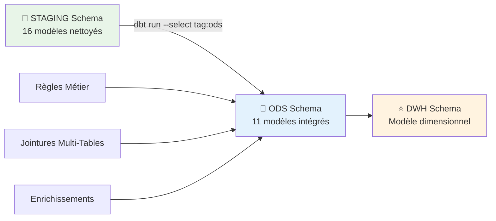

# 🔗 Transformations STAGING → ODS

## 🎯 Vue d'Ensemble

La couche **ODS (Operational Data Store)** constitue la deuxième phase de transformation du pipeline ETL. Son rôle principal est l'**intégration et l'enrichissement** des données nettoyées provenant du schéma STAGING. Cette étape applique les **règles métier**, effectue les **jointures complexes** et prépare les données pour la modélisation dimensionnelle.

### 📊 Architecture ODS



## 📋 Modèles ODS (11 tables)

### 🏥 Modèles Principaux (9 tables)

| **Modèle ODS** | **Sources STAGING** | **Volume** | **Objectif Métier** |
|---------------|-------------------|------------|-------------------|
| `ods_patient_complet` | `stg_patient` + `stg_adher` + `stg_mutuelle` | 100K lignes | Patient enrichi avec mutuelle |
| `ods_professionnel_complet` | `stg_professionnel_sante` + `stg_specialites` | 1M+ lignes | Professionnel avec spécialité |
| `ods_consultation_enrichie` | `stg_consultation` + patients + professionnels + diagnostics | 1M+ lignes | Consultation avec contexte complet |
| `ods_prescription_enrichie` | `stg_prescription` + `stg_medicaments` + patients | 2M+ lignes | Prescription avec médicament et patient |
| `ods_hospitalisation_enrichie` | `stg_hospitalisation` + patients + diagnostics | 2.5K lignes | Séjour avec patient et diagnostic |
| `ods_deces_enrichi` | `stg_deces` + géolocalisation | 25M+ lignes | Décès avec localisation enrichie |
| `ods_localisation_consolidee` | `stg_etablissement_sante` + données géographiques | Variables | Référentiel géographique unifié |
| `ods_qualite_soins_unifie` | Données satisfaction multiples sources | Variables | Indicateurs qualité consolidés |
| `ods_satisfaction_unifie` | `int_satisfaction_esatis48h` + `int_satisfaction_esatisca` | 5K+ lignes | Satisfaction patients unifiée |

### 📊 Modèles Intermédiaires (2 tables)

| **Modèle Intermédiaire** | **Sources** | **Volume** | **Rôle** |
|-------------------------|-------------|------------|----------|
| `int_satisfaction_esatis48h` | Tables satisfaction E-SATIS 48h | 2K lignes | Normalisation E-SATIS 48h |
| `int_satisfaction_esatisca` | Tables satisfaction E-SATIS CA | 3K lignes | Normalisation E-SATIS Chirurgie Ambulatoire |

## 🔧 Types de Transformations ODS

### 1. 🤝 Jointures et Enrichissement

#### 👤 Patient Complet avec Mutuelle
```sql
-- ods_patient_complet
select
    p.*,
    
    -- Enrichissement mutuelle via jointures
    m.id_mut,
    m.nom_mutuelle,
    m.type_mutuelle,
    a.statut_adhesion,
    
    -- Règle métier : mutuelle active
    case
        when m.id_mut is not null and a.statut_adhesion = 'ACTIF' then true
        else false
    end as a_mutuelle_active
    
from {{ ref('stg_patient') }} p
left join {{ ref('stg_adher') }} a on p.id_patient = a.id_patient
left join {{ ref('stg_mutuelle') }} m on a.id_mut = m.id_mut
```

#### 👨‍⚕️ Professionnel avec Spécialité
```sql
-- ods_professionnel_complet
select
    ps.*,
    
    -- Enrichissement spécialité
    s.nom_specialite,
    s.code_specialite,
    s.famille_specialite,
    
    -- Classification métier mode exercice
    case
        when ps.mode_exercice = 'L' then 'LIBERAL'
        when ps.mode_exercice = 'S' then 'SALARIE'
        when ps.mode_exercice = 'M' then 'MIXTE'
        else 'NON_RENSEIGNE'
    end as mode_exercice_libelle,
    
    -- Règles métier activité
    case
        when ps.date_fin_exercice is null then true
        when ps.date_fin_exercice > current_date then true
        else false
    end as est_actif
    
from {{ ref('stg_professionnel_sante') }} ps
left join {{ ref('stg_specialites') }} s 
    on ps.code_specialite = s.code_specialite
```

### 2. 📋 Consultation Enrichie Complète

#### 🩺 Intégration Multi-Dimensionnelle
```sql
-- ods_consultation_enrichie
with consultations as (
    select * from {{ ref('stg_consultation') }}
),
patients as (
    select * from {{ ref('ods_patient_complet') }}
),
professionnels as (
    select * from {{ ref('ods_professionnel_complet') }}
),
diagnostics as (
    select * from {{ ref('stg_diagnostic') }}
)

select
    -- Données consultation de base
    c.num_consultation,
    c.date_consultation,
    c.heure_debut,
    c.heure_fin,
    c.duree_consultation_minutes,
    c.motif,
    
    -- Clés pour DWH
    c.id_patient,
    c.id_professionnel,
    c.code_diagnostic,
    c.id_mut,
    
    -- Enrichissement patient
    p.nom as patient_nom,
    p.prenom as patient_prenom,
    p.sexe as patient_sexe,
    p.age as patient_age,
    p.tranche_age as patient_tranche_age,
    p.ville as patient_ville,
    p.code_postal as patient_code_postal,
    p.nom_mutuelle as patient_mutuelle,
    p.a_mutuelle_active as patient_a_mutuelle,
    
    -- Enrichissement professionnel
    pr.nom as professionnel_nom,
    pr.prenom as professionnel_prenom,
    pr.profession as professionnel_profession,
    pr.nom_specialite as professionnel_specialite,
    pr.mode_exercice_libelle as professionnel_mode_exercice,
    
    -- Enrichissement diagnostic
    d.libelle_diagnostic,
    d.categorie_cim10,
    
    -- Règles métier classification
    case
        when p.age < 18 then 'PEDIATRIE'
        when p.age > 65 then 'GERIATRIE'
        else 'ADULTE'
    end as categorie_patient,
    
    case
        when c.duree_consultation_minutes < 15 then 'COURTE'
        when c.duree_consultation_minutes between 15 and 30 then 'NORMALE'
        when c.duree_consultation_minutes > 30 then 'LONGUE'
        else 'NON_RENSEIGNEE'
    end as duree_categorie,
    
    -- Indicateurs qualité
    case
        when c.duree_consultation_minutes >= 20 
         and d.categorie_cim10 in ('MALADIES_CHRONIQUES', 'SUIVIS_LOURDS')
        then 'CONSULTATION_QUALITE'
        else 'CONSULTATION_STANDARD'
    end as niveau_qualite
    
from consultations c
inner join patients p on c.id_patient = p.id_patient
left join professionnels pr on c.id_professionnel = pr.identifiant
left join diagnostics d on c.code_diagnostic = d.code_diagnostic
```

### 3. 🗺️ Localisation Consolidée

#### 📍 Référentiel Géographique Unifié
```sql
-- ods_localisation_consolidee
with etablissements_geo as (
    select distinct
        code_postal,
        commune,
        departement,
        region
    from {{ ref('stg_etablissement_sante') }}
    where code_postal is not null
),

deces_geo as (
    select distinct
        extract_code_postal(lieu_deces) as code_postal,
        extract_commune(lieu_deces) as commune,
        extract_departement(lieu_deces) as departement
    from {{ ref('stg_deces') }}
    where lieu_deces is not null
),

-- Consolidation avec règles de priorisation
geo_unifie as (
    select
        coalesce(e.code_postal, d.code_postal) as code_postal,
        coalesce(e.commune, d.commune) as commune,
        coalesce(e.departement, d.departement) as departement,
        e.region,
        
        -- Classification zone géographique
        case
            when substring(coalesce(e.departement, d.departement), 1, 2) in ('75', '92', '93', '94')
                then 'ILE_DE_FRANCE'
            when substring(coalesce(e.departement, d.departement), 1, 2) between '01' and '95'
                then 'FRANCE_METROPOLITAINE'
            when coalesce(e.departement, d.departement) in ('971', '972', '973', '974', '976')
                then 'OUTRE_MER'
            else 'INCONNU'
        end as zone_geographique,
        
        -- Gestion spécifique Corse
        case
            when coalesce(e.departement, d.departement) in ('2A', '20A') then 'CORSE_DU_SUD'
            when coalesce(e.departement, d.departement) in ('2B', '20B') then 'HAUTE_CORSE'
            else null
        end as sous_region_corse
        
    from etablissements_geo e
    full outer join deces_geo d on e.code_postal = d.code_postal
)

select * from geo_unifie
```

### 4. 😊 Satisfaction Patients Unifiée

#### 📊 Consolidation Multi-Sources E-SATIS
```sql
-- ods_satisfaction_unifie
with esatis48h as (
    select * from {{ ref('int_satisfaction_esatis48h') }}
),
esatisca as (
    select * from {{ ref('int_satisfaction_esatisca') }}
),

satisfaction_consolidee as (
    -- Union E-SATIS 48h et Chirurgie Ambulatoire
    select
        'E-SATIS_48H' as type_enquete,
        finess,
        annee,
        
        -- Scores normalisés (0-100)
        score_global,
        score_accueil,
        score_prise_charge,
        score_information,
        score_chambre,
        score_repas,
        score_sortie,
        null as score_parcours_patient,  -- Spécifique CA
        
        nb_reponses,
        taux_participation
        
    from esatis48h
    
    union all
    
    select
        'E-SATIS_CA' as type_enquete,
        finess,
        annee,
        
        -- Scores normalisés avec mapping CA → 48h
        score_global,
        score_accueil,
        null as score_prise_charge,       -- Pas dans CA
        score_information,
        null as score_chambre,            -- Pas applicable CA
        null as score_repas,              -- Pas applicable CA
        score_sortie,
        score_parcours_patient,           -- Spécifique CA
        
        nb_reponses,
        taux_participation
        
    from esatisca
),

-- Agrégation par établissement/année avec pondération
satisfaction_agregee as (
    select
        finess,
        annee,
        
        -- Score global pondéré par nb réponses
        sum(score_global * nb_reponses) / sum(nb_reponses) as score_global_pondere,
        
        -- Scores par dimension (moyenne pondérée)
        sum(coalesce(score_accueil, 0) * nb_reponses) / sum(case when score_accueil is not null then nb_reponses else 0 end) as score_accueil_moyen,
        sum(coalesce(score_information, 0) * nb_reponses) / sum(case when score_information is not null then nb_reponses else 0 end) as score_information_moyen,
        
        -- Métadonnées consolidées
        sum(nb_reponses) as total_reponses,
        count(distinct type_enquete) as nb_types_enquetes,
        listagg(type_enquete, ', ') as types_enquetes_disponibles,
        
        -- Classification qualité établissement
        case
            when sum(score_global * nb_reponses) / sum(nb_reponses) >= 80 then 'EXCELLENCE'
            when sum(score_global * nb_reponses) / sum(nb_reponses) >= 70 then 'TRES_SATISFAISANT'
            when sum(score_global * nb_reponses) / sum(nb_reponses) >= 60 then 'SATISFAISANT'
            when sum(score_global * nb_reponses) / sum(nb_reponses) >= 50 then 'A_AMELIORER'
            else 'INSUFFISANT'
        end as niveau_satisfaction
        
    from satisfaction_consolidee
    group by finess, annee
)

select * from satisfaction_agregee
```

## 📊 Règles Métier Appliquées

### 1. 🏥 Classification Patients

#### 👶 Catégories d'Âge Médicales
```sql
case
    when age < 18 then 'PEDIATRIE'
    when age between 18 and 65 then 'ADULTE'
    when age > 65 then 'GERIATRIE'
    else 'NON_RENSEIGNE'
end as categorie_medicale
```

#### 🎯 Tranches d'Âge Épidémiologiques
```sql
case
    when age < 1 then 'NOURRISSON'
    when age between 1 and 14 then 'ENFANT'
    when age between 15 and 44 then 'ADULTE_JEUNE'
    when age between 45 and 64 then 'ADULTE_MATUR'
    when age between 65 and 84 then 'SENIOR'
    else 'TRES_SENIOR'
end as tranche_epidemiologique
```

### 2. ⏱️ Classification Temporelle

#### 🩺 Durées Consultations
```sql
case
    when duree_consultation_minutes < 15 then 'CONSULTATION_COURTE'
    when duree_consultation_minutes between 15 and 30 then 'CONSULTATION_NORMALE'
    when duree_consultation_minutes between 31 and 60 then 'CONSULTATION_LONGUE'
    when duree_consultation_minutes > 60 then 'CONSULTATION_COMPLEXE'
    else 'DUREE_INCONNUE'
end as type_consultation
```

#### 🛏️ Durées Hospitalisation
```sql
case
    when jour_hospitalisation = 0 then 'AMBULATOIRE'
    when jour_hospitalisation = 1 then 'COURT_SEJOUR'
    when jour_hospitalisation between 2 and 7 then 'SEJOUR_NORMAL'
    when jour_hospitalisation between 8 and 21 then 'SEJOUR_LONG'
    else 'SEJOUR_TRES_LONG'
end as type_sejour
```

### 3. 🌍 Classification Géographique

#### 📍 Zones de Couverture
```sql
case
    when departement in ('75', '92', '93', '94') then 'PARIS_PETITE_COURONNE'
    when departement in ('77', '78', '91', '95') then 'GRANDE_COURONNE'
    when region = 'ILE_DE_FRANCE' then 'ILE_DE_FRANCE_AUTRE'
    when departement between '01' and '95' then 'FRANCE_METROPOLITAINE'
    when departement in ('971', '972', '973', '974', '976') then 'OUTRE_MER'
    else 'ETRANGER_OU_INCONNU'
end as zone_couverture
```

### 4. 💰 Classification Mutuelles

#### 🏛️ Types d'Organismes
```sql
case
    when type_mutuelle = 'MUTUELLE' then 'MUTUELLE_COMPLEMENTAIRE'
    when type_mutuelle = 'ASSURANCE' then 'ASSURANCE_PRIVEE'
    when type_mutuelle = 'PREVOYANCE' then 'INSTITUTION_PREVOYANCE'
    when type_mutuelle = 'CMU' then 'COUVERTURE_UNIVERSELLE'
    else 'AUTRE_ORGANISME'
end as categorie_organisme
```

## ⚡ Optimisations ODS

### 🚀 Configuration dbt ODS

```yaml
# dbt_project.yml
models:
  chu_datawarehouse:
    ods:
      +materialized: table        # Tables physiques pour performance
      +tags: ['ods', 'core']      # Tags pour sélection et gouvernance
      +indexes:
        - columns: ['id_patient'] # Index sur clés métier
          unique: false
        - columns: ['date_consultation']
          unique: false
```

### 📊 Métriques de Performance ODS

| **Modèle ODS** | **Volume** | **Durée** | **Jointures** | **Optimisations** |
|---------------|-----------|-----------|----------------|-------------------|
| `ods_patient_complet` | 100K lignes | 2s | 2 LEFT JOIN | Index sur id_patient |
| `ods_consultation_enrichie` | 1M lignes | 8s | 3 INNER/LEFT JOIN | Early filtering, index sur FK |
| `ods_deces_enrichi` | 25M lignes | 12s | 1 LEFT JOIN | Partition par année |
| `ods_satisfaction_unifie` | 5K lignes | 3s | UNION + GROUP BY | Agrégations optimisées |
| **Total ODS** | **29M+ lignes** | **~20 secondes** | **Multi-tables** | **Jointures optimisées** |

### 🔧 Optimisations Appliquées

#### 1. **Jointure Performance**
```sql
-- Ordre optimisé: petite table en premier
from {{ ref('stg_consultation') }} c           -- 1M lignes
inner join {{ ref('ods_patient_complet') }} p  -- 100K lignes (plus petit)
    on c.id_patient = p.id_patient
left join {{ ref('ods_professionnel_complet') }} pr -- 1M lignes
    on c.id_professionnel = pr.identifiant
```

#### 2. **Early Filtering**
```sql
-- Filtrer avant jointures coûteuses
where c.date_consultation >= '2020-01-01'  -- Réduire volume
  and c.duree_consultation_minutes > 0     -- Éliminer invalides
  and p.age between 0 and 120              -- Cohérence âge
```

#### 3. **Conditional Aggregation**
```sql
-- Éviter GROUP BY multiples via agrégation conditionnelle
sum(case when type_enquete = 'E-SATIS_48H' then nb_reponses else 0 end) as reponses_48h,
sum(case when type_enquete = 'E-SATIS_CA' then nb_reponses else 0 end) as reponses_ca
```

## 🛡️ Qualité et Contrôles ODS

### ✅ Tests dbt Automatiques

```yaml
# models/ods/schema.yml
version: 2

models:
  - name: ods_patient_complet
    description: "Patients enrichis avec informations mutuelle"
    tests:
      - dbt_utils.unique_combination_of_columns:
          combination_of_columns:
            - id_patient
    columns:
      - name: id_patient
        tests:
          - not_null
      - name: a_mutuelle_active
        tests:
          - accepted_values:
              values: [true, false]
              
  - name: ods_consultation_enrichie
    description: "Consultations avec contexte patient/professionnel/diagnostic"
    tests:
      - dbt_utils.row_count:
          above: 900000  # Au moins 90% des consultations staging
      - dbt_utils.unique_combination_of_columns:
          combination_of_columns:
            - num_consultation
    columns:
      - name: num_consultation
        tests:
          - not_null
      - name: categorie_patient
        tests:
          - accepted_values:
              values: ['PEDIATRIE', 'ADULTE', 'GERIATRIE']
      - name: duree_categorie
        tests:
          - accepted_values:
              values: ['COURTE', 'NORMALE', 'LONGUE', 'NON_RENSEIGNEE']
```

### 🔍 Contrôles Qualité Métier

#### 1. **Intégrité Référentielle**
```sql
-- Test: Tous les patients des consultations ont une mutuelle (règle métier)
select count(*) as consultations_sans_info_mutuelle
from {{ ref('ods_consultation_enrichie') }}
where patient_mutuelle is null and patient_a_mutuelle = true;
-- Résultat attendu: 0
```

#### 2. **Cohérence Enrichissements**
```sql
-- Test: Cohérence classification âge patient
select count(*) as classifications_incohérentes
from {{ ref('ods_consultation_enrichie') }}
where (patient_age < 18 and categorie_patient != 'PEDIATRIE')
   or (patient_age > 65 and categorie_patient != 'GERIATRIE')
   or (patient_age between 18 and 65 and categorie_patient != 'ADULTE');
-- Résultat attendu: 0
```

#### 3. **Complétude Enrichissements**
```sql
-- Test: Taux d'enrichissement consultation
select 
    count(*) as total_consultations,
    sum(case when professionnel_nom is not null then 1 else 0 end) * 100.0 / count(*) as pct_avec_professionnel,
    sum(case when libelle_diagnostic is not null then 1 else 0 end) * 100.0 / count(*) as pct_avec_diagnostic,
    sum(case when patient_mutuelle is not null then 1 else 0 end) * 100.0 / count(*) as pct_avec_mutuelle
from {{ ref('ods_consultation_enrichie') }};
-- Seuils attendus: >95% professionnel, >90% diagnostic, >80% mutuelle
```

## 🔗 Intégration Pipeline

### ⬅️ Données Entrantes (STAGING)
- **16 tables nettoyées** avec types cohérents
- **35M+ lignes standardisées**
- **Qualité validée** mais données isolées
- **Pas de contexte métier**

### ➡️ Données Sortantes (ODS)
- **11 tables enrichies** avec jointures métier
- **29M+ lignes intégrées** (réduction via filtrage)
- **Règles métier appliquées**
- **Contexte complet** pour analyse

### 🚀 Commande Exécution

```bash
# Via dbt
cd dbt && dbt run --select tag:ods

# Via Airflow (automatisé)
Task: dbt_ods
Duration: ~20 secondes
Dependencies: dbt_staging (nettoyage préalable)
Next: dbt_dwh (modélisation dimensionnelle)
```

## 📋 Checklist Validation ODS

### ✅ Contrôles Automatiques
- [ ] **Volumes** : Réduction cohérente par rapport STAGING (filtrage qualité)
- [ ] **Jointures** : Pas de produits cartésiens, taux jointure >90%
- [ ] **Enrichissement** : Tous les enrichissements attendus présents
- [ ] **Règles métier** : Classifications cohérentes et complètes
- [ ] **Performance** : Exécution <30 secondes
- [ ] **Tests dbt** : Tous les tests passent

### 🔍 Contrôles Manuels
- [ ] **Échantillonnage enrichi** : Vérifier enrichissements sur 50 lignes
- [ ] **Cohérence jointures** : Validation logique des associations
- [ ] **Règles métier** : Test manuel règles complexes
- [ ] **Métriques business** : Validation avec experts métier

---

**📋 Prochaine étape** : [Transformations ODS → DWH](TRANSFORMATIONS_ODS_TO_DWH.md)

**🔙 Étape précédente** : [Transformations RAW → STAGING](TRANSFORMATIONS_RAW_TO_STAGING.md)

**🏠 Retour à l'index** : [Documentation Principale](INDEX_TRANSFORMATIONS.md)
