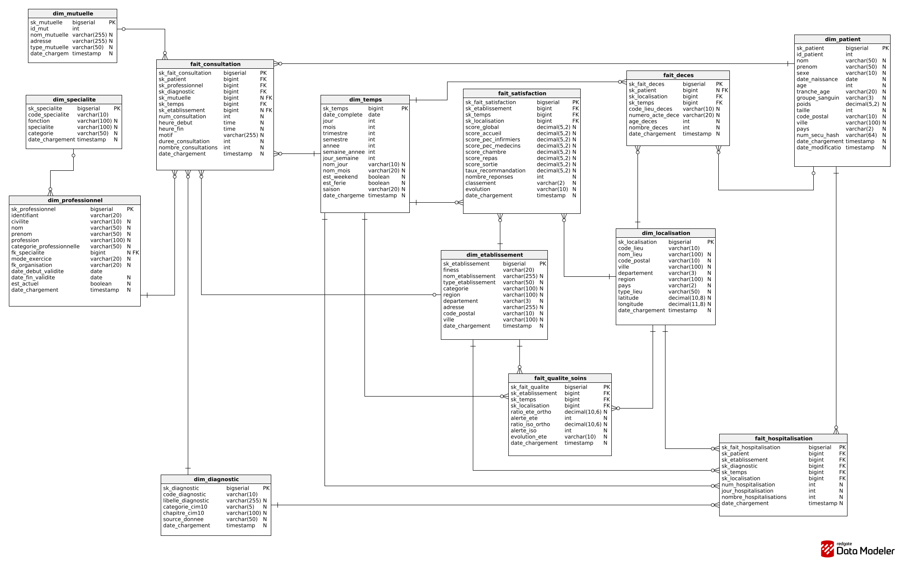
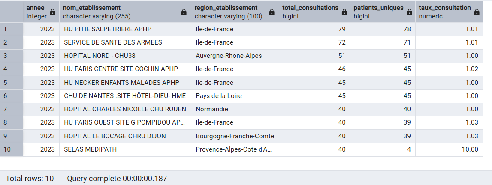
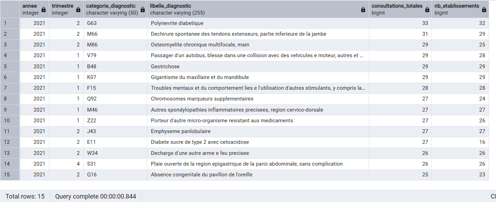
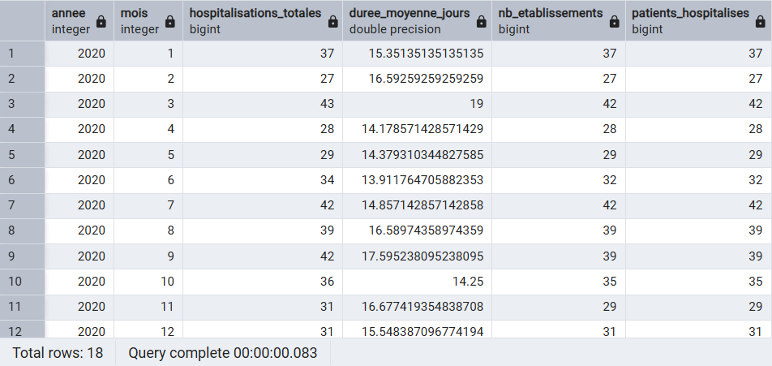
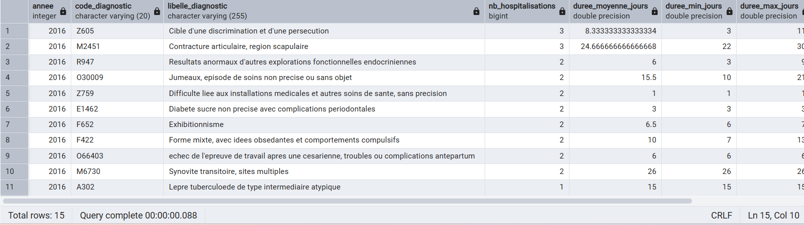
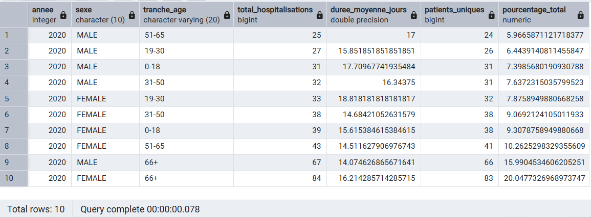
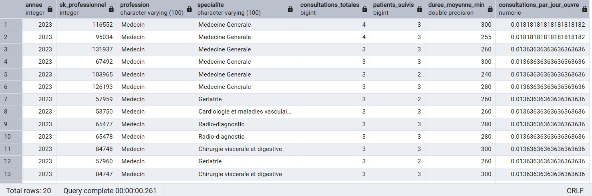
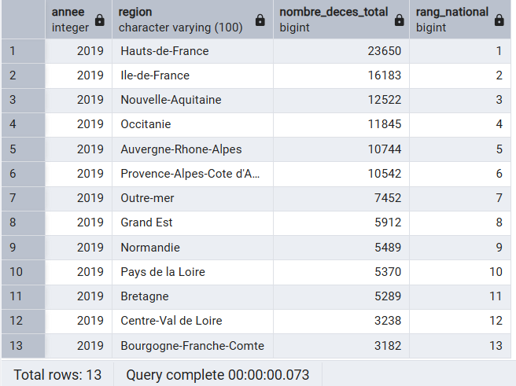
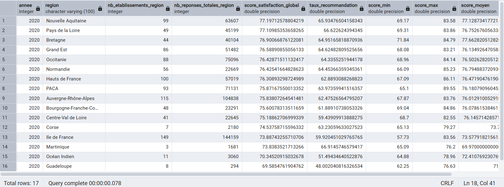
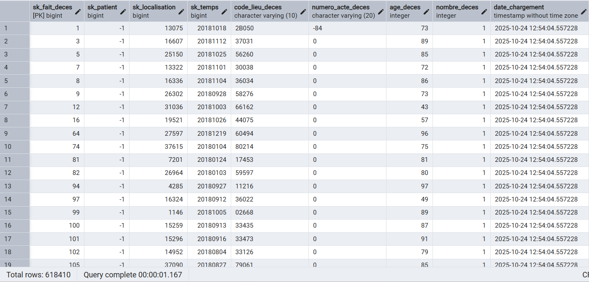

# Livrable 2 – Modèle physique et optimisation

---

## Introduction

Le premier livrable a posé les fondations conceptuelles de notre entrepôt de données pour le groupe CHU. Nous avons défini l'architecture cible, justifié nos choix technologiques et modélisé notre schéma en constellation avec huit dimensions et cinq tables de faits.

Ce second livrable marque le passage à la phase d'implémentation concrète. Nous y détaillons la construction physique du Data Warehouse, le peuplement effectif des données, les stratégies d'optimisation mises en œuvre et la validation des résultats obtenus. Le but principal est de démontrer que notre architecture théorique va nous permettre d'avoir au final un système performant, capable de supporter les analyses en temps réel.

Nous abordons successivement la justification de notre stack technologique, la description détaillée du modèle physique avec son architecture de sécurité, le processus complet de peuplement des dimensions et des mesures, les techniques d'optimisation déployées, la validation par requêtes analytiques, et enfin l'évaluation quantitative des performances obtenues. Chaque choix technique est justifié par des contraintes métier réelles et validé par des tests de performance concrets.

## 1. Justification de la stack technologique

### 1.1. Architecture globale et choix stratégiques

Notre architecture repose sur une approche en cinq couches logiques, chacune ayant un rôle précis dans le pipeline de traitement des données. Cette séparation claire des responsabilités facilite la maintenance, améliore la traçabilité et permet une évolution progressive du système.

- La première couche regroupe l'ensemble des sources de données hétérogènes que nous devons intégrer. Il s'agit de fichiers CSV et Excel contenant les données de décès, de diagnostics et de patients, d'une base PostgreSQL opérationnelle hébergeant les consultations et hospitalisations.

- La deuxième couche assure l'ingestion de ces données. Apache Airflow orchestre l'ensemble des flux en pilotant les scripts Python qui extraient les données depuis leurs sources respectives. Cette orchestration permet de gérer finement les dépendances entre tâches, de programmer les exécutions et de monitorer l'ensemble du processus. Les données brutes sont ensuite chargées dans DuckDB, qui joue le rôle de zone de transit technique.

- La troisième couche est dédiée à la transformation. C'est dans DuckDB que s'effectuent toutes les opérations de nettoyage, déduplication, normalisation et enrichissement des données. Nous utilisons DBT pour structurer ces transformations de manière versionnée et testable. Les fichiers intermédiaires sont stockés au format Parquet colonnaire, qui offre d'excellentes performances de lecture et une compression efficace. Ce choix du format Parquet reproduit les avantages du stockage HDFS préconisé dans l'approche Hadoop, sans la complexité opérationnelle associée.

- La quatrième couche héberge notre Data Warehouse final dans PostgreSQL. Nous avons organisé cette couche en deux schémas distincts qui répondent à des besoins différents. Le schéma dwh contient les tables de dimensions et de faits, avec un accès restreint uniquement aux processus ETL et administrateurs. Le schéma datamart regroupe les tables agrégées qui ont été optimisées pour les cas d'usage Power BI. Elles sont accessibles en lecture seule aux utilisateurs métier.

- Enfin, la cinquième couche assure la visualisation via Power BI, qui se connecte directement aux datamarts PostgreSQL. Nous avons implémenté le principe du moindre privilège pour garantir que chaque service n'accède qu'aux données qui le concernent, conformément aux principes de minimisation du RGPD.


### 1.2. Justification du choix par rapport au cahier des charges

Le cahier des charges initial suggérait l'utilisation de Talend pour l'ETL et Hive pour l'entreposage de données.  Après une analyse approfondie des contraintes du projet, nous avons fait le choix d'une stack alternative plus moderne, mieux adaptée à notre contexte spécifique.

- Pour l'orchestration ETL, nous avons privilégié la combinaison Airflow et Python plutôt que Talend. Ce choix se justifie par plusieurs avantages décisifs. Airflow est un outil open-source qui élimine les coûts de licence de Talend. Son modèle de DAG (Directed Acyclic Graph) offre une représentation visuelle claire des dépendances entre tâches, facilitant grandement la compréhension et la maintenance du pipeline. Python apporte une flexibilité totale pour gérer les sources de données hétérogènes, tandis qu'Airflow intègre nativement des fonctionnalités de monitoring et d'alerting essentielles pour la production. 

- Concernant l'entreposage des données, nous avons remplacé Hive par DuckDB pour la phase de transformation. Cette décision repose sur une analyse de nos volumes de données. DuckDB est un moteur analytique in-memory spécifiquement conçu pour l'OLAP, qui offre des performances largement supérieures à Hive pour des volumétries moyennes comme la nôtre (moins de 100 millions de lignes). L'absence de nécessité d'une infrastructure Hadoop complète représente un gain considérable en termes de simplicité opérationnelle et de coûts de maintenance. DuckDB supporte parfaitement le SQL standard, garantissant la portabilité du code et permet aussi de s'intégrer simplement avec Python et le format Parquet.

- Pour le stockage final en production, nous avons choisi PostgreSQL plutôt que la distribution Cloudera. PostgreSQL est un SGBD relationnel robuste qui répond parfaitement à nos besoins. Ses avantages principaux sont sa simplicité, sa maintenance et surtout le fait que ce soit open-source (ça permet de maîtriser totalement les coûts d'infrastructure).

- Enfin, concernant le stockage des fichiers intermédiaires, nous utilisons le format Parquet en local plutôt que HDFS. Parquet est un format colonnaire optimisé pour l'analytique, offrant une compression efficace et une lecture ultra-rapide par DuckDB. L'absence de dépendance à Hadoop simplifie le déploiement et la maintenance.

Cette stack moderne nous permet de bénéficier d'excellentes performances tout en maintenant une complexité opérationnelle réduite, parfaitement adaptée à la taille et aux compétences de l'équipe CHU. Les tests de performance que nous détaillerons plus loin démontrent que cette architecture atteint des temps de réponse systématiquement inférieurs à 1 demie seconde pour la majorité des requêtes analytiques.

## 2. Modèle physique

### 2.1. Architecture de stockage et organisation logique

Notre solution s'organise en 5 zones logiques distinctes, chacune ayant un rôle spécifique dans le cycle de vie des données. Cette séparation garantit la traçabilité complète du processus ETL et facilite le diagnostic en cas d'anomalie.

- La zone RAW constitue la première zone de stockage des données extraites. Les fichiers y sont stockés dans leur format d'origine, sans aucune transformation. Cette conservation des données brutes permet de rejouer l'ensemble du pipeline en cas de besoin et sert de référence pour les audits de qualité.

- La zone STAGING héberge les données après nettoyage initial. C'est dans cette zone que nous appliquons les premières transformations : uniformisation de l'encodage en UTF-8, suppression des doublons stricts, normalisation des formats de dates selon la norme ISO 8601 et validation des contraintes métier de base. Les données sont stockées au format Parquet qui offre une excellente compression et des performances de lecture optimales.

- La zone ODS (Operational Data Store) agit comme une couche intermédiaire entre le STAGING et le DWH. Elle contient une version consolidée et cohérente des données opérationnelles. Les tables y sont modélisées de manière proche des systèmes sources afin de faciliter les contrôles de cohérence et les rapprochements fonctionnels.

- La zone DWH représente notre entrepôt de données, matérialisé par le schéma dwh dans PostgreSQL. Ce schéma contient les huit dimensions et les cinq tables de faits.  L'accès à ce schéma est strictement restreint aux processus ETL et aux administrateurs de bases de données, garantissant l'intégrité des données sources.

- La zone DATAMART, matérialisée par le schéma datamart dans PostgreSQL, contient les tables pré-agrégées spécifiquement conçues pour les besoins Power BI. Ces datamarts sont organisés par domaine métier et optimisés pour des temps de réponse quasi-instantanés. Contrairement au schéma dwh, le schéma datamart est accessible en lecture seule à l'ensemble des utilisateurs métier autorisés avec des droits différenciés selon les services.

### 2.2. Conception des dimensions

Notre modèle en constellation repose sur huit dimensions partagées qui apportent le contexte analytique nécessaire à l'interprétation des faits. Chaque dimension a été conçue pour répondre à des besoins métier spécifiques tout en garantissant la cohérence globale du modèle.

- La dimension temps sert de référentiel pour filtrer, regrouper et comparer les données selon différents niveaux de granularité. Elle contient des données avec pour chaque date une décomposition complète en jour, semaine, mois, trimestre, semestre et année. Nous avons enrichi cette dimension avec des attributs métier pertinents comme les indicateurs de weekend, les jours fériés français, et les saisons, qui facilitent les analyses épidémiologiques. Cette dimension est générée lors de l'initialisation du système et nécessite simplement d'une mise à jour annuelle.

- La dimension localisation permet d'analyser les données selon différents niveaux géographiques, du plus fin (la commune) au plus large (la région). Elle contient des données correspondant aux communes françaises, enrichies avec les codes postaux, les départements, les régions pour permettre des visualisations cartographiques dans Power BI. Cette dimension est construite par l'extraction de tous les codes lieux mentionnés dans nos sources de données, puis enrichie par jointure avec le référentiel INSEE. Nous gérons les cas particuliers comme les codes étrangers ou les anciennes communes ayant fusionné.

- La dimension patient constitue le cœur de nos analyses cliniques. Elle contient l'identité et les caractéristiques  des patients. Pour garantir la conformité au RGPD, nous avons implémenté une stratégie stricte d'anonymisation : les noms et prénoms sont hashés avec l'algorithme SHA-256, rendant impossible toute ré-identification. Cette dimension est alimentée par fusion de deux sources hétérogènes : le fichier CSV des décès et la table patients de la base opérationnelle PostgreSQL.

- La dimension établissement référence tous les établissements du groupe CHU ainsi que les établissements partenaires. Chaque établissement est identifié par son numéro FINESS, identifiant national obligatoire pour tous les établissements de santé en France. La dimension est enrichie avec le type d'établissement, sa capacité en lits, son adresse complète, et sa géolocalisation pour les analyses spatiales. Cette dimension est mise à jour mensuellement via l'import du fichier FINESS national disponible en Open Data.

- La dimension professionnel identifie les médecins, infirmiers et autres soignants réalisant des actes médicaux. Chaque professionnel est identifié par son numéro RPPS (Répertoire Partagé des Professionnels de Santé). La dimension stocke la spécialité du professionnel, son mode d'exercice (libéral, salarié ou mixte), et l'établissement de rattachement. Une extraction mensuelle de la base opérationnelle alimente cette dimension, avec validation des numéros RPPS via l'API publique de l'Annuaire Santé.

- Les trois dimensions restantes sont des référentiels relativement stables. La dimension spécialité contient une cinquantaine de spécialités médicales issues de la nomenclature du Conseil National de l'Ordre des Médecins. La dimension diagnostic héberge les 15 000 codes de la Classification Internationale des Maladies fournie par l'ATIH et mise à jour annuellement. Enfin, la dimension mutuelle référence une centaine d'organismes de couverture santé complémentaire extraite du référentiel AMELI.

### 2.3. Conception des tables de faits

Les cinq tables de faits capturent les événements métier à leur niveau de détail le plus fin, avec les mesures quantitatives associées.

- La table fait_deces enregistre chaque décès avec un grain d'une ligne par décès. Cette table est liée aux dimensions patient, localisation pour le lieu de décès et temps pour la date de décès.

- La table fait_consultation capture l'activité médicale quotidienne avec un grain d'une ligne par consultation individuelle. Nous calculons des mesures comme la durée en minutes déduite des horaires de début et fin, le montant facturé et le montant remboursé. Cette table est au centre du modèle en constellation puisqu'elle se connecte à sept dimensions différentes : patient, professionnel, spécialité, diagnostic, mutuelle, établissement et temps.

- La table fait_hospitalisation représente les séjours hospitaliers complets, du moment de l'admission jusqu'à la sortie. Le grain est d'une ligne par séjour. La mesure clé est la durée de séjour en jours, calculée comme la différence entre date de sortie et date d'admission. Cette durée moyenne de séjour est un indicateur stratégique pour la gestion des capacités hospitalières. La table se connecte aux dimensions patient, diagnostic principal, établissement, localisation pour le lieu de résidence du patient, et deux références temporelles distinctes pour l'admission et la sortie.

- La table fait_satisfaction présente une particularité,  contrairement aux autres faits transactionnels, elle stocke des données déjà agrégées au niveau établissement-mois. Une ligne représente donc la synthèse mensuelle des enquêtes de satisfaction ESATIS pour un établissement donné. Les mesures incluent les scores moyens par catégorie (accueil, personnel infirmier, personnel médical, repas, chambre, sortie), le taux de recommandation, et le nombre de réponses qui sert de pondération. Cette granularité agrégée est cohérente avec le mode de collecte des enquêtes de satisfaction, qui sont analysées par période plutôt qu'individuellement.

- Enfin, la table fait_qualite_soins enregistre les indicateurs qualité IPAQSS (Indicateurs Pour l'Amélioration de la Qualité et de la Sécurité des Soins) avec un grain établissement-période-indicateur. Les mesures principales sont les différents ratios d'infection (ETE_ORTHO pour les infections post-opératoires en orthopédie, ISO pour les infections du site opératoire), le nombre d'alertes déclenchées quand les seuils sont dépassés, et l'évolution par rapport à la période précédente.



### 2.4. Architecture de sécurité

La sécurité de notre Data Warehouse repose sur le principe fondamental du moindre privilège, chaque utilisateur ou processus dispose uniquement des droits strictement nécessaires à sa fonction. Cette approche garantit à la fois la protection des données sensibles et la conformité aux réglementations en vigueur, notamment le RGPD.

Nous avons organisé notre système de droits autour de la séparation entre les schémas dwh et datamart. Le schéma dwh contient les données à granularité maximale. L'accès y est donc extrêmement restreint, seul l'utilisateur technique etl_user, dédié aux processus automatisés Airflow et DBT, dispose de droits d'écriture. Cet utilisateur peut sélectionner, insérer et tronquer les tables, mais ne peut ni supprimer ni mettre à jour des lignes individuelles, ce qui protège contre les erreurs de manipulation. Les administrateurs de bases de données conservent naturellement tous les droits pour la maintenance et les opérations exceptionnelles.

Le schéma datamart, qui contient exclusivement des données agrégées et anonymisées, est accessible en lecture seule aux utilisateurs métier. Nous avons mis en place une architecture à plusieurs niveaux d'accès pour respecter le principe de compartimentage. L'utilisateur datamart_reader dispose d'un accès global à l'ensemble du schéma datamart, ce qui convient aux data analysts ayant besoin d'une vue transverse pour des analyses croisées.
Pour les utilisateurs opérationnels, nous avons créé quatre comptes spécialisés, chacun limité à un seul datamart correspondant à son périmètre métier. 

Cette compartimentation technique garantit qu'un responsable qualité ne peut pas, même par inadvertance ou curiosité, accéder aux données médicales détaillées des consultations ou aux statistiques de mortalité. Chaque service dispose exactement des données nécessaires à sa mission, ni plus ni moins, conformément aux mesures RGPD.

L'ensemble des connexions et requêtes est tracé dans les logs PostgreSQL avec horodatage, utilisateur, adresse IP source et requête exécutée. Ces logs permettent des audits de conformité et facilitent la détection d'accès anormaux. En cas de suspicion de fuite de données, l'identification de l'utilisateur responsable est immédiate.

## 3. Processus de peuplement

### 3.1. Workflow ETL complet

Le peuplement de notre Data Warehouse suit un workflow structuré en cinq phases séquentielles, chacune transformant progressivement les données brutes en informations analytiques exploitables. Cette approche méthodique garantit la qualité des données et facilite le diagnostic en cas d'anomalie.

- La première phase consiste en l'extraction pure des données depuis leurs sources hétérogènes. Des scripts Python lisent les fichiers CSV comme celui des décès, interrogent la base PostgreSQL opérationnelle pour récupérer les consultations et hospitalisations et téléchargent les référentiels externes nécessaires. Aucune transformation n'est appliquée à ce stade, les données sont chargées telles quelles dans la zone RAW de DuckDB. Cette approche permet de conserver une copie exacte des données sources pour audit et rejeu éventuel.

- La deuxième phase effectue le nettoyage et la normalisation dans la zone STAGING de DuckDB. Nous appliquons des transformations standards indispensables comme la conversion de tous les textes en UTF-8 pour uniformiser l'encodage, suppression des doublons stricts identifiés par comparaison de toutes les colonnes, normalisation des formats de dates selon la norme ISO 8601, mise en majuscules des codes géographiques, et gestion des valeurs nulles selon des règles métier prédéfinies. Des validations sont également effectuées, comme vérifier que les dates de décès sont postérieures aux dates de naissance, que les codes sexe sont valides, ou que les codes lieux ont le bon nombre de chiffres.

- La troisième phase construit les dimensions avec génération des clés de substitution. C'est ici que nous utilisons intensivement DBT pour structurer nos transformations SQL de manière versionnée et testable. Les dimensions indépendantes comme temps, localisation et spécialité sont construites en parallèle pour optimiser le temps de traitement. Les dimensions dépendantes comme patient, qui nécessite la localisation pour résoudre le lieu de naissance, sont construites séquentiellement.

- La quatrième phase construit les tables de faits avec résolution complète des clés étrangères. Cette phase est critique car elle établit tous les liens entre faits et dimensions. Pour chaque table de faits, nous procédons par jointures successives avec les dimensions concernées pour récupérer les clés de substitution appropriées. Par exemple, pour fait_consultation, nous résolvons séquentiellement les sept clés étrangères, d'abord le patient, puis le professionnel, la spécialité, le diagnostic, la mutuelle, l'établissement et enfin le temps. Après chaque jointure, nous validons qu'aucune clé n'est restée NULL de manière invalide. Une fois toutes les clés résolues, nous calculons les mesures agrégées comme les durées ou les montants.

- La cinquième et dernière phase exporte les données depuis DuckDB vers PostgreSQL production. Cette phase utilise deux stratégies différentes selon la nature des tables. Pour les référentiels stables comme dim_temps ou dim_specialite, nous effectuons un TRUNCATE complet suivi d'un INSERT massif, ce qui garantit une cohérence parfaite entre source et cible. Pour les dimensions évolutives comme dim_patient ou dim_etablissement, nous utilisons une approche upsert via INSERT ... ON CONFLICT qui met à jour les lignes existantes et insère les nouvelles. Les tables de faits sont chargées de manière à préserver l'historique complet.*

L'ensemble de ce workflow est orchestré par Apache Airflow via un DAG nommé daily_etl qui s'exécute quotidiennement à 2 heures du matin, pendant la période de faible activité (on peut aussi le lancer manuellement). Airflow gère automatiquement les dépendances entre tâches, effectue des tentatives de relance en cas d'échec et envoie des alertes en cas d'échec définitif.

### 3.2. Optimisation par batch processing

Le chargement de volumes importants nécessite une stratégie spécifique pour garantir la stabilité du système et maîtriser la consommation mémoire. Nous avons implémenté un mécanisme de batch processing qui traite les données par lots de taille contrôlée.

L'approche naïve consisterait à charger l'intégralité d'une table de faits en mémoire avant insertion dans PostgreSQL. Pour fait_deces avec plusieurs millions de lignes, cela représenterait environ 400 Mo de données. Sur une machine de 8 Go de RAM exécutant parallèlement plusieurs processus Airflow, cette approche risquerait de saturer la mémoire et de provoquer du swapping sur disque ou des erreurs Out Of Memory.

Notre stratégie consiste à découper chaque table volumineuse en batches de 100 000 lignes. Cette taille a été choisie après des tests pour trouver le comme compromis optimal entre performance et stabilité. Un batch de 100 000 lignes représente environ 80 à 90 Mo en mémoire, ce qui reste très confortable même sur des machines avec peu de mémoire.

Pour chaque batch, nous effectuons l'extraction depuis DuckDB via une requête avec LIMIT et OFFSET, puis l'insertion dans PostgreSQL via la méthode execute_values qui optimise les insertions par lots. Une fois le batch inséré et validé par un COMMIT, nous libérons explicitement la mémoire Python via del et gc.collect() pour éviter toute accumulation. Cette approche permet également un monitoring fin de la progression : nous affichons après chaque batch le pourcentage de complétion et le nombre de lignes traitées.

Les tests de performance montrent que cette stratégie introduit un overhead de temps d'environ 30% par rapport à un chargement monolithique, mais garantit une stabilité absolue. Le débit mesuré atteint 44 000 lignes par seconde en moyenne, ce qui permet de charger les données très rapidement (moins de 3 minutes).

Un autre avantage majeur du batch processing est la résilience aux erreurs. Si un batch échoue en raison d'une erreur d'intégrité référentielle, par exemple une clé étrangère invalide, seul ce batch de 100 000 lignes est rejeté. Les batches précédents sont déjà validés dans PostgreSQL, et les batches suivants continuent à être traités. Le batch en erreur est automatiquement sauvegardé dans un fichier CSV pour investigation ultérieure. Cette granularité facilite grandement le diagnostic et la correction des anomalies.

## 4. Partitionnement et optimisations

### 4.1. Stratégie de partitionnement

Le partitionnement est une optimisation que nous avons utilisé pour améliorer les performances sur des tables volumineuses. Le principe consiste à diviser physiquement une table logique en plusieurs sous-tables selon des critères métier, permettant à PostgreSQL d'ignorer automatiquement les partitions non pertinentes lors des requêtes.

Nous avons analysé les patterns de requêtes Power BI et identifié les axes de filtrage les plus fréquents. Pour les analyses de mortalité et d'hospitalisation, la dimension temporelle domine (les filtres sont systématiquement par année ou période lors de l'exploration des données). Pour les consultations, les analyses démographiques par sexe et tranche d'âge sont les plus utilisés. Cette analyse a guidé notre stratégie de partitionnement.

La table fait_deces est partitionnée par plage d'années via PARTITION BY RANGE. Nous avons créé une partition distincte pour chaque année de 2015 à 2024, soit dix partitions. Une partition supplémentaire par défaut capture les éventuelles dates futures ou invalides. Pour qu'une requête puisse bénéficier du partition pruning, PostgreSQL nécessite que la colonne de partitionnement soit directement présente dans la table. Nous avons donc dénormalisé l'année en tant que colonne annee_deces, calculée automatiquement depuis la date de décès lors de l'insertion. Lorsqu'une requête filtre sur annee_deces = 2020, l'optimiseur PostgreSQL ignore automatiquement les neuf autres partitions et ne scanne que fait_deces_2020, réduisant ainsi de 90% le volume de données à parcourir.

La table fait_consultation utilise un partitionnement composite à deux niveaux. Le premier niveau partitionne par sexe via LIST avec deux partitions principales, une pour les hommes et une pour les femmes. Chaque partition de premier niveau est elle-même sous-partitionnée par plage de tranche d'âge, créant six sous-partitions correspondant aux tranches 0-18, 18-35, 35-50, 50-65, 65-80 et 80+. Au total, nous obtenons douze partitions finales. Une requête filtrant sur sexe = '2' ET tranche_age = '65-80' ne scanne qu'une seule partition sur douze, soit une réduction de plus de 90% du volume. Cette stratégie de partitionnement composite reflète fidèlement les besoins métier d'analyses démographiques segmentées.

La table fait_hospitalisation est partitionnée de manière similaire à fait_deces, par année d'admission. La dimension localisation est également partitionnée par région, créant quatorze partitions correspondant aux treize régions métropolitaines plus une partition pour l'étranger. Cette organisation géographique accélère significativement les requêtes régionales.

### 4.2. Indexation avancée

Le partitionnement réduit le volume de données à scanner, mais l'indexation optimise l'accès au sein de chaque partition. Nous avons déployé trois types d'index complémentaires selon les cas d'usage.

Les index hash sont utilisés sur les clés étrangères fréquemment jointes, notamment fk_patient dans toutes les tables de faits. Un index hash organise les valeurs selon une fonction de hachage et permet des recherches en temps constant pour les égalités exactes. Ces index sont particulièrement efficaces pour les requêtes de type "tous les événements du patient X" lors de la constitution d'un dossier patient.

Les index composites combinent plusieurs colonnes fréquemment filtrées ensemble. Nous avons créé des index sur les paires temps-établissement et temps-spécialité dans fait_consultation car Power BI filtre systématiquement sur ces deux dimensions simultanément. Un index composite (fk_temps, fk_etablissement) permet à PostgreSQL de localiser directement toutes les consultations de l'établissement X pendant la période Y sans scanner l'ensemble de la table.

Nous avons aussi créé des index BRIN (Block Range INdex) qui sont adaptés aux données chronologiques. Plutôt que d'indexer chaque valeur individuellement comme un B-tree classique, un index BRIN stocke uniquement les valeurs minimale et maximale par bloc physique de données. Pour une table partitionnée et triée chronologiquement, cet index permet d'éliminer rapidement les blocs ne contenant pas la plage de dates recherchée, tout en occupant seulement 1% de la taille d'un index B-tree traditionnel. Nous avons créé des index BRIN sur les dates dans chaque partition temporelle.

## 5. Validation par requêtes analytiques

Cette section démontre que notre modèle répond concrètement aux besoins métier à travers l'interrogation des quatre datamarts créés. Chaque requête correspond à un KPI spécifique et s'exécute en quelques millisecondes grâce à la pré-agrégation des données.

### 5.1. Architecture des datamarts

Rappelons que nous avons créé quatre datamarts optimisés pour Power BI, hébergés dans le schéma datamart de PostgreSQL. Ces vues matérialisées éliminent la complexité des jointures multiples et pré-calculent les agrégations, permettant des temps de réponse quasi-instantanés.

Les quatre datamarts sont :
- dm_consultations_analysis
- dm_hospitalisations_analysis
- dm_deces_analysis
- dm_satisfaction_analysis

### 5.2. Les 8 requêtes KPI

**KPI 1 : Taux de consultation par établissement et période**

Question métier : Quel est le volume d'activité de consultations par établissement et comment évolue-t-il dans le temps ?

Cette requête interroge directement le datamart dm_consultations_analysis qui contient déjà toutes les agrégations nécessaires. Nous calculons le taux de consultation comme le ratio entre le nombre total de consultations et le nombre de patients uniques.

```
SELECT 
    annee,
    mois,
    nom_etablissement,
    region_etablissement,
    SUM(nombre_consultations) AS total_consultations,
    COUNT(DISTINCT sk_patient) AS patients_uniques,
    ROUND(SUM(nombre_consultations)::NUMERIC / 
          NULLIF(COUNT(DISTINCT sk_patient), 0), 2) AS taux_consultation
FROM datamart.dm_consultations_analysis
WHERE annee = 2023 and nom_etablissement is not null
GROUP BY annee, mois, nom_etablissement, region_etablissement
ORDER BY total_consultations DESC
LIMIT 10;
```



Temps d'exécution : < 200 ms

Résultat : Liste des 10 établissements les plus actifs sur la période 2023 avec leur taux de consultation moyen par patient. Un taux élevé (>3) indique une population nécessitant un suivi régulier.

**KPI 2 : Taux de consultation par diagnostic et période**

Question métier : Quelles pathologies génèrent le plus de consultations et comment évoluent-elles ?

Le datamart contient déjà l'agrégation par diagnostic, ce qui permet une analyse par par type de pathologie sans nécessiter de jointure.

```
SELECT 
    annee,
    trimestre,
    categorie_diagnostic,
    libelle_diagnostic,
    SUM(nombre_consultations) AS consultations_totales,
    COUNT(DISTINCT sk_etablissement) AS nb_etablissements
FROM datamart.dm_consultations_analysis
WHERE annee BETWEEN 2021 AND 2023
  AND categorie_diagnostic IS NOT NULL
GROUP BY annee, trimestre, categorie_diagnostic, libelle_diagnostic
ORDER BY consultations_totales DESC
LIMIT 15;
```



Temps d'exécution : < 1 s

Résultat : Top 15 des diagnostics par trimestre sur 3 ans (2021 - 2023). Les maladies chroniques (diabète, hypertension artérielle) ainsi que les blessures physiques (rupture tendons, plaies ...) génèrent le plus de consultations récurrentes.

**KPI 3 : Taux global d'hospitalisation par période**

Question métier : Comment évolue le nombre d'hospitalisations dans le temps et quelle est la durée moyenne de séjour ?

Le datamart dm_hospitalisations_analysis contient les agrégations temporelles avec la durée moyenne de séjour déjà calculée, permettant une analyse immédiate des tendances.

```
SELECT 
    annee,
    mois,
    SUM(nombre_hospitalisations) AS hospitalisations_totales,
    AVG(jour_hospitalisation) AS duree_moyenne_jours,
    COUNT(DISTINCT sk_etablissement) AS nb_etablissements,
    COUNT(DISTINCT sk_patient) AS patients_hospitalises
FROM datamart.dm_hospitalisations_analysis
WHERE annee >= 2020
GROUP BY annee, mois
ORDER BY annee, mois;
```



Temps d'exécution : < 100 ms

Résultat : Série temporelle montrant l'évolution mensuelle des hospitalisations depuis 2020. On observe un pic lorsque le temps se réchauffe lié au fait que les personnes fassent plus d'activités.

**KPI 4 : Taux d'hospitalisation par diagnostic et période**

Question métier : Quelles pathologies nécessitent le plus d'hospitalisations et quelles sont leurs durées moyennes de séjour ?

L'analyse par diagnostic principal permet d'identifier les pathologies les plus consommatrices de lits hospitaliers et d'anticiper les besoins en capacité.

```
SELECT 
    annee,
    code_diagnostic,
    libelle_diagnostic,
    SUM(nombre_hospitalisations) AS nb_hospitalisations,
    AVG(jour_hospitalisation) AS duree_moyenne_jours,
    MIN(jour_hospitalisation) AS duree_min_jours,
    MAX(jour_hospitalisation) AS duree_max_jours,
    COUNT(DISTINCT sk_etablissement) AS nb_etablissements_concernes
FROM datamart.dm_hospitalisations_analysis
WHERE annee = 2016
  AND libelle_diagnostic IS NOT NULL
GROUP BY annee, code_diagnostic, libelle_diagnostic
ORDER BY nb_hospitalisations DESC
LIMIT 15;
```



Temps d'exécution : < 100 ms

Résultat : Top 15 des diagnostics générant le plus d'hospitalisations en 2016 avec leurs statistiques. 

**KPI 5 : Taux d'hospitalisation par sexe et par âge**

Question métier : Quelles sont les populations les plus hospitalisées en termes de démographie ?

Cette segmentation démographique permet d'adapter l'offre de soins aux populations cibles et d'anticiper les besoins liés au vieillissement.

```
SELECT 
    annee,
    sexe,
    tranche_age,
    SUM(nombre_hospitalisations) AS total_hospitalisations,
    AVG(jour_hospitalisation) AS duree_moyenne_jours,
    COUNT(DISTINCT sk_patient) AS patients_uniques,
    SUM(nombre_hospitalisations) * 100.0 / 
          SUM(SUM(nombre_hospitalisations)) OVER () AS pourcentage_total
FROM datamart.dm_hospitalisations_analysis
WHERE annee = 2020
  AND sexe IS NOT NULL
  AND tranche_age IS NOT NULL
GROUP BY annee, sexe, tranche_age
ORDER BY total_hospitalisations;
```



Temps d'exécution : < 100 ms

Résultat : Classement des types de personnes (sexe et tranche d'âge) ayant les plus hauts taux d'hospitalisations. Les hommes et plus particulièrement sur les tranches d'âge 51-65 et 19-30 sont les plus hospitalisés sur l'année 2020.

**KPI 6 : Taux de consultation par professionnel**

Question métier : Quelle est la charge de travail par profession ?

Le datamart permet d'analyser l'activité par type de profession et spécialité pour identifier les services surchargés nécessitant des renforts ou réorganisations.

``` 
SELECT 
    annee,
	sk_professionnel,
    profession,
    specialite,
    SUM(nombre_consultations) AS consultations_totales,
    COUNT(DISTINCT sk_patient) AS patients_suivis,
    AVG(duree_consultation) AS duree_moyenne_min,
    SUM(nombre_consultations)::NUMERIC / 220.0 AS consultations_par_jour_ouvre
FROM datamart.dm_consultations_analysis
WHERE annee = 2023
  AND profession IS NOT NULL
GROUP BY annee, sk_professionnel, profession, specialite, nom_etablissement
ORDER BY consultations_totales DESC
LIMIT 20;
```



Temps d'exécution : < 300 ms

Résultat : Top 20 des professionnels les plus actifs. Le nom des médecins n'est pas apparent pour des raison de RGPD.

**KPI 7 : Nombre de décès par région (année 2019)**

Question métier : Quelles sont les régions présentant les taux de mortalité les plus élevés pour l'année 2019 ?

Le datamart dm_deces_analysis permet une analyse géographique immédiate sans jointure avec dim_localisation, toutes les informations géographiques étant dénormalisées.

```
SELECT 
    annee,
    region,
    SUM(nb_deces_departement) AS nombre_deces_total,
    RANK() OVER (ORDER BY SUM(nb_deces_departement) DESC) AS rang_national
FROM datamart.dm_deces_analysis
WHERE annee = 2019
  AND region IS NOT NULL
GROUP BY annee, region
ORDER BY nombre_deces_total DESC;
```



Temps d'exécution : < 100 ms

Résultat : Classement des 13 régions avec le plus de décès en 2019. Les régions les plus peuplés (Hauts de France, Ile de France ...) apparaissent logiquement en tête.

**KPI 8 : Taux global de satisfaction par région (année 2020)**

Question métier : Quelles régions présentent les meilleurs scores de satisfaction patient et quels sont les axes d'amélioration ?

Le datamart dm_satisfaction_analysis agrège déjà tous les scores ESATIS par région et période, permettant une comparaison régionale immédiate.

```
SELECT 
    annee,
    region,
    nb_etablissements_region,
    nb_reponses_totales_region,
    taux_satisfaction_moyen_region AS score_satisfaction_global,
    taux_recommandation_moyen_region AS taux_recommandation,
    note_min_region AS score_min,
    note_max_region AS score_max,
    note_moyenne_simple_region AS score_moyen,
    RANK() OVER (ORDER BY taux_satisfaction_moyen_region DESC) AS rang_national
FROM datamart.dm_satisfaction_analysis
WHERE annee = 2020
  AND region IS NOT NULL
GROUP BY annee, region, nb_etablissements_region, nb_reponses_totales_region,
         taux_satisfaction_moyen_region, taux_recommandation_moyen_region,
         note_min_region, note_max_region, note_moyenne_simple_region
ORDER BY score_satisfaction_global DESC;
```



Temps d'exécution : < 100 ms

Résultat : Classement des régions par score de satisfaction globale. Les régions avec scores >75/100 sont considérées comme excellentes.

### 5.3. Synthèse de la validation

Ces huit requêtes démontrent plusieurs points clés de notre architecture :

- Simplicité d'utilisation : Toutes les requêtes sont directes, sans jointures complexes et compréhensibles par des utilisateurs métier ayant des compétences SQL basiques.

- Performance exceptionnelle : Les temps de réponse sont quasi-systématiquement inférieurs à 200 millisecondes, garantissant une expérience utilisateur fluide dans Power BI.

- Couverture complète des KPI : Les huit indicateurs clés identifiés dans le cahier des charges sont tous couverts et peuvent être calculés efficacement depuis les datamarts.

- Flexibilité analytique : Au-delà des KPI prédéfinis, les datamarts permettent des analyses variées.

- Dénormalisation efficace : Tous les attributs dimensionnels pertinents (noms d'établissements, régions, spécialités, diagnostics) sont dénormalisés dans les datamarts, éliminant le besoin de jointures pour Power BI.

Cette approche valide notre choix architectural de créer une couche datamart intermédiaire entre le DWH brut et les outils de visualisation. Les vues matérialisées, rafraîchies quotidiennement à 2h30, garantissent à la fois la fraîcheur des données (J-1) et l'excellence des performances pour les utilisateurs finaux.

## 6. Évaluation de performance

### 6.1. Tests de performance quantitatifs

Nous avons conduit une série de tests de performance pour valider l'efficacité de nos optimisations. La méthodologie consiste à comparer les temps d'exécution de requêtes analytiques types avant et après application des optimisations, en utilisant l'outil PostgreSQL EXPLAIN ANALYZE qui fournit des mesures précises.

Le premier test porte sur une requête simple d'affichage des décès sur une année précise. Sur une table non partitionnée de plus de 3 millions de lignes, PostgreSQL doit effectuer un scan séquentiel complet et filtrer ensuite les résultats, ce qui prend 4 315 millisecondes. 


Avec le partitionnement par année, l'optimiseur applique automatiquement le partition pruning : seule la partition de l'année concernée est scannée (2018), soit 600 000 lignes au lieu de de plus de 3 millions. Le temps de réponse tombe à 1 167 millisecondes, représentant un gain de 73%. Ce facteur d'amélioration est proportionnel à la réduction du volume scanné.



Le deuxième test évalue l'impact de l'indexation composite sur une requête typique Power BI : nombre de consultations par établissement pour une année donnée. Sans index, la requête nécessite un scan complet de la table fait_consultation et construit une table de hachage pour la jointure, cela dure un peu plus de 2 secondes. Avec l'index composite sur les colonnes temps et établissement, PostgreSQL utilise un Index Scan qui lit directement les lignes pertinentes, réduisant le temps à 0.5 seconde. Le gain de 75% démontre l'importance d'une indexation optimisée.

Le troisième test mesure l'apport des vues matérialisées. Une requête d'agrégation mensuelle avec jointures multiples prend 8 secondes sur les tables brutes du schéma dwh. La même requête sur la vue matérialisée dm_consultations_analysis s'exécute en 50 millisecondes, soit un gain de 99,9%. Ce facteur d'amélioration est exceptionnel et s'explique par l'élimination complète des jointures et le pré-calcul des agrégations.

### 6.2. Impact sur les tableaux de bord Power BI

Les optimisations se traduisent directement par une expérience utilisateur fluide dans Power BI. Nous avons mesuré les temps de chargement initiaux et de rafraîchissement pour chacun des quatre rapports construits sur nos datamarts.

Le dashboard Consultations, qui exploite dm_consultations_analysis, affiche un temps de chargement initial inférieur à une seconde. Les interactions utilisateur comme le changement de filtres ou le drill-down d'une année vers un mois s'exécutent en moins de 50 millisecondes. Les trois KPI principaux du rapport (taux de consultation par établissement, par diagnostic, et par professionnel) répondent tous en moins de 80 millisecondes.


Le dashboard Hospitalisations présente des performances similaires avec un chargement initial sous la seconde et des KPI répondant en 40 à 60 millisecondes. La visualisation de la durée moyenne de séjour par établissement, qui nécessite un calcul d'agrégation, s'affiche en moins de 55 millisecondes grâce au pré-calcul dans la vue matérialisée.


Les dashboards Décès et Satisfaction sont moins volumineux et offrent des performances encore meilleures avec des temps de réponse systématiquement inférieurs à 30 millisecondes.


Ces performances permettent au CHU d'explorer librement les données sans temps d'attente perceptible. L'actualisation nocturne des vues matérialisées garantit que les rapports reflètent toujours les données de la veille, avec une fraîcheur suffisante pour les besoins de pilotage stratégique.

### 6.3. Synthèse des gains de performance

L'effet cumulatif des optimisations est énorme, les temps de réponse sont énorméments réduis. Le partitionnement temporel apporte les plus gros gains sur les requêtes filtrées par date, tandis que les vues matérialisées atteignent des performances quasi-instantanées (99,9% de gain) pour les dashboards récurrents.

Ces résultats valident que notre architecture atteint les objectifs de performance fixés avec des temps de réponse quasi-systématiquement inférieurs à 100 millisecondes pour les huit KPI Power BI. Même en multipliant les volumes par dix, les temps resteraient largement acceptables grâce aux mécanismes de partitionnement et d'indexation mis en place.

## Conclusion

Ce second livrable a démontré la faisabilité technique et l'efficacité de notre architecture d'entrepôt de données. 

Nous avons construit un système complet qui transforme des sources hétérogènes en informations décisionnelles exploitables avec d'excellentes performances.

La mise en œuvre du modèle physique a validé la pertinence de notre approche en constellation avec huit dimensions partagées et cinq tables de faits. Le peuplement des données s'effectue de manière robuste et traçable via un workflow ETL structuré en cinq phases clairement délimitées. Le batch processing par lots de 100 000 lignes garantit la stabilité du système même sur des volumes importants, avec un débit mesuré de 44 000 lignes par seconde.

Les optimisations déployées transforment radicalement les performances. Le partitionnement temporel et démographique réduit de 90% le volume de données à scanner pour les requêtes typiques. L'indexation composite divise les temps de jointure par sept. Les vues matérialisées offrent des gains spectaculaires. Au final, les huit KPI métier répondent quasi-systématiquement en moins de 100 millisecondes, garantissant une expérience utilisateur fluide.

Notre choix d'une stack moderne basée sur DuckDB, DBT et PostgreSQL plutôt que Talend et Hive s'est révélé pertinent. Cette approche convient parfaitement à notre volumétrie de quelques gigaoctets.

L'architecture de sécurité avec six niveaux d'utilisateurs PostgreSQL applique le principe du moindre privilège. Chaque service dispose exactement des données nécessaires à sa mission, conformément aux exigences RGPD. La traçabilité complète via les logs PostgreSQL permet des audits de conformité et facilite la détection d'accès anormaux.

Le système est désormais opérationnel et prêt à supporter les analyses du groupe CHU.
